# Overloaded shard example

This article describes an example of how to diagnose overloaded shards and resolve the issue.

For more information about overloaded shards and their causes, see [{#T}](../../performance/schemas/overloaded-shards.md).

The article begins by [stating the problem](#initial-issue). Then, we'll examine diagrams in Grafana and information on the **Diagnostics** tab in the [Embedded UI](../../../reference/embedded-ui/index.md) to [solve the problem](#solution) and [observe the solution in action](#aftermath).

At the end of the article, you can find the steps to [reproduce the situation](#testbed).

## Initial issue {#initial-issue}

You were notified that your system has started taking too long to process user requests.



These requests access a [row-oriented table](../../../concepts/datamodel/table.md#row-oriented-tables), which is managed by [data shards](../../../concepts/glossary.md#data-shard).



Let's examine the **Latency** diagrams in the [DB overview](../../../reference/observability/metrics/grafana-dashboards.md#dboverview) Grafana dashboard to determine whether the problem is related to the {{ ydb-short-name }} cluster:

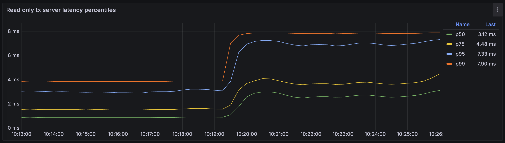



The diagram shows transaction latency percentiles. At approximately ##10:19:30##, these values increased by two to three times.



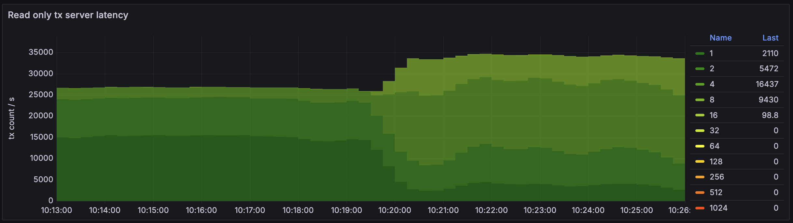



The diagram shows a heatmap of transaction latencies. Transactions are grouped into buckets based on their latency, with each bucket represented by a different color. This diagram displays both the number of transactions processed by {{ ydb-short-name }} per second (on the vertical axis) and the latency distribution among them (with color).

By ##10:20:30##, the share of transactions with the lowest latencies (`Bucket 1`, dark green) had dropped by four to five times. `Bucket 4` grew by approximately five times, and a new group of slower transactions, `Bucket 8`, appeared.



Indeed, the latencies have increased. Now, we need to localize the problem.

## Diagnostics {#diagnostics}

Let's determine why the latencies increased. Could the cause be an increased workload? Here is the **Requests** diagram from the **API details** section of the [DB overview](../../../reference/observability/metrics/grafana-dashboards.md#dboverview) Grafana dashboard:

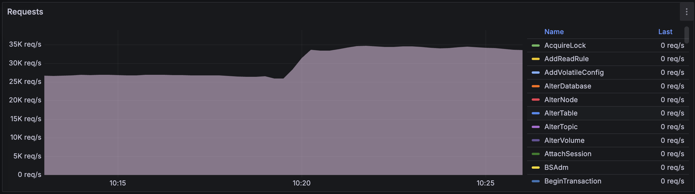

The number of user requests increased from approximately 27,000 to 35,000 at around ##10:20:00##. But can {{ ydb-short-name }} handle the increased load without additional hardware resources?

The CPU load has increased, as shown in the **CPU by execution pool** diagram.

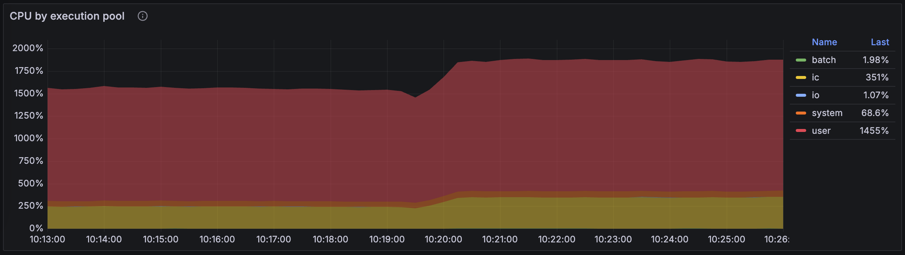



Examining the **CPU** Grafana dashboard reveals that CPU usage increased [in the user pool and the interconnect pool](../../../concepts/glossary.md#actor-system-pool):

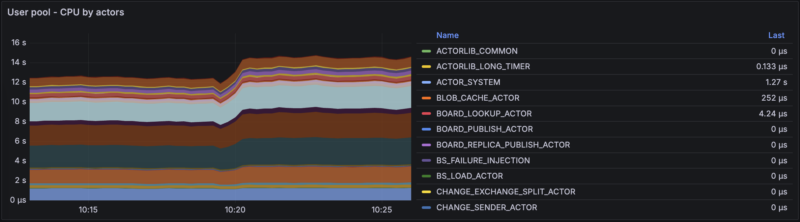

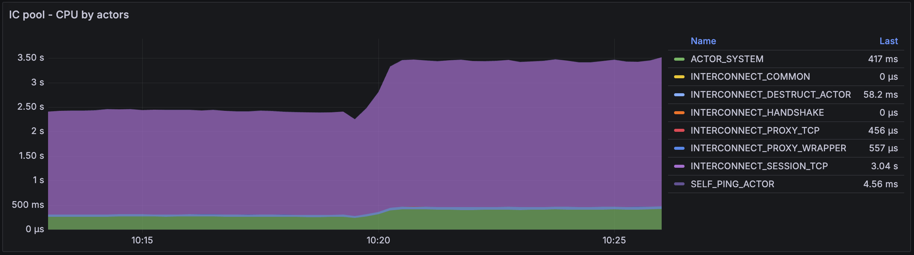

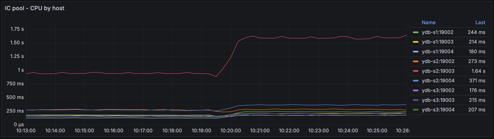



We can also observe overall CPU usage on the **Diagnostics** tab of the [Embedded UI](../../../reference/embedded-ui/index.md):

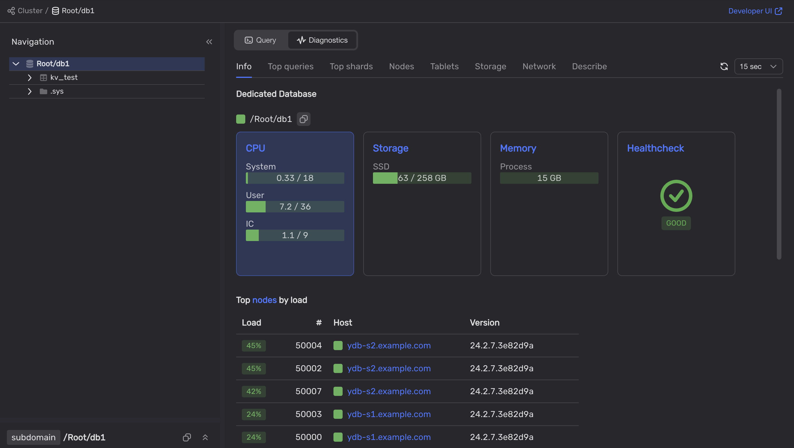

The {{ ydb-short-name }} cluster appears not to utilize all of its CPU capacity.

By inspecting the **DataShard** and **DataShard details** sections of the [DB overview](../../../reference/observability/metrics/grafana-dashboards.md#dboverview) Grafana dashboard, we can see that after the cluster load increased, one of its data shards became overloaded.

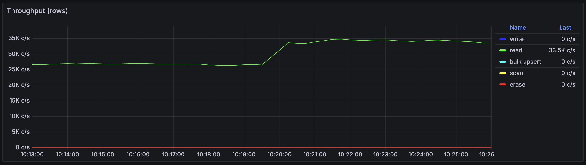



This diagram shows that the number of rows read per second in the {{ ydb-short-name }} database increased from approximately 26,000 to 33,500 rows per second.



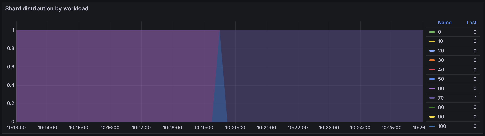



This diagram shows a heatmap of data shard distribution by workload. Data shards are grouped into ten buckets based on the ratio of their current workload to full computing capacity. This allows you to see how many data shards your {{ ydb-short-name }} cluster currently runs and how loaded they are.

The diagram shows only one data shard whose workload changed at approximately ##10:19:30##—the data shard moved to `Bucket 70`, which contains shards loaded to between 60% and 70% of their capacity.



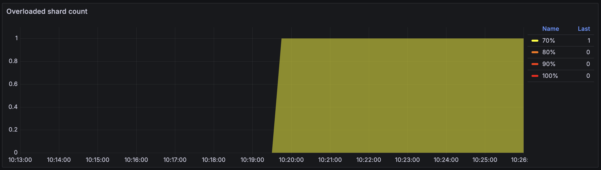



Similar to the previous diagram, the **Overloaded shard count** is a heatmap of data shard distribution by load. However, it displays only data shards with a workload exceeding 60%.

This diagram shows that the workload on one data shard increased to 70% at approximately ##10:19:30##.



To determine which table the overloaded data shard is processing, let's open the **Diagnostics > Top shards** tab in the Embedded UI:

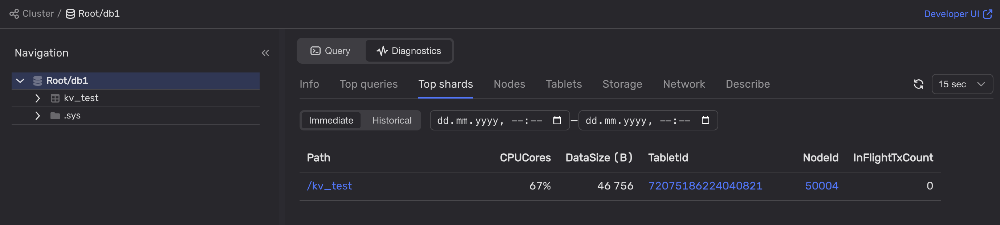

We can see that one of the data shards processing queries for the `kv_test` table is loaded at 67%.

Next, let's examine the `kv_test` table on the **Info** tab:

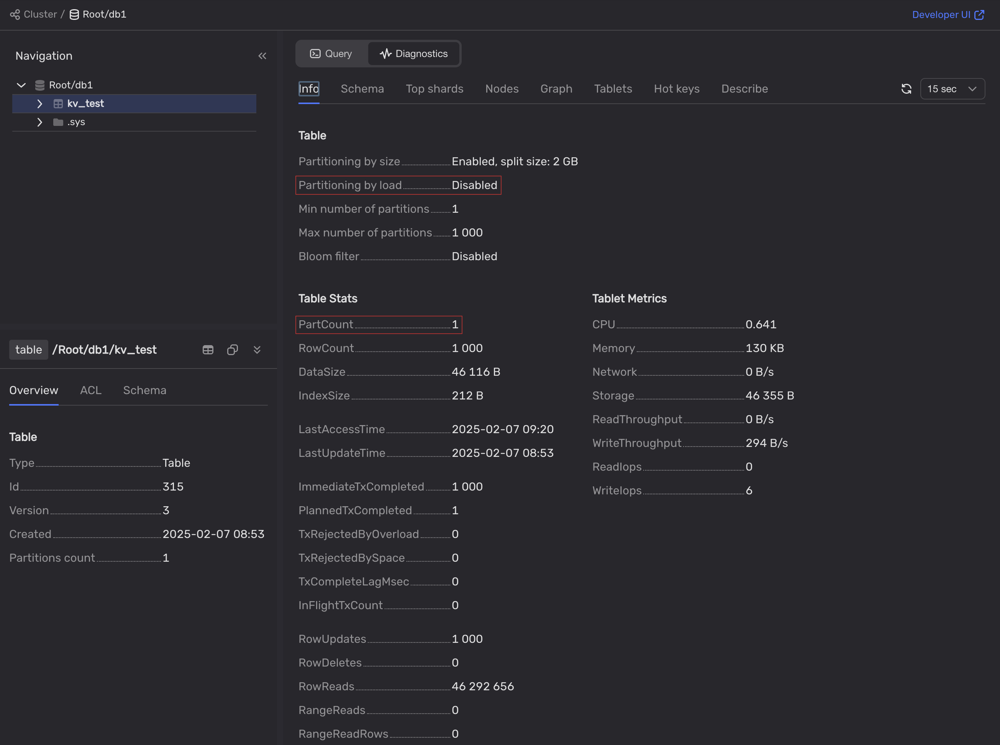



The `kv_test` table was created with partitioning by load disabled and has only one partition.

This means that a single data shard processes all requests to this table. Since data shards are single-threaded and thus can handle only one request at a time, this is a poor practice.



## Solution {#solution}

We should enable partitioning by load for the `kv_test` table:

1. In the Embedded UI, select the database.
2. Open the **Query** tab.
3. Run the following query:

    ```yql
    ALTER TABLE kv_test SET (
        AUTO_PARTITIONING_BY_LOAD = ENABLED
    );
    ```

## Aftermath {#aftermath}

When we enable automatic partitioning for the `kv_test` table, the overloaded data shard splits into two.

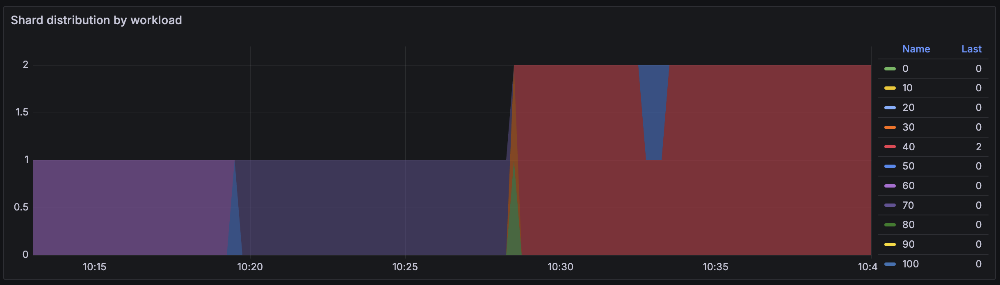



The diagram shows that the number of data shards increased at about ##10:28:00##. Based on the bucket color, their workload does not exceed 40%.



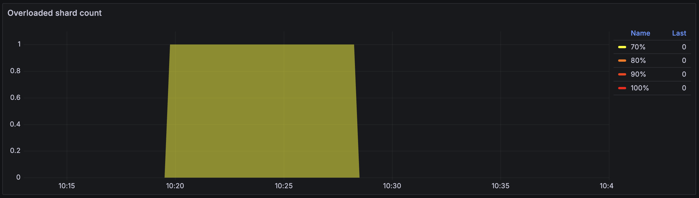



The overloaded shard disappeared from the diagram at approximately ##10:28:00##.



Now, two data shards are processing queries to the `kv_test` table, and neither is overloaded:

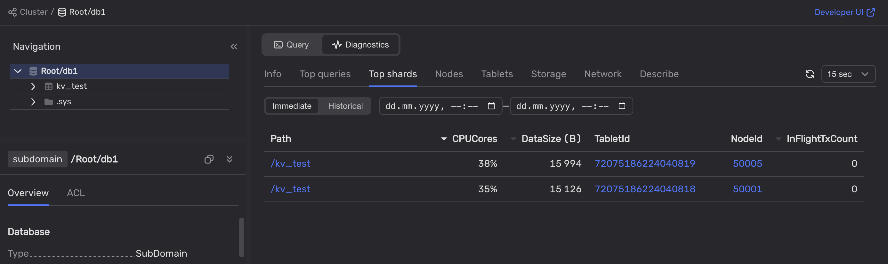

Let's confirm that latencies have returned to normal:

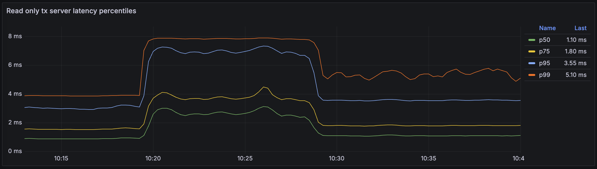



At approximately ##10:28:00##, the p50, p75, and p95 latency percentiles dropped almost to their original levels. The decrease in p99 latency is less pronounced but still shows a twofold reduction.



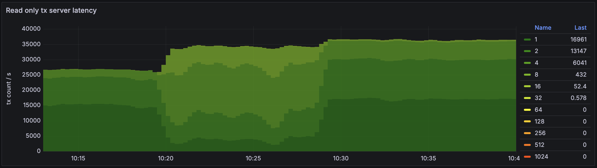



The diagram shows that transactions are now grouped into six buckets. Approximately half of the transactions have returned to `Bucket 1`, meaning their latency is less than one millisecond. More than a third of the transactions are in `Bucket 2`, with latencies between one and two milliseconds. One-sixth of the transactions are in `Bucket 4`. The sizes of the other buckets are insignificant.



The latencies are almost as low as they were before the workload increased. We did not increase the system costs by introducing additional hardware resources. We've only enabled automatic partitioning by the load, which allowed us to use the existing resources more efficiently.

#|
|| Bucket name
| Latencies, ms
|
Single overloaded data shard,
transactions per second
|
Multiple data shards,
transactions per second
||
|| 1
| 0-1
| 2110
| <span style="color:teal">▲</span> 16961
||
|| 2
| 1-2
| 5472
| <span style="color:teal">▲</span> 13147
||
|| 4
| 2-4
| 16437
| <span style="color:navy">▼</span> 6041
||
|| 8
| 4-8
| 9430
| <span style="color:navy">▼</span> 432
||
|| 16
| 8-16
| 98.8
| <span style="color:navy">▼</span> 52.4
||
|| 32
| 16-32
| —
| <span style="color:teal">▲</span> 0.578
||
|#

## Testbed {#testbed}

### Topology

For this example, we used a {{ ydb-short-name }} cluster consisting of three servers running Ubuntu 22.04 LTS. Each server runs one [storage node](../../../concepts/glossary.md#storage-node) and three [database nodes](../../../concepts/glossary.md#database-node) belonging to the same database.

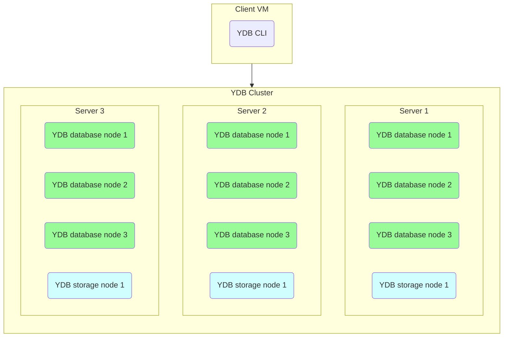

### Hardware configuration

The servers are virtual machines with the following computing resources:

- Platform: Intel Broadwell
- Guaranteed vCPU performance: 100%
- vCPU: 28
- RAM: 32 GB
- Storage:
    - 3 x 93 GB SSD per storage node
    - 20 GB HDD for the operating system


### Test

The load on the {{ ydb-short-name }} cluster was generated using the `ydb workload` CLI command. For more information, see [{#T}](../../../reference/ydb-cli/commands/workload/index.md).

To reproduce the load, follow these steps:

1. Initialize the tables for the workload test:

    ```shell
    ydb workload kv init --min-partitions 1 --auto-partition 0
    ```

    We deliberately disable automatic partitioning for the created tables by using the `--min-partitions 1 --auto-partition 0` options.

1. Emulate the standard workload on the {{ ydb-short-name }} cluster:

    ```shell
    ydb workload kv run select -s 600 -t 100
    ```

    We ran a simple load type using a {{ ydb-short-name }} database as a key-value storage. Specifically, we used the `select` load to create SELECT queries and retrieve rows based on an exact match of the primary key.

    The `-t 100` parameter is used to run the test in 100 threads.

3. Overload the {{ ydb-short-name }} cluster:

    ```shell
    ydb workload kv run select -s 1200 -t 250
    ```

    As soon as the first test ended, we ran the same load test in 250 threads to simulate the overload.

## See also

- [Troubleshooting performance issues](../../performance/index.md)
- [Overloaded shards](../../performance/schemas/overloaded-shards.md)
- [Row-oriented tables](../../../concepts/datamodel/table.md#row-oriented-tables)