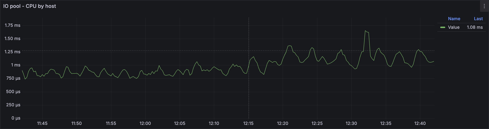

1. Use **Diagnostics** in the [Embedded UI](../../../../reference/embedded-ui/index.md) to analyze CPU utilization in all pools:

    1. In the [Embedded UI](../../../../reference/embedded-ui/index.md), go to the **Databases** tab and click on the database.

    1. On the **Navigation** tab, ensure the required database is selected.

    1. Open the **Diagnostics** tab.

    1. On the **Info** tab, click the **CPU** button and see if any pools show high CPU usage.

        

1. Use Grafana charts to analyze CPU utilization in all pools:

    1. Open the **[CPU](../../../../reference/observability/metrics/grafana-dashboards.md#cpu)** dashboard in Grafana.

    1. See if the following charts show any spikes:

        - **CPU by execution pool** chart

            

        - **User pool - CPU by host** chart

            

        - **System pool - CPU by host** chart

            

        - **Batch pool - CPU by host** chart

            

        - **IC pool - CPU by host** chart

            

        - **IO pool - CPU by host** chart

            

1. If the spike is in the user pool, analyze changes in the user load that might have caused the CPU bottleneck. See the following charts on the **DB overview** dashboard in Grafana:

    - **Requests** chart

        

    - **Request size** chart

        

    - **Response size** chart

        

    Also, see all of the charts in the **Operations** section of the **DataShard** dashboard.

2. If the spike is in the batch pool, check if there are any backups running.
