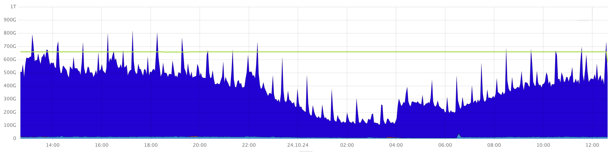
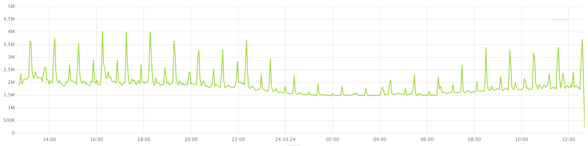

1. Open the **[Distributed Storage Overview](../../../../reference/observability/metrics/grafana-dashboards.md)** dashboard in Grafana.

1. On the **DiskTimeAvailable and total Cost relation** chart, see if the **Total Cost** spikes cross the **DiskTimeAvailable** level.

    

    This chart shows the estimated total bandwidth capacity of the storage system in conventional units (green) and the total usage cost in conventional units (blue). When the total usage cost exceeds the total bandwidth capacity, the {{ ydb-short-name }} storage system becomes overloaded, leading to increased latencies.

1. On the **Total burst duration** chart, check for any load spikes on the storage system. This chart displays microbursts of load on the storage system, measured in microseconds.

    

    

    This chart might show microbursts of the load that are not detected by the average usage cost in the **Cost and DiskTimeAvailable relation** chart.

    
