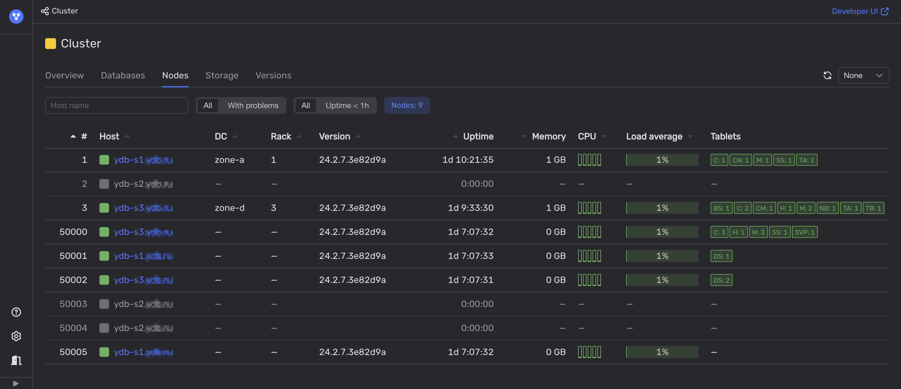

To determine if one of the data centers of the {{ ydb-short-name }} cluster is not available, follow these steps:

1. Open [Embedded UI](../../../../reference/embedded-ui/index.md).

1. On the **Nodes** tab, analyze the [health indicators](../../../../reference/embedded-ui/ydb-monitoring.md#colored_indicator) in the **Host** and **DC** columns.

    

    If all of the nodes in one of the data centers (DC) are not available, this data center is most likely offline.

    If not, review the **Rack** column to check if all {{ ydb-short-name }} nodes are unavailable in one or more server racks. This could indicate that these racks are offline, which could be treated as a partial data center outage.
