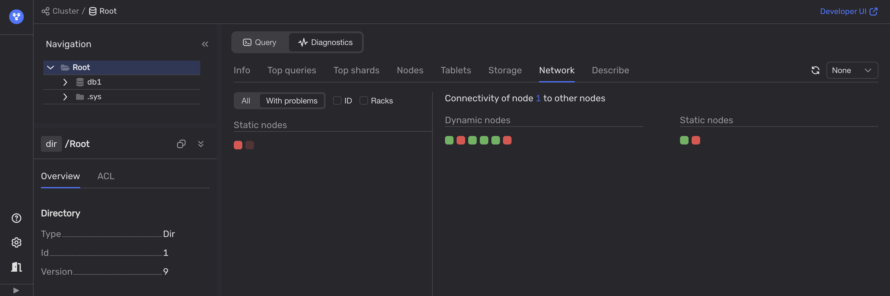

To diagnose network issues, use the healthcheck in the [Embedded UI](../../../../reference/embedded-ui/index.md):

1. Open the [Embedded UI](../../../../reference/embedded-ui/index.md):

    1. Navigate to the **Databases** tab and click on the desired database.

    1. In the **Navigation** tab, confirm the required database is selected.

    1. Switch to the **Diagnostics** tab.

    1. Under the **Network** tab, apply the **With problems** filter.

        

2. Use available third-party tools to monitor network performance metrics such as latency, jitter, packet loss, throughput, and others.
