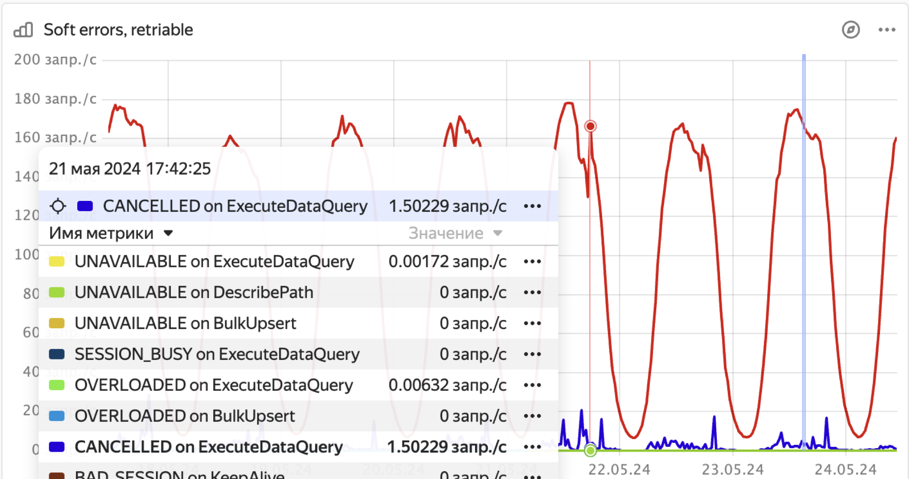

1. Open the **[DB overview](../../../../reference/observability/metrics/grafana-dashboards.md#dboverview)** Grafana dashboard.

1. In the **API details** section, see if the **Soft errors (retriable)** chart shows any spikes in the rate of queries with the `OVERLOADED` status.

    

1. To check if the spikes in overloaded errors were caused by exceeding the limit of 15000 queries in table partition queues:

    * Through the UI:

        1. In the [Embedded UI](../../../../reference/embedded-ui/index.md), go to the **Databases** tab and click on the database.

        1. On the **Navigation** tab, ensure the required database is selected.

        1. Open the **Diagnostics** tab.

        1. Open the **Top shards** tab.

        1. In the **Immediate** and **Historical** tabs, sort the shards by the **InFlightTxCount** column and see if the top values reach the 15000 limit.

    * Through the monitoring system:

        1. Find the dashboard that displays database metrics.

        1. Select `category = app`, `type = DataShard`, `sensor = SUM(DataShard/ImmediateTxInFly)`.

        1. Check if the values are growing to levels close to or exceeding 15000.

1. To check if the spikes in overloaded errors were caused by the lag of accepted transactions:

    1. Find the dashboard that displays database metrics.

    1. Select `category = app`, `type = DataShard`, `sensor = MAX(DataShard/TxCompleteLag)`.

    1. Check if the values are growing to 300 seconds or higher.

1. To check if the spikes in overloaded errors were caused by the overload of the local shard database:

    1. Find the dashboard that displays database metrics.

    1. Select `category = executor`, `type = DataShard`, `sensor = MAX(RejectProbability)`.

    1. Check if the values are above zero. An increase in this sensor means that the local DB has started to probabilistically reject some new requests due to overload.

1. To check if the spikes in overloaded errors were caused by too frequent tablet splits and merges, see [{#T}](../../schemas/splits-merges.md).

1. To check if the spikes in overloaded errors were caused by exceeding the 1000 limit of open sessions, in the Grafana **[DB status](../../../../reference/observability/metrics/grafana-dashboards.md#dbstatus)** dashboard, see the **Session count by host** chart.

1. See the [overloaded shards](../../schemas/overloaded-shards.md) issue.
