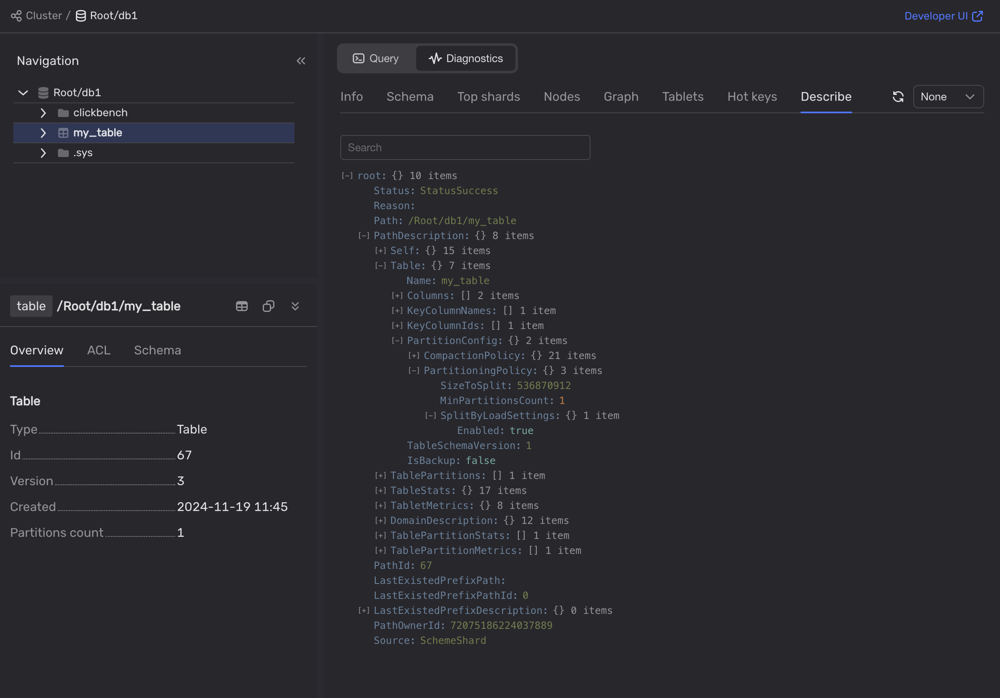

1. Use the Embedded UI or Grafana to see if the {{ ydb-short-name }} nodes are overloaded:

    - In the **[DB overview](../../../../reference/observability/metrics/grafana-dashboards.md#dboverview)** Grafana dashboard, analyze the **Overloaded shard count** chart.

        

        The chart indicates whether the {{ ydb-short-name }} cluster has overloaded shards, but it does not specify which table's shards are overloaded.

        

        Use Grafana to set up alert notifications when {{ ydb-short-name }} data shards get overloaded.

        


    - In the [Embedded UI](../../../../reference/embedded-ui/index.md):

        1. Go to the **Databases** tab and click on the database.

        1. On the **Navigation** tab, ensure the required database is selected.

        1. Open the **Diagnostics** tab.

        1. Open the **Top shards** tab.

        1. In the **Immediate** and **Historical** tabs, sort the shards by the **CPUCores** column and analyze the information.

        

        Additionally, the information about overloaded shards is provided as a system table. For more information, see [{#T}](../../../../dev/system-views.md#top-overload-partitions).

1. To pinpoint the schema issue, use the [Embedded UI](../../../../reference/embedded-ui/index.md) or [{{ ydb-short-name }} CLI](../../../../reference/ydb-cli/index.md):

    - In the [Embedded UI](../../../../reference/embedded-ui/index.md):

        1. On the **Databases** tab, click on the database.

        1. On the **Navigation** tab, select the required table.

        1. Open the **Diagnostics** tab.

        1. On the **Describe** tab, navigate to `root > PathDescription > Table > PartitionConfig > PartitioningPolicy`.

            

        1. Analyze the **PartitioningPolicy** values:

            - `SizeToSplit`
            - `SplitByLoadSettings`
            - `MaxPartitionsCount`

            If the table does not have these options, see [Recommendations for table configuration](../overloaded-shards.md#table-config).

        

        You can also find this information on the **Diagnostics > Info** tab.

        


    - In the [{{ ydb-short-name }} CLI](../../../../reference/ydb-cli/index.md):

        1. To retrieve information about the problematic table, run the following command:

            ```bash
            ydb scheme describe <table_name>
            ```

        2. In the command output, analyze the **Auto partitioning settings**:

            - `Partitioning by size`
            - `Partitioning by load`
            - `Max partitions count`

            If the table does not have these options, see [Recommendations for table configuration](../overloaded-shards.md#table-config).

1. Analyze whether primary key values increment monotonically:

    - Check the data type of the primary key column. `Serial` data types are used for autoincrementing values.

    - Check the application logic.

    - Calculate the difference between the minimum and maximum values of the primary key column. Then compare this value to the number of rows in a given table. If these values match, the primary key might be incrementing monotonically.

    If primary key values do increase monotonically, see [Recommendations for the imbalanced primary key](../overloaded-shards.md#pk-recommendations).
