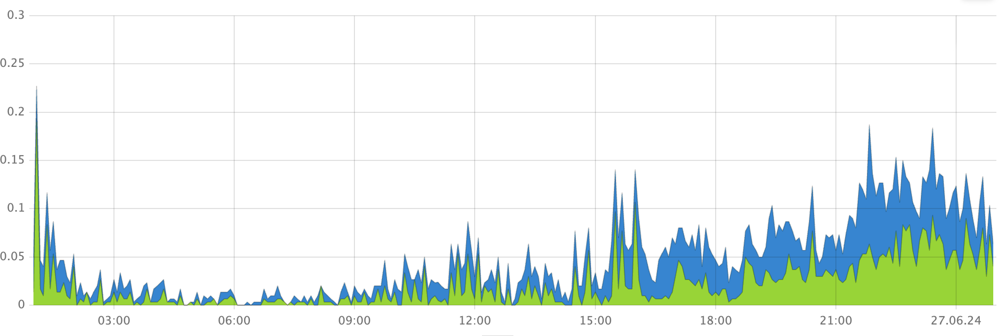
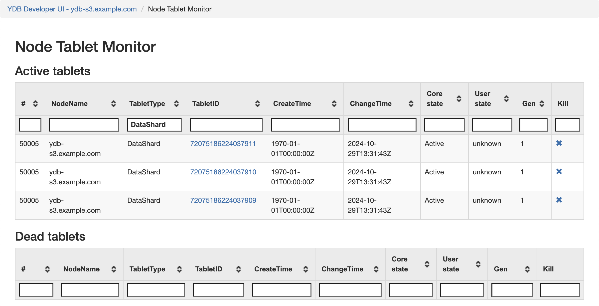

1. See if the **Split / Merge partitions** chart in the **[DB status](../../../../reference/observability/metrics/grafana-dashboards.md#dbstatus)** Grafana dashboard shows any spikes.

    

        This chart displays the time-series data for the following values:

        - Number of split table partitions per second (blue)
        - Number of merged table partitions per second (green)

1. Check whether the user load increased when the tablet splits and merges spiked.

    [//]: # (TODO: Add user load charts)

    - Review the diagrams on the **DataShard** dashboard in Grafana for any changes in the volume of data read or written by queries.

    - Examine the **Requests** chart on the **Query engine** dashboard in Grafana for any spikes in the number of requests.

1. To identify recently split or merged tablets, follow these steps:

    1. In the [Embedded UI](../../../../reference/embedded-ui/index.md), click the **Developer UI** link in the upper right corner.

    1. Navigate to **Node Table Monitor** > **All tablets of the cluster**.

    1. To show only data shard tablets, in the **TabletType** filter, specify `DataShard`.

        

    1. Sort the tablets by the **ChangeTime** column and review tablets, which change time values coincide with the spikes on the **Split / Merge partitions** chart.

    1. To identify the table associated with the data shard, in the data shard row, click the link in the **TabletID** column.

    1. On the **Tablets** page, click the **App** link.

        The information about the table is displayed in the **User table \<table-name\>** section.

1. To pinpoint the schema issue, follow these steps:

    1. Retrieve information about the problematic table using the [{{ ydb-short-name }} CLI](../../../../reference/ydb-cli/index.md). Run the following command:

        ```bash
        ydb scheme describe <table_name>
        ```

    1. In the command output, analyze the **Auto partitioning settings**:

        * `Partitioning by load`
        * `Max partitions count`
        * `Min partitions count`

