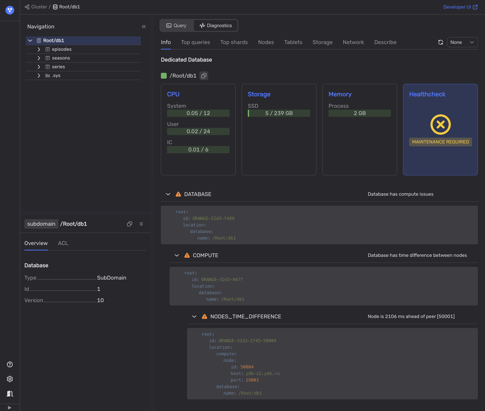

# System clock drift

Synchronized clocks are critical for distributed databases. If system clocks on the {{ ydb-short-name }} servers drift excessively, distributed transactions will experience increased latencies.



It is important to keep system clocks on the {{ ydb-short-name }} servers in sync, to avoid high latencies.



If the system clocks of the nodes running the [coordinator](../../../concepts/glossary.md#coordinator) tablets differ, transaction latencies increase by the time difference between the fastest and slowest system clocks. This occurs because a transaction planned on a node with a faster system clock can only be executed once the coordinator with the slowest clock reaches the same time.

Furthermore, if the system clock drift exceeds 30 seconds, {{ ydb-short-name }} will refuse to process distributed transactions. Before coordinators start planning a transaction, affected [Data shards](../../../concepts/glossary.md#data-shard) determine an acceptable range of timestamps for the transaction. The start of this range is the current time of the mediator tablet's clock, while the 30-second planning timeout determines the end. If the coordinator's system clock exceeds this time range, it cannot plan a distributed transaction, resulting in errors for such queries.

## Diagnostics

To diagnose the system clock drift, use the following methods:

1. Use **Healthcheck** in the [Embedded UI](../../../reference/embedded-ui/index.md):

    1. In the [Embedded UI](../../../reference/embedded-ui/index.md), go to the **Databases** tab and click on the database.

    1. On the **Navigation** tab, ensure the required database is selected.

    1. Open the **Diagnostics** tab.

    1. On the **Info** tab, click the **Healthcheck** button.

        If the **Healthcheck** button displays a `MAINTENANCE REQUIRED` status, the {{ ydb-short-name }} cluster might be experiencing issues, such as system clock drift. Any identified issues will be listed in the **DATABASE** section below the **Healthcheck** button.

    1. To see the diagnosed problems, expand the **DATABASE** section.

        

        The system clock drift problems will be listed under `NODES_TIME_DIFFERENCE`.

    

    For more information, see [{#T}](../../../reference/ydb-sdk/health-check-api.md)

    

1. Open the [Interconnect overview](../../../reference/embedded-ui/interconnect-overview.md) page of the [Embedded UI](../../../reference/embedded-ui/index.md).

1. Use such tools as `pssh` or `ansible` to run the command (for example, `date +%s%N`) on all {{ ydb-short-name }} nodes to display the system clock value.

    

    Network delays between the host that runs `pssh` or `ansible` and {{ ydb-short-name }} hosts will influence the results.

    

    If you use time synchronization utilities, you can also request their status instead of requesting the current timestamps. For example, `timedatectl show-timesync --all`.

## Recommendations

1. Manually synchronize the system clocks of servers running {{ ydb-short-name }} nodes. For instance, use `pssh` or `ansible` to run the clock sync command across all nodes.

2. Ensure that system clocks on all {{ ydb-short-name }} servers are regularly synchronized using `timesyncd`, `ntpd`, `chrony`, or a similar tool. It’s recommended to use the same time source for all servers in the {{ ydb-short-name }} cluster.
