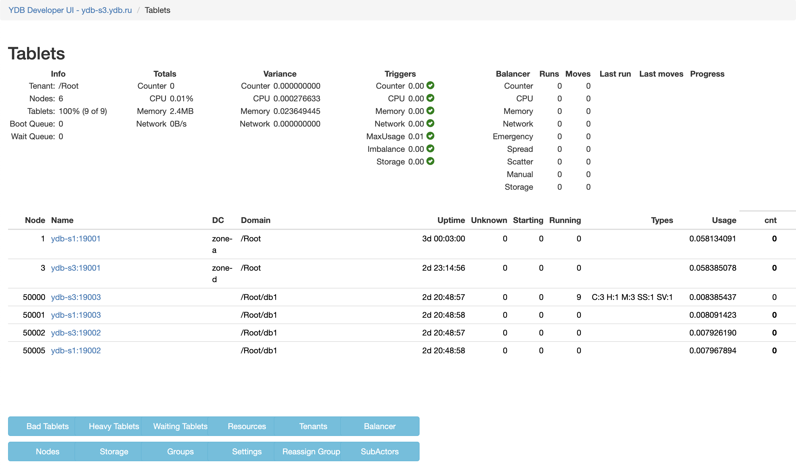

# Frequent tablet moves between nodes

{{ ydb-short-name }} automatically balances the load by moving tablets from overloaded nodes to other nodes. This process is managed by [Hive](../../../concepts/glossary.md#hive). When Hive moves tablets, queries affecting those tablets might experience increased latencies while they wait for the tablet to get initialized on the new node.

{{ ydb-short-name }} considers usage of the following hardware resources for balancing nodes:

- CPU
- Memory
- Network
- [Count](*count)

Autobalancing occurs in the following cases:

- **Disbalance in hardware resource usage**

    {{ ydb-short-name }} uses the **scatter** metric to evaluate the balance in hardware resource usage. This metric is calculated for each resource using the following formula:

    $Scatter = \frac {MaxUsage - MinUsage} {MaxUsage},$

    where:

    - $MaxUsage$ is the maximum hardware resource usage among all of the nodes.
    - $MinUsage$ is the minimum hardware resource usage among all of the nodes.

    To distribute the load, {{ ydb-short-name }} considers the hardware resources available to each node. Under low loads, the scatter value may vary significantly across nodes; however, the minimum value for this formula is set to never fall below 30%.

- **Overloaded nodes (CPU and memory usage)**

    Hive starts the autobalancing procesure when the highest load on a node exceeds 90%, while the lowest load on a node is below 70%.

- **Uneven distribution of database objects**

    {{ ydb-short-name }} uses the **ObjectImbalance** metric to monitor the distribution of tablets utilizing the **[count](*count)** resource across {{ ydb-short-name }} nodes. When {{ ydb-short-name }} nodes restart, these tablets may not distribute evenly, prompting Hive to initiate the autobalancing procedure.

## Diagnostics

<!-- The include is added to allow partial overrides in overlays  -->


## Recommendations

Adjust Hive balancer settings:

1. Open [Embedded UI](../../../reference/embedded-ui/index.md).

1. Click **Developer UI** in the upper right corner of the Embedded UI.

1. In the **Developer UI**, navigate to **Tablets > Hive > App**.

    

1. Click **Settings**.

1. To reduce the likelihood of overly frequent balancing, increase the following Hive balancer thresholds:

    #|
    || Parameter | Description | Default value ||
    || MinCounterScatterToBalance
    | The threshold for the counter scatter value. When this value is reached, Hive starts balancing the load.
    | 0.02 ||
    || MinCPUScatterToBalance
    | The threshold for the CPU scatter value. When this value is reached, Hive starts balancing the load.
    | 0.5 ||
    || MinMemoryScatterToBalance
    | The threshold for the memory scatter value. When this value is reached, Hive starts balancing the load.
    | 0.5 ||
    || MinNetworkScatterToBalance
    | The threshold for the network scatter value. When this value is reached, Hive starts balancing the load.
    | 0.5 ||
    || MaxNodeUsageToKick
    | The threshold for the node resource usage. When this value is reached, Hive starts emergency balancing.
    | 0.9 ||
    || ObjectImbalanceToBalance
    | The threshold for the database object imbalance metric.
    | 0.02 ||
    |#

    

    These parameters use relative values, where 1.0 represents 100% and effectively disables balancing. If the total hardware resource value can exceed 100%, adjust the ratio accordingly.

    

[*count]: Count is a virtual resource for distributing tablets of the same type evenly between nodes.
