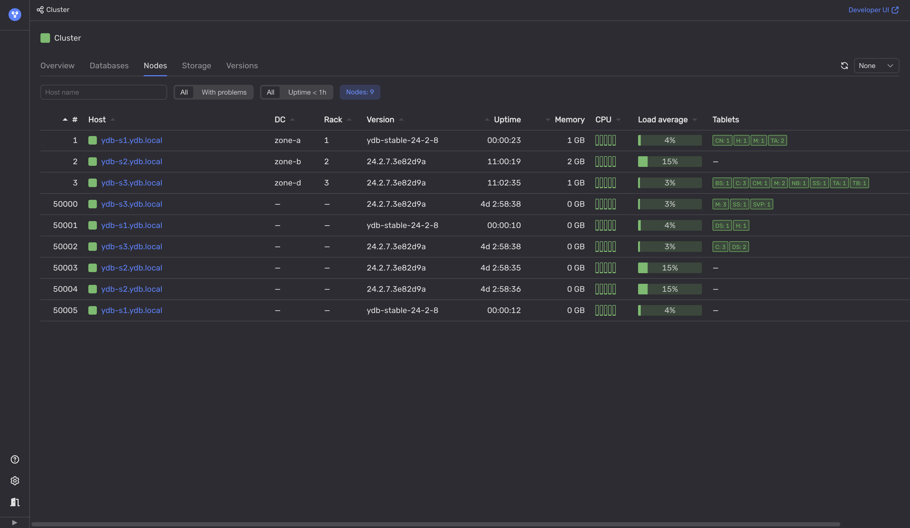

# Rolling restart

{{ ydb-short-name }} clusters can be updated without downtime, which is possible because {{ ydb-short-name }} normally has redundant components and supports rolling restart procedure. To ensure continuous data availability, {{ ydb-short-name }} includes [Cluster Management System (CMS)](../../../concepts/glossary.md#cms) that tracks all outages and nodes taken offline for maintenance, such as restarts. CMS halts new maintenance requests if they might risk data availability.

However, even if data is always available, the restart of all nodes in a relatively short period of time might have a noticeable impact on overall performance. Each [tablet](../../../concepts/glossary.md#tablet) running on a restarted node is relaunched on a different node. Moving a tablet between nodes takes time and may affect latencies of queries involving it. See recommendations [for rolling restart](#rolling-restart).

Furthermore, a new {{ ydb-short-name }} version may handle queries differently. While performance generally improves with each update, certain corner cases may occasionally end up with degraded performance. See recommendations [for new version performance](#version-performance).

## Diagnostics



Diagnostics of {{ ydb-short-name }} rolling restarts and updates relies only on secondary symptoms. To be absolutely sure, contact your database administrator.



To check if the {{ ydb-short-name }} cluster is currently being updated:

1. Open [Embedded UI](../../../reference/embedded-ui/index.md).

1. On the **Nodes** tab, see if {{ ydb-short-name }} versions of the nodes differ.

    Also, see if the nodes with the higher {{ ydb-short-name }} version have the lower uptime value.

    



Low uptime value of a {{ ydb-short-name }} node might also indicate other problems. For example, see [{#T}](../hardware/insufficient-memory.md).



## Recommendations

### For rolling restart {#rolling-restart}

If the ongoing {{ ydb-short-name }} cluster rolling restart significantly impacts applications to the point where they can no longer meet their latency requirements, consider slowing down the restart process:

1. If nodes are restarted in batches, reduce the batch size, up to one node at a time.
2. Space out in time the restarts for each data center and/or server rack.
3. Inject artificial pauses between restarts.

### For new version performance {#version-performance}

The goal is to detect any negative performance impacts from the new {{ ydb-short-name }} version on specific queries in your particular workload as early as possible:

1. Review the [{{ ydb-short-name }} server changelog](../../../changelog-server.md) for any performance-related notes relevant to your workload.
2. Use a dedicated pre-production and/or testing {{ ydb-short-name }} cluster to run a workload that closely mirrors your production workload. Always deploy the new {{ ydb-short-name }} version to these clusters first. Monitor both client-side latencies and server-side metrics to identify any potential performance issues.
3. Implement canary deployment by updating only one node initially to observe any changes in its behavior. If everything appears stable, gradually expand the update to more nodes, such as an entire server rack or data center, and repeat checks for anomalies. If any issues arise, immediately roll back to the previous version and attempt to reproduce the issue in a non-production environment.

Report any identified performance issues on [{{ ydb-short-name }}'s GitHub](https://github.com/ydb-platform/ydb/issues/new). Provide context and all the details that could help reproduce it.
