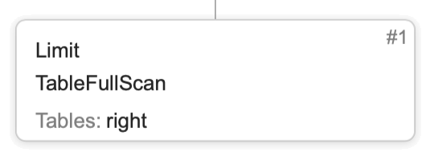
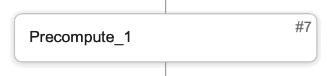

# Query plan structure

To understand how a query will be executed, you can build and analyze its plan. The query plan structure in {{ ydb-short-name }} is represented as a graph, where each node contains information about operations and tables.

Below you can find information about node types, and an example of analyzing a specific query plan can be found [here](../dba/query-plans-optimization.md).

## Node types
### Stage
Query execution stage.

**UI representation**:

Stage can contatin the following operation:

#### TableFullScan
Full table scan. It is important to keep in mind that the resource intensity of this operation is proportional to the size of the table, so it should be avoided whenever possible.

Attribute | Description 
--- | --- 
Table | table name
ReadColumns | read columns list
ReadLimit | read rows limit
Reverse | flag indicating the order in which the rows will be read, by default the order is forward (ascending), but if the flag is set to `true`, the reading order will be reversed (descending).

#### TableRangeScan
Reading a table based on a specific range of primary key.

Attribute | Description
--- | --- 
Table | table name
ReadColumns | read columns list
ReadRange | key range
ReadLimit | read rows limit
Reverse | flag indicating the order in which the rows will be read, by default the order is forward (ascending), but if the flag is set to `true`, the reading order will be reversed (descending).

#### TablePointLookup
Reading a table based on specific values of the primary key. Note that for this operation all components of the primary key should be specified, reading by key prefix is performed as a `TableRangeScan`.

Attribute | Description
--- | ---
Table | table name
ReadColumns | read columns list

#### Upsert
Updates or inserts multiple rows to a table based on a comparison by the primary key. For the existing rows, the values of the specified columns are updated, but the values of the other columns are preserved.

Attribute | Description
--- | ---
Table | table name
Columns | columns contained in the row

#### Delete
 Deleting rows from the table.

Attribute | Description
--- | ---
Table | table name

#### Join
Combine two data sources (subqueries or tables), join strategy is specified in the operation description.

#### Filter
Filtering rows, leaving only those for which the predicate returns true.

Attribute | Description
--- | ---
Predicate | filtering condition
Limit | rows limit

#### Aggregate 
Grouping rows by the values of the specified columns or expressions.

Attribute | Description
--- | ---
GroupBy | columns used for aggregation
Aggregation | aggregate function

#### Sort
Sorting rows.

Attribute | Description
--- | ---
SortBy | columns used for sorting

#### TopSort
Sorting rows with specified limit.

Attribute | Description
--- | ---
TopSortBy | columns used for sorting
Limit | rows limit

#### Top
Returns first N elements that are less or equal to the N+1 element if the entire sequence were sorted.

Attribute | Description
--- | ---
TopBy | columns by which the first N rows will be taken
Limit | rows limit

#### Limit
Limit on the number of rows.

Attribute | Description
--- | ---
Limit | limit value

#### Offset
Offset, allowing to skip the first N elements of a given set of rows.

Attribute | Description
--- | ---
Offset | offset value

#### Union
Union the results of two or more subqueries into one set.

#### Iterator
Iterates through a given set of rows, typically use a [precompute](#precompute) as an argument.

#### PartitionByKey
Partitioning by key typically use a [precompute](#precompute).

### Connection
Data dependencies between stages.

**UI representation**:

Each stage is executed as a certain number of tasks. For example, a reading stage may be executed in N tasks, where N is the number of table shards. Method of transferring data between stages depends on the type of connection. You can find a description of different connections below.

#### UnionAll
Combines the results of all producer stage tasks and sends them as a single result to a single consumer stage task.

#### Merge
This is a special case of `UnionAll`. The results of the producer stage are sorted by a specified set of columns and merged into a result that is also sorted.

#### Broadcast
Sends the result of a single producer stage task to all consumer stage tasks.

#### Map
Implements 1-to-1 relationships between tasks of stages, the producer and consumer stages should have the same number of tasks.

#### HashShuffle
Sends the results of producer stage tasks to consumer stage tasks based on a certain rule for specified columns. The rule is defined in the code, but the list of columns is specified in the connection.

### ResultSet
The query execution result.

**UI representation**:

### Precompute
Materialized intermediate result.

**UI representation**:

Stages that depend on precomputes should be executed after the precompute has been completed.
