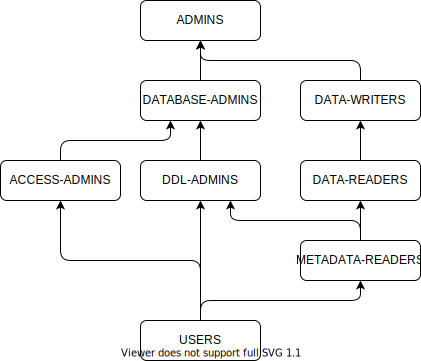

## Built-in groups {#builtin}

The {{ ydb-short-name }} cluster has built-in groups providing predefined role sets:

| Group              | Description                                                                                   |
|--------------------|-----------------------------------------------------------------------------------------------|
| `ADMINS`           | Unlimited rights over the entire cluster schema                                               |
| `DATABASE-ADMINS`  | Rights to create and delete databases (`CreateDatabase`, `DropDatabase`)                      |
| `ACCESS-ADMINS`    | Rights to manage other users' permissions (`GrantAccessRights`)                               |
| `DDL-ADMINS`       | Rights to alter database schemas (`CreateDirectory`, `CreateTable`, `WriteAttributes`, `AlterSchema`, `RemoveSchema`) |
| `DATA-WRITERS`     | Rights to modify data (`UpdateRow`, `EraseRow`)                                               |
| `DATA-READERS`     | Rights to read data (`SelectRow`)                                                             |
| `METADATA-READERS` | Rights to read metadata, without access to data (`DescribeSchema` and `ReadAttributes`)       |
| `USERS`            | Rights to connect to databases (`ConnectDatabase`)                                           |

By default, all users are included in the `USERS` group, and the `root` user is included in the `ADMINS` group.

Below is a diagram demonstrating how groups inherit permissions from each other. For example, `DATA-WRITERS` includes all permissions of `DATA-READERS`:

