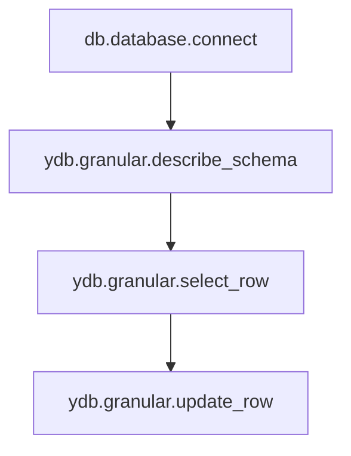

## Access rights {#permissions-list}

As names of access rights, you can use either the names of {{ ydb-short-name }} rights or the corresponding YQL keywords.  
The possible names of rights are listed in the table below.

| {{ ydb-short-name }} right            | YQL keyword         | Description                                                                                          |
|---------------------------------------|---------------------|------------------------------------------------------------------------------------------------------|
| **Database-level rights**             |                     |                                                                                                      |
| `ydb.database.connect`                | `CONNECT`           | The right to connect to a database                                                                  |
| `ydb.database.create`                 | `CREATE`            | The right to create new databases in the cluster                                                    |
| `ydb.database.drop`                   | `DROP`              | The right to delete databases in the cluster                                                        |
| **Elementary rights for database objects** |                |                                                                                                      |
| `ydb.granular.select_row`             | `SELECT ROW`        | The right to read rows from a table (select), read messages from topics                             |
| `ydb.granular.update_row`             | `UPDATE ROW`        | The right to update rows in a table (insert, update, erase), write messages to topics               |
| `ydb.granular.erase_row`              | `ERASE ROW`         | The right to delete rows from a table                                                               |
| `ydb.granular.create_directory`       | `CREATE DIRECTORY`  | The right to create and delete directories, including existing and nested ones                      |
| `ydb.granular.create_table`           | `CREATE TABLE`      | The right to create tables (including index, external, columnar), views, sequences                  |
| `ydb.granular.create_queue`           | `CREATE QUEUE`      | The right to create topics                                                                          |
| `ydb.granular.remove_schema`          | `REMOVE SCHEMA`     | The right to delete objects (directories, tables, topics) that were created using rights            |
| `ydb.granular.describe_schema`        | `DESCRIBE SCHEMA`   | The right to view existing access rights (ACL) on an access object, view descriptions of access objects (directories, tables, topics) |
| `ydb.granular.alter_schema`           | `ALTER SCHEMA`      | The right to modify access objects (directories, tables, topics), including users' rights to access objects |
| **Additional flags**                  |                     |                                                                                                      |
| `ydb.access.grant`                    | `GRANT`             | The right to grant or revoke rights from other users to the extent not exceeding the current scope of the user's rights on the access object |
| `ydb.tables.modify`                   | `MODIFY TABLES`     | `ydb.granular.update_row` + `ydb.granular.erase_row`                                                |
| `ydb.tables.read`                     | `SELECT TABLES`     | Alias for `ydb.granular.select_row`                                                                 |
| `ydb.generic.list`                    | `LIST`              | Alias for `ydb.granular.describe_schema`                                                            |
| `ydb.generic.read`                    | `SELECT`            | `ydb.granular.select_row` + `ydb.generic.list`                                                      |
| `ydb.generic.write`                   | `INSERT`            | `ydb.granular.update_row` + `ydb.granular.erase_row` + `ydb.granular.create_directory` + `ydb.granular.create_table` + `ydb.granular.create_queue` + `ydb.granular.remove_schema` + `ydb.granular.alter_schema` |
| `ydb.generic.use_legacy`              | `USE LEGACY`        | `ydb.generic.read` + `ydb.generic.write` + `ydb.access.grant`                                       |
| `ydb.generic.use`                     | `USE`               | `ydb.generic.use_legacy` + `ydb.database.connect`                                                   |
| `ydb.generic.manage`                  | `MANAGE`            | `ydb.database.create` + `ydb.database.drop`                                                         |
| `ydb.generic.full_legacy`             | `FULL LEGACY`       | `ydb.generic.use_legacy` + `ydb.generic.manage`                                                     |
| `ydb.generic.full`                    | `FULL`              | `ydb.generic.use` + `ydb.generic.manage`                                                            |

* `ALL [PRIVILEGES]` is used to specify all possible rights on schema objects for users or groups. `PRIVILEGES` is an optional keyword needed for compatibility with the SQL standard.  



Rights `ydb.database.connect`, `ydb.granular.describe_schema`, `ydb.granular.select_row`, and `ydb.granular.update_row` should be considered as layers of rights.  

For example, to update rows, you need not only the right `ydb.granular.update_row`, but also all the overlying rights.


