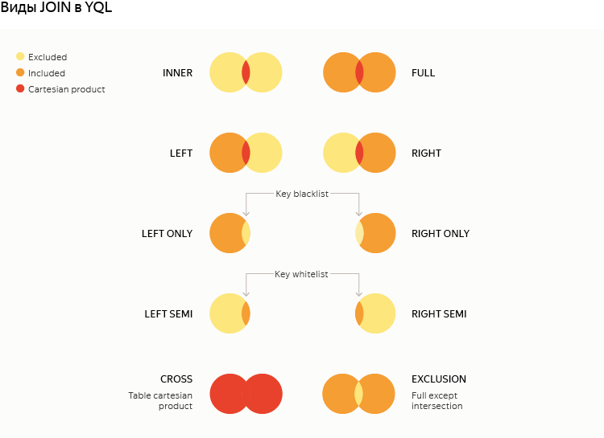

# JOIN

It lets you combine multiple data sources (subqueries or tables) by equality of values in the specified columns or expressions (the `JOIN` keys).

**Syntax**

```sql
SELECT ...    FROM table_1
-- first JOIN step:
  <Join_Type> JOIN table_2 <Join_Condition>
  -- left subquery -- entries in table_1
  -- right subquery -- entries in table_2
-- next JOIN step:
  <Join_Type> JOIN table_n <Join_Condition>
  -- left subquery -- JOIN result in the previous step
  -- right subquery -- entries in table_n
-- JOIN can include the following steps
...
WHERE  ...
```

At each JOIN step, rules are used to establish correspondences between rows in the left and right data subqueries, creating a new subquery that includes every combination of rows that meet the JOIN conditions.



Since columns in YQL are identified by their names, and you can't have two columns with the same name in the subquery, `SELECT * FROM ... JOIN ...` can't be executed if there are columns with identical names in the joined tables.



## Types of join (Join_Type)

* `INNER` <span style="color: gray;">(default)</span>: Rows from joined subqueries that don't match any rows on the other side won't be included in the result.
* `LEFT`: If there's no value in the right subquery, it adds a row to the result with column values from the left subquery, using `NULL` in columns from the right subquery
* `RIGHT`: If there's no value in the left subquery, it adds the row to the result, including column values from the right subquery, but using `NULL` in columns from the left subquery
* `FULL` = `LEFT` + `RIGHT`
* `LEFT/RIGHT SEMI`: One side of the subquery is a whitelist of keys, its values are not available. The result includes columns from one table only, no Cartesian product is created.
* `LEFT/RIGHT ONLY`: Subtracting the sets by keys (blacklist). It's almost the same as adding `IS NULL` to the key on the opposite side in the regular `LEFT/RIGHT` JOIN, but with no access to values: the same as `SEMI` JOIN.
* `CROSS`: A full Cartesian product of two tables without specifying key columns and no explicit `ON/USING`.
* `EXCLUSION`: Both sides minus the intersection.





`NULL` is a special value to denote nothing. Hence, `NULL` values on both sides are not treated as equal to each other. This eliminates ambiguity in some types of `JOIN` and avoids a giant Cartesian product otherwise created.



## Conditions for joining (Join_Condition)

For `CROSS JOIN`, no join condition is specified. The result includes the Cartesian product of the left and right subquery, meaning it combines everything with everything. The number of rows in the resulting subquery is the product of the number of rows in the left and right subqueries.

For any other JOIN types, specify the condition using one of the two methods:

1. `USING (column_name)`. Used if both the left and right subqueries share a column whose equality of values is a join condition.
2. `ON (equality_conditions)`. Lets you set a condition of equality for column values or expressions over columns in the left and right subqueries or use several such conditions combined by `and`.

**Examples:**

```sql
SELECT    a.value as a_value, b.value as b_value
FROM      a_table AS a
FULL JOIN b_table AS b USING (key);
```

```sql
SELECT    a.value as a_value, b.value as b_value
FROM      a_table AS a
FULL JOIN b_table AS b ON a.key = b.key;
```

```sql
SELECT     a.value as a_value, b.value as b_value, c.column2
FROM       a_table AS a
CROSS JOIN b_table AS b
LEFT  JOIN c_table AS c ON c.ref = a.key and c.column1 = b.value;
```

To make sure no full scan of the right joined table is required, a secondary index can be applied to the columns included in the Join condition. Accessing a secondary index should be specified explicitly in `JOIN table_name VIEW index_name AS table_alias` format.

For example, creating an index to use in the Join condition:

```yql
ALTER TABLE b_table ADD INDEX b_index_ref GLOBAL ON(ref);
```

Using the created index:

```yql
SELECT    a.value as a_value, b.value as b_value
FROM      a_table AS a
INNER JOIN b_table VIEW b_index_ref AS b ON a.ref = b.ref;
```



If the statement filters data in addition to `JOIN`, we recommend wrapping the criteria that would return `true` for most of the rows in the `LIKELY(...)` function call. If your assumption that positive values prevail for the criteria is correct, such a hint might speed up your subquery. `LIKELY` can be useful when the predicate calculation is a resource-intensive operation and JOIN significantly reduces the number of rows.

In front of any data source for `JOIN`, you can add the `ANY` keyword to suppress duplicate `JOIN` keys on the given side. In this case, only one row is left from the set of rows with the same `JOIN` key value (no matter which one, that's why the keyword is called `ANY`).
This syntax is different from that used in [ClickHouse](https://clickhouse.com/docs/en/sql-reference/statements/select/join/)(https://clickhouse.tech/docs/ru/sql-reference/statements/select/join/), where `ANY` is placed before the `JOIN` type and applies to the right side only.

Request

```yql
$t1 = AsList(
    AsStruct("1" AS key, "v111" AS value),
    AsStruct("2" AS key, "v121" AS value),
    AsStruct("2" AS key, "v122" AS value),
    AsStruct("3" AS key, "v131" AS value),
    AsStruct("3" AS key, "v132" AS value));

$t2 = AsList(
    AsStruct("2" AS key, "v221" AS value),
    AsStruct("2" AS key, "v222" AS value),
    AsStruct("3" AS key, "v231" AS value),
    AsStruct("3" AS key, "v232" AS value),
    AsStruct("4" AS key, "v241" AS value));

SELECT
  a.key, a.value, b.value
FROM ANY AS_TABLE($t1) AS a
JOIN ANY AS_TABLE($t2) AS b
ON a.key == b.key;
```

results in:

| a.key | a.value | b.value |
| --- | --- | --- |
| "3" | "v131" | "v231" |
| "2" | "v121" | "v221" |

and without `ANY` it would result in:

| a.key | a.value | b.value |
| --- | --- | --- |
| "3" | "v131" | "v231" |
| "3" | "v131" | "v232" |
| "3" | "v132" | "v231" |
| "3" | "v132" | "v232" |
| "2" | "v121" | "v221" |
| "2" | "v121" | "v222" |
| "2" | "v122" | "v221" |
| "2" | "v122" | "v222" |


