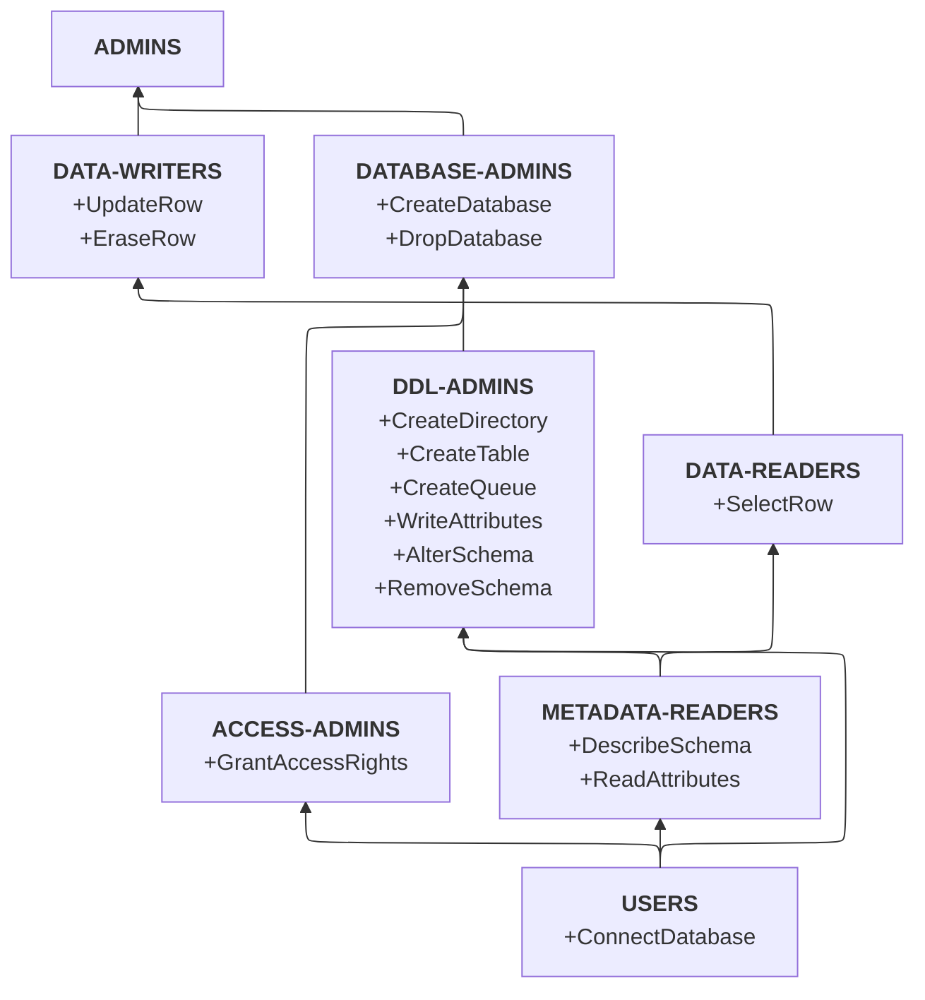

```mermaid
---
config:
  layout: elk
  elk:
    mergeEdges: true
    nodePlacementStrategy: NETWORK_SIMPLEX
---
graph BT

DATA-WRITERS & DATABASE-ADMINS --> ADMINS
DDL-ADMINS & ACCESS-ADMINS --> DATABASE-ADMINS
DATA-READERS --> DATA-WRITERS
METADATA-READERS --> DATA-READERS & DDL-ADMINS
%%USERS --> METADATA-READERS & DATA-READERS & DATA-WRITERS & DDL-ADMINS & ACCESS-ADMINS & DATABASE-ADMINS & ADMINS
USERS --> METADATA-READERS & DDL-ADMINS & ACCESS-ADMINS

    DATA-READERS["<b>DATA-READERS</b>
    +SelectRow"
    ]

    DATA-WRITERS["<b>DATA-WRITERS</b>
    +UpdateRow
    +EraseRow"
    ]

    METADATA-READERS["<b>METADATA-READERS</b>
    +DescribeSchema
    +ReadAttributes"
    ]

    DATABASE-ADMINS["<b>DATABASE-ADMINS</b>
    +CreateDatabase
    +DropDatabase"
    ]

    ACCESS-ADMINS["<b>ACCESS-ADMINS</b>
    +GrantAccessRights"
    ]

    DDL-ADMINS["<b>DDL-ADMINS</b>
    +CreateDirectory
    +CreateTable
    +CreateQueue
    +WriteAttributes
    +AlterSchema
    +RemoveSchema"
    ]

    USERS[<b>USERS</b>
    +ConnectDatabase
    ]
    ADMINS[<b>ADMINS</b>]
```

[//]: # (diplodoc support for mermaid lacks support for markdown in labels)
