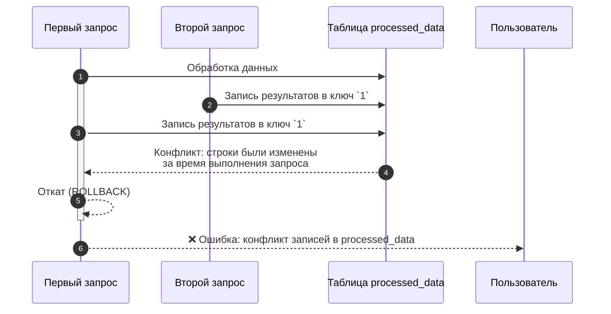
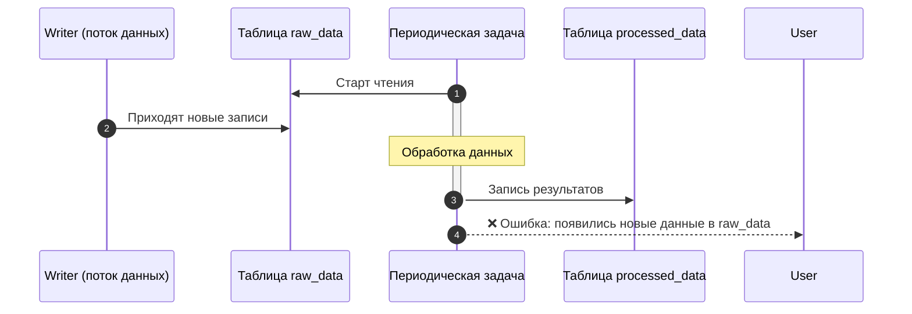

# Известные ограничения

В данном разделе собраны важные особенности {{ydb-short-name}}, которые необходимо учитывать при проектировании приложений и написании запросов. Для каждой особенности описывается текущее поведение и возможные способы обхода.

## Транзакции и изоляция

### Уровни изоляции транзакций

{{ydb-short-name}} поддерживает разные уровни изоляции для строковых (OLTP) и колоночных (OLAP) таблиц.

- [Строковые таблицы](../concepts/datamodel/table.md#row-oriented-tables). Поддерживают транзакции с уровнями изоляции [Serializable](../concepts/transactions.md#modes), `Online Read-Only` и другими. Это обеспечивает строгую консистентность для OLTP-нагрузок.

- [Колоночные таблицы](../concepts/datamodel/table.md#column-oriented-tables). Все операции выполняются в режиме `Serializable`. Это гарантирует, что любая аналитическая транзакция работает с консистентным срезом данных, как если бы в базе данных больше не происходило никаких изменений.

Далее рассматриваются особенности работы с режимом `Serializable` в контексте аналитических (OLAP) запросов.

### Особенности Serializable-изоляции при параллельной работе с данными

Уровень изоляции `Serializable` гарантирует отсутствие аномалий чтения, но накладывает определённые требования на проектирование ETL/ELT-пайплайнов. Конфликты возникают, если данные, которые транзакция прочитала или собирается изменить, были изменены другой, уже завершённой транзакцией.

#### Конфликт записи (Write-Write Conflict)

Две параллельные задачи пытаются записать данные в один и тот же диапазон ключей в выходной таблице. Первая задача, которая начала выполнение, но работает медленнее, будет отменена при попытке коммита, потому что вторая, более быстрая задача, уже успела изменить эти строки.



Варианты решения:

- **Партиционирование нагрузки:** разделите входные данные так, чтобы параллельные запросы записывали данные в разные таблицы или ключи. Например, обрабатывайте данные по дням или по идентификаторам пользователей в разных задачах;
- **Использование промежуточных таблиц:** каждая задача пишет результат в свою временную таблицу. После завершения всех задач данные из временных таблиц переносятся в итоговую таблицу одной транзакцией с помощью `INSERT INTO ... SELECT FROM`.

#### Конфликт чтения (Read-Write Conflict)

Длительный аналитический запрос читает данные из таблицы `raw_data`, в которую в это же время продолжается запись. К моменту, когда запрос завершает чтение и обработку, исходная таблица уже изменилась. {{ ydb-short-name }} обнаруживает это и отменяет запрос, чтобы гарантировать консистентность среза.



##### Решение

Использование промежуточных таблиц: Создайте временную таблицу с необходимыми данными и выполняйте дальнейшую обработку уже с ней. Это фиксирует состояние данных и исключает конфликты.

```sql
CREATE TABLE temp_snapshot AS SELECT * FROM raw_data WHERE ...;
-- Далее работаем только с temp_snapshot
INSERT INTO processed_data SELECT process(t.*) FROM temp_snapshot AS t;
```

### Модифицирующие запросы одновременно к колоночным и строковым таблицам запрещены

В рамках одной транзакции невозможно выполнять операции изменения данных (DML) одновременно и для строковых, и для колоночных таблиц.

#### Решение

Разделяйте логику на две последовательные транзакции. Сначала выполните операцию со строковой таблицей, а после ее успешного завершения — с колоночной (или наоборот, в зависимости от бизнес-логики).

## Особенности синтаксиса

### Common table expression (CTE) не поддерживаются

YQL не поддерживает синтаксис `WITH ... AS (CTE)`. Вместо этого используется механизм именованных выражений с помощью переменных, начинающихся со знака `$`.

#### Решение

Использование именованных выражений (named expressions). Это синтаксический аналог CTE, который позволяет декомпозировать сложные запросы.

Часть запроса можно выделить в отдельное выражение и дать ему имя, начинающейся с `$`, с помощью механизма именованных выражений. Такое выражение можно использовать несколько раз в рамках одного запроса. Поддерживается использование как для табличных, так и для скалярных выражений.

```sql
-- объявление параметра
DECLARE $days AS Int32;
$cutoff = CurrentUtcTimestamp() - $days * Interval("P1D"); -- создание скалярного именованного выражения

-- создание табличного именованного выражения
$base = (
  SELECT *
  FROM raw_events
  WHERE event_ts >= $cutoff -- использование скалярной переменной
);

-- использование именованного выражения
SELECT * FROM $base WHERE event_ts > CurrentUtcTimestamp()
```

{{ ydb-short-name }} гарантирует, что при многократном использовании именованного выражения в пределах одной транзакции будут прочитаны одни и те же данные. Это обеспечивается уровнем изоляции транзакций [Serializable](../concepts/transactions.md#modes).

### Отсутствие поддержки коррелированных подзапросов

Коррелированный подзапрос — это подзапрос, который ссылается на столбцы из внешнего запроса. В YQL такие подзапросы не поддерживаются.
Большинство случаев использования коррелированных подзапросов можно заменить с помощью `JOIN` и агрегатных функций.

#### EXISTS

Преобразование `EXISTS` → `INNER JOIN` с использованием `DISTINCT`.

Оригинальный запрос:

```sql
SELECT a.* FROM A a WHERE EXISTS (
  SELECT 1 FROM B b WHERE b.key = a.key AND b.flag = 1
);
```

##### Решение

```sql
$B_match = (
  SELECT key
  FROM B
  WHERE flag = 1
  GROUP BY key
);

SELECT DISTINCT a.*
FROM A AS a
JOIN $B_match AS b
ON b.key = a.key;
```

#### Подзапрос с агрегатом

Скалярный подзапрос с агрегатом → агрегирование + JOIN

Оригинальный запрос:

```sql
SELECT a.*, (SELECT MAX(ts) FROM B b WHERE b.user_id = a.user_id) AS last_ts
FROM A a;
```

##### Решение

```sql
$B_last = (
  SELECT user_id, MAX(ts) AS last_ts
  FROM B
  GROUP BY user_id
);

SELECT a.*, bl.last_ts
FROM A AS a
LEFT JOIN $B_last AS bl
ON bl.user_id = a.user_id;
```

#### NOT EXISTS

`NOT EXISTS` → анти-джойн

Оригинальный запрос

```sql
SELECT a.* FROM A a WHERE NOT EXISTS (
  SELECT 1 FROM B b WHERE b.key = a.key AND b.flag = 1
);
```

##### Решение

```sql
$B_keys = (SELECT DISTINCT key FROM B);

SELECT a.* FROM A AS a LEFT ONLY JOIN $B_keys AS b ON b.key = a.key;
```

### Поддержка только equi-JOIN (соединения по равенству)

Условия в JOIN могут содержать только оператор равенства (=). Соединения по неравенству (>, <, >=, <=, BETWEEN) не поддерживаются. Условие неравенства можно вынести в секцию WHERE после CROSS JOIN.



CROSS JOIN создает декартово произведение таблиц. Этот подход не рекомендуется для больших таблиц, так как он приводит к взрывному росту объема промежуточных данных и деградации производительности. Используйте его только в том случае, если одна из таблиц очень маленькая или обе таблицы были предварительно отфильтрованы до небольшого размера.



Оригинальный запрос:

```sql
SELECT e.event_id, e.user_id, e.ts
FROM events AS e
JOIN periods AS p
ON e.user_id = p.user_id
 AND e.ts >= p.start_ts
```

#### Решение

```sql
SELECT e.event_id, e.user_id, e.ts
FROM events AS e
CROSS JOIN periods AS p
WHERE e.user_id = p.user_id
  AND e.ts >= p.start_ts
```

## Импорт данных с помощью федеративных запросов

{{ydb-short-name}} поддерживает [федеративные запросы](../concepts/query_execution/federated_query/index.md) к внешним источникам данных (таким как ClickHouse, PostgreSQL и др.). Этот механизм предназначен для быстрой ad-hoc аналитики и объединения данных «на лету», но не является оптимальным инструментом для массовой и регулярной загрузки больших объёмов данных (ETL/ELT). При использовании федеративных запросов для импорта вы можете столкнуться с ограничениями по поддерживаемым типам данных и выполнению запросов.

### Решение

1. Выгрузите данные из вашей СУБД в один из открытых форматов (рекомендуется `CSV`) в бакет {{ objstorage-name }}. Используйте команду `INSERT INTO ... SELECT FROM` для чтения данных из внешней таблицы, связанной с вашим бакетом в {{ objstorage-name }}. Этот подход позволяет эффективно распараллелить чтение данных.
2. Для задач непрерывной репликации или построения сложных пайплайнов используйте стандартные инструменты индустрии, которые интегрируются с {{ydb-short-name }}:
    - Change Data Capture (CDC): инструменты вроде Debezium могут захватывать изменения из транзакционного лога вашей OLTP-базы и доставлять их в {{ydb-short-name}}.
    - ETL/ELT-фреймворки: системы, такие как Apache Spark или Apache NiFi, имеют коннекторы к {{ydb-short-name}} и позволяют строить гибкие и мощные пайплайны по обработке и загрузке данных.

Список ограничений:

- [ClickHouse](../concepts/query_execution/federated_query/clickhouse.md#ogranicheniya)
- [Greenplum](../concepts/query_execution/federated_query/greenplum.md#ogranicheniya)
- [Microsoft SQL Server](../concepts/query_execution/federated_query/ms_sql_server.md#ogranicheniya)
- [MySQL](../concepts/query_execution/federated_query/mysql.md#ogranicheniya)
- [PostgreSQL](../concepts/query_execution/federated_query/postgresql.md#ogranicheniya)
- [YDB](../concepts/query_execution/federated_query/ydb.md#ogranicheniya)

```sql
-- Параметры (для примера — как переменные)
DECLARE $yc_key    AS String;
DECLARE $yc_secret AS String;

-- 1) Внешний источник S3 с endpoint Yandex Cloud
CREATE EXTERNAL DATA SOURCE s3_backup_ds
WITH (
  SOURCE_TYPE = "S3",
  LOCATION    = "https://storage.yandexcloud.net",  -- endpoint YC
  AUTH_METHOD = "AWS",
  AWS_ACCESS_KEY_ID     = $yc_key,
  AWS_SECRET_ACCESS_KEY = $yc_secret
);

-- 2) Внешняя "таблица" (папка с CSV в бакете)
CREATE EXTERNAL TABLE s3_my_columnstore_table_backup
WITH (
  DATA_SOURCE = "s3_backup_ds",
  LOCATION    = "s3://my-bucket/ydb-backups/processed_data/full/",  -- путь в Object Storage
  FORMAT      = "CSV"
)(
  id Uint64,
  event_dt Datetime,
  value String
  -- ... остальные колонки вашей CS-таблицы ...
);

-- 3) Экспорт
INSERT INTO s3_my_columnstore_table_backup
SELECT * FROM my_columnstore_table;

-- 4) Восстановление данных
INSERT INTO my_columnstore_table
SELECT *
FROM s3_my_columnstore_table_backup;
```

## Число партиций фиксируется при создании

В {{ydb-short-name}} число партиций (сегментов данных) для колоночной таблицы задаётся один раз при её создании и не может быть изменено в дальнейшем.

Правильный выбор числа партиций — важный аспект проектирования схемы данных.

- Слишком мало партиций: может привести к неравномерной загрузке вычислительных узлов (hotspots) и ограничить параллелизм выполнения запросов.
- Слишком много партиций: может создать избыточную нагрузку на управляющий компонент базы данных (Scheme Shard) и увеличить накладные расходы на обработку запросов.

### Решение

- Начальное количество партиций: для базовой оценки числа партиций можно использовать формулу `(количество узлов * 4)`. Это позволит максимально утилизировать ресурсы кластера при выполнении параллельных запросов.
- Выбирайте число партиций с учётом ожидаемого роста объёма данных и увеличения количества узлов в кластере.
- Суммарное количество партиций во всех таблицах одной базы данных не должно превышать **2000**.
- Если необходимо увеличить число партиций, можно создать новую таблицу и перенести в неё данные с помощью запроса `CREATE TABLE (PRIMARY KEY (a, b)) PARTITION BY HASH(a) WITH(STORE=COLUMN, PARTITION_COUNT=96) new_table AS SELECT * FROM old_table;`.

## Отсутствуют вторичные индексы и скип-индексы

Производительность аналитических запросов при колоночном хранении данных достигается за счёт механизмов, основанных на физической организации данных: колоночное хранение, партиционирование, сортировка по первичному ключу.

### Решение

Уделите особое внимание ключам партиционирования и первичным ключам, как описано в разделе [{#T}](../dev/primary-key/column-oriented.md).

## Не рекомендуется смешивать OLTP и OLAP в одной базе

Нагрузки OLTP и OLAP предъявляют противоположные требования к ресурсам, и их смешивание почти всегда приводит к взаимной деградации производительности.

- OLTP-нагрузка (строковые таблицы) — это множество коротких, быстрых транзакций (чтение/запись по ключу), критичных к задержкам (latency).
- OLAP-нагрузка (колоночные таблицы) — как правило, длительные и ресурсоёмкие запросы, сканирующие большие объёмы данных, выполняющие агрегацию и активно потребляющие CPU, память и дисковый ввод-вывод.

Когда тяжёлый OLAP-запрос начинает выполняться, он может монополизировать ресурсы кластера, из-за чего быстрые OLTP-запросы встают в очередь, и их время отклика увеличивается.

Не рекомендуется совмещать OLTP- и OLAP-нагрузки в одной базе данных. OLAP-нагрузки могут негативно влиять на OLTP, увеличивая время выполнения запросов.

### Решение

Для обеспечения стабильной и предсказуемой производительности обоих контуров используйте две отдельные базы данных {{ ydb-short-name }}: одну для OLTP, другую для OLAP. Для синхронизации данных между ними используйте механизм Change Data Capture (CDC) и сервис [{#T}](../concepts/transfer.md), который позволяет в потоковом режиме доставлять изменения из OLTP-базы в OLAP-базу.

