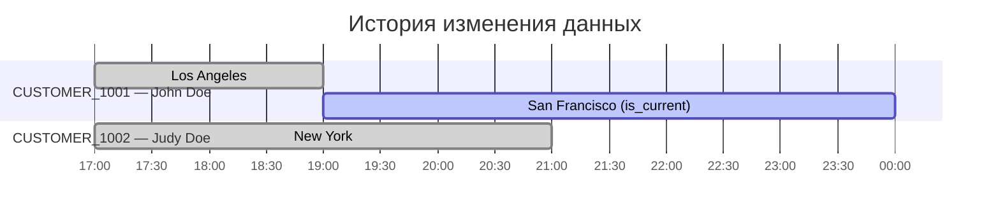

# Использование процесса подмерживания изменения для реализации SCD2 в {{ ydb-full-name }} 

В этой статье описывается реализация паттерна [Slowly Changing Dimensions Type 2 (SCD2)](./index.md#scd2) в {{ ydb-full-name }} с использованием процесса подмерживания изменений.

## Используемые инструменты

Для поставки данных в SCD2 таблицу в данной статье будет использоваться следующая комбинация из доступной в {{ ydb-short-name }} функциональности:

1. Таблица-источник `dimension_scd_changes`, содержащая информацию об атрибутах, их значениях и моментах изменений данных.
1. Таблица-приёмник `dimension_scd2_final` для хранения результирующих данных.
1. Периодически внешнее приложение должно вызывать запрос, который будет подмерживать изменения данных, накопившиеся в таблице `dimension_scd_changes`, в таблицу `dimension_scd2_final`.
1. Для поставки данных из строковых таблиц для хранения их в формате SCD2 удобно использовать встроенный в {{ydb-short-name}} механизм [трансфера](../../../concepts/transfer.md).



Таблицы `dimension_scd_changes`, `dimension_scd2_final` приведены для иллюстрации. Для реальных запросов вам нужно скорректировать структуру таблиц и их атрибутов.



## Создание таблицы для приёма всех изменений `dimension_scd_changes`

```sql
CREATE TABLE dimension_scd_changes (
    id Utf8 NOT NULL, -- Бизнес-ключ
    attribute1 Utf8,  -- Атрибут данных
    attribute2 Utf8,  -- Атрибут данных
    change_time Timestamp NOT NULL, -- Момент изменения данных
    operation Utf8, -- Тип изменений данных
    PRIMARY KEY (change_time, id)
)
WITH (
    STORE=COLUMN
)
```

Описание полей таблицы:

- `id` — бизнес-ключ записи;
- `attribute1`, `attribute2` — атрибуты измерения;
- `change_time` — момент времени изменения данных;
- `operation` — тип изменения данных: `CREATE`, `UPDATE`, `DELETE`.

Первичный ключ создается как `PRIMARY KEY (change_time, id)`, так как по одному и тому же бизнес-ключу данных может происходить множество изменений и все эти изменения по одному ключу важно сохранять.

## Создание финальной SCD2 таблицы `dimension_scd2_final`

```sql
CREATE TABLE dimension_scd2_final (
    id Utf8 NOT NULL, -- Бизнес-ключ данных
    attribute1 Utf8,  -- Атрибут данных
    attribute2 Utf8,  -- Атрибут данных
    valid_from Timestamp NOT NULL, -- Момент времени, с которого данные актуальны
    valid_to Timestamp,            -- Момент времени, до которого данные актуальны.
                                   -- Если данные актуальны прямо сейчас, то в valid_to находится NULL
    is_current Uint8,              -- Признак, что данные актуальны прямо сейчас.
    is_deleted Uint8,              -- Признак, что данные были удалены. Если данные были удалены, то is_current = FALSE
    PRIMARY KEY (valid_from, id)
)
PARTITION BY HASH(valid_from, id)
WITH(
    STORE=COLUMN
)
```

Описание полей таблицы:

- `id` — бизнес-ключ записи;
- `attribute1`, `attribute2` — атрибуты измерения;
- `valid_from` — момент времени, с которого запись становится актуальной;
- `valid_to` — момент времени, до которого запись была актуальной, или `NULL` для текущих записей;
- `is_current` — флаг, указывающий, является ли запись текущей (1 - текущая запись) или (0 - запись историческая);
- `is_deleted` — флаг, указывающий, была ли запись удалена (1 - запись была удалена) или (0 - запись не была удалена).

Первичный ключ создается как `PRIMARY KEY (valid_from, id)`, так как по одному и тому же ключу данных может происходить множество изменений и все эти изменения по одному ключу важно сохранять.

## Загрузка данных в таблицу изменений

Для загрузки данных в таблицу изменений можно использовать любой способ загрузки данных и автоматическую поставку изменений с помощью механизма [трансфер](../../../concepts/transfer.md).

Пример запроса для явной загрузки изменений:

```sql
UPSERT INTO dimension_scd_changes (id, attribute1, attribute2, change_time, operation)
VALUES ('CUSTOMER_1001', 'John Doe', 'Los Angeles', Unwrap(CAST('2025-08-22T17:00:00Z' as Timestamp)), 'CREATE');

UPSERT INTO dimension_scd_changes (id, attribute1, attribute2, change_time, operation)
VALUES ('CUSTOMER_1002', 'John Doe', 'New York', Unwrap(CAST('2025-08-22T17:00:00Z' as Timestamp)), 'CREATE');

UPSERT INTO dimension_scd_changes (id, attribute1, attribute2, change_time, operation)
VALUES ('CUSTOMER_1001', 'John Doe', 'San Francisco', Unwrap(CAST('2025-08-22T19:00:00Z' as Timestamp)), 'UPDATE');

UPSERT INTO dimension_scd_changes (id, attribute1, attribute2, change_time, operation)
VALUES ('CUSTOMER_1002', 'John Doe', 'New York', Unwrap(CAST('2025-08-22T21:00:00Z' as Timestamp)), 'DELETE');
```


## Запрос для размещения изменений в формате SCD2

Для преобразования данных из таблицы изменений в формат SCD2 и загрузки в финальную таблицу используется следующий запрос:

```sql
-- Шаг 1: Читаем все новые события из таблицы `dimension_scd_changes`.
-- Это именованное выражение ($changes) является исходным набором данных для всей последующей обработки в рамках этого запуска.
$changes = (
    SELECT
        id,
        attribute1,
        attribute2,
        change_time,
        String::AsciiToUpper(operation) AS op
    FROM dimension_scd_changes
);

-- Шаг 2: Фильтруем события, оставляя только те, которых еще нет в целевой таблице.
-- Цель этого шага - обеспечить идемпотентность на уровне чтения, чтобы не обрабатывать
-- уже загруженные данные в случае сбоя и перезапуска скрипта.
$unprocessed_data = (
    SELECT
        chg.id AS id,
        chg.attribute1 AS attribute1,
        chg.attribute2 AS attribute2,
        chg.change_time AS change_time,
        chg.op AS op
    FROM $changes AS chg
    LEFT JOIN dimension_scd2_final AS scd
        ON chg.id = scd.id AND chg.change_time = scd.valid_from -- Ищем записи по каждой сущности (id) и времени изменения
    WHERE scd.id IS NULL -- для исключения строк, которые уже были перенесены в таблицу dimension_scd2_final ранее
);

-- Шаг 3: Находим в целевой таблице активные записи (`is_current=1`), для которых пришли обновления.
-- Формируем для них "закрывающие" версии, устанавливая `valid_to` равным времени
-- самого первого изменения из новой пачки ($unprocessed_data).
$close_open_intervals = (
    SELECT
        target.id AS id,
        target.attribute1 as attribute1,
        target.attribute2 as attribute2,
        target.valid_from as valid_from,
        0ut AS is_current, -- Закрываемая запись больше не является текущей
        unprocessed_data.change_time AS valid_to,
        target.is_deleted as is_deleted
    FROM dimension_scd2_final AS target
    INNER JOIN (
        SELECT
            id,
            MIN(change_time) AS change_time
        FROM $unprocessed_data
        GROUP BY id
    ) AS unprocessed_data
    ON target.id = unprocessed_data.id
    WHERE target.is_current = 1ut
);

-- Шаг 4: Преобразуем поток необработанных событий в версионные записи (строки для вставки).
-- Здесь вычисляются все необходимые атрибуты для новых версий: `valid_to`, `is_current`, `is_deleted`.
$updated_data = (
    SELECT
        t.id AS id,
        t.attribute1 AS attribute1,
        t.attribute2 AS attribute2,
        t.is_deleted AS is_deleted,
        -- Логика флага `is_current`: он устанавливается в 1 только для последней
        -- записи в цепочке (`next_change_time IS NULL`), и только если это не
        -- операция удаления (`is_deleted == 0`).
        IF(t.next_change_time IS NOT NULL OR t.is_deleted == 1ut, 0ut, 1ut) AS is_current,
        t.change_time AS valid_from,
        t.next_change_time AS valid_to
    FROM (
        -- Подзапрос вычисляет для каждой строки флаг удаления (`is_deleted`)
        -- и временную метку следующего события (`next_change_time`) с помощью оконной функции LEAD.
        SELECT
            unprocessed_data.id AS id,
            unprocessed_data.attribute1 AS attribute1,
            unprocessed_data.attribute2 AS attribute2,
            unprocessed_data.op AS op,
            unprocessed_data.change_time AS change_time,
            IF(unprocessed_data.op = "DELETE", 1ut, 0ut) AS is_deleted,
            LEAD(unprocessed_data.change_time) OVER (PARTITION BY id ORDER BY unprocessed_data.change_time) AS next_change_time
        FROM $unprocessed_data AS unprocessed_data
    ) AS t
);

-- Шаг 5: Атомарно применяем все рассчитанные изменения к целевой таблице.
-- UPSERT обновит существующие записи (из $close_open_intervals) и вставит новые (из $updated_data).
UPSERT INTO dimension_scd2_final (id, attribute1, attribute2, is_current, is_deleted, valid_from, valid_to)
SELECT
    id,
    attribute1,
    attribute2,
    is_current,
    is_deleted,
    valid_from,
    valid_to
FROM $close_open_intervals
UNION ALL
SELECT
    id,
    attribute1,
    attribute2,
    is_current,
    is_deleted,
    valid_from,
    valid_to
FROM $updated_data;

-- Шаг 6: Очищает стейджинг-таблицу от обработанных записей.
DELETE FROM dimension_scd_changes ON
SELECT id, change_time FROM $changes;
```

## Демонстрация работы

В примере ниже рассматривается сущность **Customer**:

- бизнес-ключ — поле `id`,
- атрибуты — `attribute1` (полное имя) и `attribute2` (город).

В момент времени `2025-08-22 17:00` создаются два клиента (John в Los Angeles и Judy в New York), в момент времени `2025-08-22 19:00` клиент `CUSTOMER_1001` меняет город на San Francisco `UPDATE`, а в момент `2025-08-22 21:00` клиент `CUSTOMER_1002` удаляется `DELETE`.

| id             | attribute1 | attribute2    | change\_time     | operation |
| -------------- | ---------- | ------------- | ---------------- | --------- |
| CUSTOMER\_1001 | John Doe   | Los Angeles   | 2025-08-22 17:00 | CREATE    |
| CUSTOMER\_1002 | Judy Doe   | New York      | 2025-08-22 17:00 | CREATE    |
| CUSTOMER\_1001 | John Doe   | San Francisco | 2025-08-22 19:00 | UPDATE    |
| CUSTOMER\_1002 | Judy Doe   | New York      | 2025-08-22 21:00 | DELETE    |

Процесс SCD2 превращает эти события в версионные интервальные записи **\[valid\_from, valid\_to)**: у `CUSTOMER_1001` образуются две последовательные версии (LA → SF, текущая с `valid_to = NULL`), у `CUSTOMER_1002` — историческая версия и финальная «тумбстоун»-запись с `is_deleted=1` и `is_current=0`.

Ниже показаны исходные события и соответствующие им версии в финальной таблице.



| id             | attribute1 | attribute2    | valid\_from      | valid\_to        | is\_current | is\_deleted |
| -------------- | ---------- | ------------- | ---------------- | ---------------- | ----------- | ----------- |
| CUSTOMER\_1001 | John Doe   | Los Angeles   | 2025-08-22 17:00 | 2025-08-22 19:00 | 0           | 0           |
| CUSTOMER\_1001 | John Doe   | San Francisco | 2025-08-22 19:00 | NULL             | 1           | 0           |
| CUSTOMER\_1002 | Judy Doe   | New York      | 2025-08-22 17:00 | 2025-08-22 21:00 | 0           | 0           |
| CUSTOMER\_1002 | Judy Doe   | New York      | 2025-08-22 21:00 | NULL             | 0           | 1           |


## Получение данных из SCD2-таблицы

### Получение актуальных данных

```sql
SELECT
    id,
    attribute1,
    attribute2,
    valid_from,
    valid_to
FROM dimension_scd2_final
WHERE is_current = 1ut;
```

Результат:

| id             | attribute1 | attribute2    | valid\_from      | valid\_to        | is\_current | is\_deleted |
| -------------- | ---------- | ------------- | ---------------- | ---------------- | ----------- | ----------- |
| CUSTOMER\_1001 | John Doe   | San Francisco | 2025-08-22 19:00 | NULL             | 1           | 0           |


### Получение данных на определённый момент времени

```sql
DECLARE $as_of AS Timestamp;
$as_of = Timestamp("2025-08-22T19:11:30.000000Z");

SELECT
    id,
    attribute1,
    attribute2,
    valid_from,
    valid_to
FROM dimension_scd2_final
WHERE valid_from <= $as_of
    AND (valid_to IS NULL OR valid_to > $as_of) -- Получаем записи, которые действовали в $as_of момент времени
    AND is_deleted = 0ut -- Только записи, которые не удалены
```

Результат:

| id             | attribute1 | attribute2    | valid\_from      | valid\_to        |
| -------------- | ---------- | ------------- | ---------------- | ---------------- |
| CUSTOMER\_1001 | John Doe   | San Francisco | 2025-08-22 19:00 | NULL             |
| CUSTOMER\_1002 | Judy Doe   | New York      | 2025-08-22 17:00 | 2025-08-22 21:00 |


### Получение истории изменений для конкретной записи

```sql
SELECT
    id,
    attribute1,
    attribute2,
    valid_from,
    valid_to,
    is_current,
    is_deleted
FROM dimension_scd2_final
WHERE id = 'CUSTOMER_1001'
ORDER BY valid_from;
```

Результат:

| id             | attribute1 | attribute2    | valid\_from      | valid\_to        | is\_current | is\_deleted |
| -------------- | ---------- | ------------- | ---------------- | ---------------- | ----------- | ----------- |
| CUSTOMER\_1001 | John Doe   | Los Angeles   | 2025-08-22 17:00 | 2025-08-22 19:00 | 0           | 0           |
| CUSTOMER\_1001 | John Doe   | San Francisco | 2025-08-22 19:00 | NULL             | 1           | 0           |
