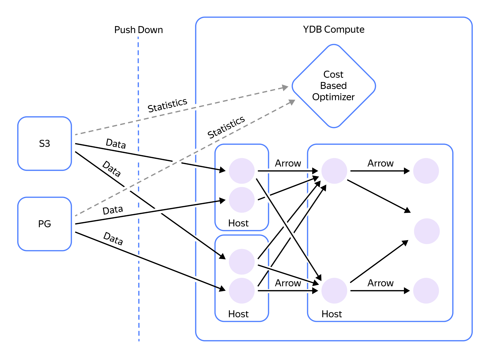

# Федеративные запросы

[Федеративные запросы](../../query_execution/federated_query/index.md) — это возможность выполнять запросы к данным, хранящимся во внешних системах, без их предварительной загрузки (ETL) в {{ydb-short-name}}. Наиболее популярный сценарий — работа с данными в объектных хранилищах, совместимых с S3.

## Как это работает

Вы можете создать во {{ydb-short-name}} [внешнюю таблицу](../../../concepts/datamodel/external_table.md), которая ссылается на данные в S3. При выполнении запроса `SELECT` к такой таблице {{ydb-short-name}} инициирует параллельное чтение данных со всех вычислительных узлов. Каждый узел считывает и обрабатывает только ту часть данных, которая ему необходима.

- Поддерживаемые форматы: [Parquet, CSV, JSON](../../query_execution/federated_query/s3/formats.md) с [различными алгоритмами сжатия](../../query_execution/federated_query/s3/formats.md#compression).
- Оптимизация чтения: {{ydb-short-name}} использует механизмы оптимизации чтения данных из S3 (partition pruning) для [Hive-размещения данных](../../query_execution/federated_query/s3/partitioning.md#podderzhivaemye-formaty-putej-hraneniya) и для [более сложных алгоритмов размещения](../../query_execution/federated_query/s3/partition_projection.md).

{width=600}
