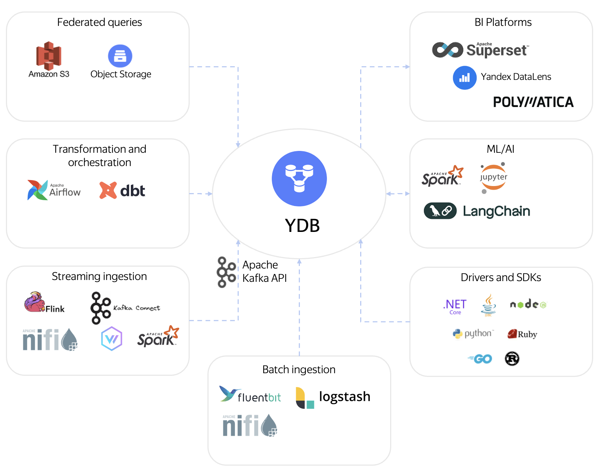

# Обзор

{{ ydb-short-name }} — это распределённая отказоустойчивая база данных, которая предоставляет компоненты для построения корпоративного хранилища данных (КХД) на единой платформе.

Использование {{ydb-short-name}} позволяет консолидировать функциональность нескольких технологий (например, отдельных систем для потоковой обработки, хранения и аналитики) в одном решении. Вы можете использовать привычные инструменты и подходы, получая при этом свойства распределённой системы.

## Ввод данных {#ingest}

Платформа спроектирована для приёма потоковых и пакетных данных в больших объёмах.

- Потоковая обработка: встроенная система топиков с поддержкой Kafka API для интеграции с существующими системами. Для сбора логов доступны плагины к [Fluent Bit](../../integrations/ingestion/fluent-bit.md) и [Logstash](../../integrations/ingestion/logstash.md).
- Пакетная загрузка: API [BulkUpsert](../../recipes/ydb-sdk/bulk-upsert.md) для быстрой загрузки массивов данных и коннектор к Apache Spark для интеграции с платформами обработки данных.
- Подключение через стандартные интерфейсы: [JDBC-драйвер](../../reference/languages-and-apis/jdbc-driver/index.md) и нативные [SDK](../../recipes/ydb-sdk/index.md).

[Подробнее о вводе данных](concepts/ingest.md)

## Хранение данных {#store}

Основа хранилища — [колоночные таблицы](../../concepts/datamodel/table.md#column-oriented-tables) со встроенным сжатием, оптимизированные для аналитических нагрузок.

- Разделение хранения и вычислений: ключевое свойство {{ydb-short-name}}, позволяющее независимо масштабировать дисковое пространство и вычислительные мощности.
- Минимизация администрирования: фоновые процессы уплотнения (compaction) и удаления данных по TTL уменьшают количество ручных операций.

[Подробнее о хранении данных](concepts/store.md)

## Выполнение запросов {#execution}

{{ydb-short-name}} — это MPP-СУБД (Massively Parallel Processing) без выделенного мастер-узла. Узлы выполняют одинаковые роли, и система масштабируется горизонтально за счёт динамического добавления или удаления вычислительных ресурсов.

- Стоимостной оптимизатор (cost-based optimizer, CBO): выбирает план выполнения для запросов, анализируя статистику по данным.
- Механизм сброса на диск (spilling): позволяет выполнять запросы, промежуточные результаты которых не помещаются в оперативную память.
- Workload Manager: управляет распределением ресурсов между запросами, изолируя разные типы нагрузки.

[Подробнее о выполнении запросов](concepts/execution.md)

## Трансформация данных {#transformation}

Поддерживается трансформация данных с использованием стандартных подходов и инструментов.

- ELT на SQL: используйте `INSERT INTO ... SELECT` для построения витрин. Для управления сложными SQL-пайплайнами есть интеграция с [dbt](../../integrations/migration/dbt.md).
- ETL на Apache Spark: запускайте ETL-задания на Apache Spark с помощью [параллельного коннектора](../../integrations/ingestion/spark.md).
- Оркестрация: автоматизируйте пайплайны с помощью [Apache Airflow](../../integrations/orchestration/airflow.md).

[Подробнее о трансформации данных](concepts/etl.md)

## Федеративные запросы {#federated}

{{ydb-short-name}} позволяет выполнять запросы к данным в S3-совместимых хранилищах без их предварительной загрузки. Это упрощает работу с данными, хранящимися в озере данных (data lake).

[Подробнее о федеративных запросах](concepts/federated.md)

## Анализ и визуализация (BI и ML) {#bi-ml}

Для анализа данных можно использовать стандартные инструменты индустрии:

- BI-инструменты: [Yandex DataLens](../../integrations/visualization/datalens.md), [Apache Superset](../../integrations/visualization/superset.md), [Grafana](../../integrations/visualization/grafana.md), [Polymatica](https://wiki.polymatica.ru/display/PDTNUG1343/YDB+Server).
- ML-инструменты: используйте [Jupyter Notebook](../../integrations/gui/jupyter.md) и [Apache Spark](../../integrations/ingestion/spark.md) для подготовки данных и обучения моделей машинного обучения.

[Подробнее о BI](concepts/bi.md); [Подробнее о ML](concepts/ml.md)
