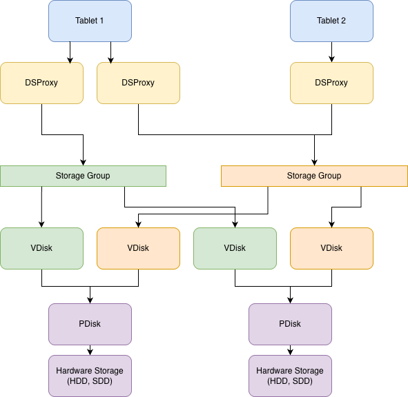

# Архитектурный обзор {{ ydb-short-name }}

## Введение

{{ ydb-short-name }} — это горизонтально масштабируемая, распределённая и отказоустойчивая универсальная система управления базами данных (СУБД), разработанная для обеспечения высокой производительности: например, типичный узел кластера способен обрабатывать десятки тысяч запросов в секунду. Система поддерживает геораспределённые (кросс-датацентровые) конфигурации — от небольших кластеров с несколькими узлами до кластеров из тысяч серверов, способных эффективно обрабатывать сотни петабайт данных.

### Ключевые особенности и возможности {{ ydb-short-name }}

- **Горизонтальное масштабирование и автоматическое партицирование**: данные и нагрузка распределяются динамически при росте объёма или интенсивности запросов.
- **Отказоустойчивость**: автоматическое восстановление при сбоях узлов, стоек и зон доступности.
- **Высокая доступность и сохранность данных**: обеспечивается с помощью автоматической синхронной репликации данных в пределах кластера.
- **Строгая консистентность и поддержка ACID-транзакций**: система обеспечивает [распределённые транзакции](transactions.md) с уровнем изоляции *serializable*. При необходимости уровень изоляции и строгость согласованности могут быть ослаблены для повышения производительности.
- [**Язык запросов YQL**](../yql/reference/index.md) — SQL-диалект, оптимизированный для больших данных и сложных сценариев обработки.
- **Реляционная модель данных** с поддержкой [строковых](datamodel/table.md#row-tables) и [колоночных](datamodel/table.md#column-tables) таблиц, что делает возможным эффективное использование {{ ydb-short-name }} как для транзакционных (OLTP), так и для аналитических (OLAP) нагрузок.
- **Иерархия объектов**: таблицы, топики и другие [объекты](datamodel/index.md) организуются в иерархическое [пространство имён](datamodel/cluster-namespace.md), аналогично файловой системе.
- [**Асинхронная репликация**](async-replication.md): возможность настроить синхронизацию данных между базами {{ ydb-short-name }} почти в реальном времени — как внутри одного кластера, так и между разными.
- **Потоковая обработка и распространение данных**:
  - [**Топики**](datamodel/topic.md) — хранение и потоковая доставка неструктурированных сообщений множеству подписчиков; поддерживают, в том числе, работу по протоколу [Kafka](../reference/kafka-api/index.md).
  - [**Change Data Capture (CDC)**](cdc.md) — встроенная поддержка потокового чтения изменений данных из таблиц.
  - [**Трансферы**](transfer.md) — автоматическая доставка данных из топиков в таблицы.
- [**Федеративные запросы**](query_execution/federated_query/index.md) — выполнение запросов к внешним источникам данных (например, S3) в составе YQL-запросов без предварительной загрузки внешних данных в базу данных {{ ydb-short-name }}.
- [**Векторные индексы**](query_execution/vector_search.md) — поддержка хранения и поиска по векторным представлениям данных для задач семантического поиска, сходства и ML-сценариев.
- [**Наблюдаемость**](../reference/observability/index.md) — встроенная поддержка метрик, логов и дашбордов.
- **Безопасность и аудит** — шифрование данных (at-rest и in-transit), аудит операций, поддержка аутентификации и авторизации; подробнее — в разделе [Безопасность](../security/index.md).
- **Инструменты взаимодействия и интеграции** — доступны [{{ ydb-short-name }} CLI](../reference/ydb-cli/index.md) для администрирования и отладки, а также [SDK](../reference/ydb-sdk/index.md) для C++, C#, Go, Java, Node.js, PHP, Python и Rust; поддерживается интеграция с внешними системами; подробнее — в разделах [{#T}](../integrations/index.md) и [{#T}](../reference/languages-and-apis/index.md).
- **Открытая архитектура**: [исходный код](https://github.com/ydb-platform/ydb) доступен под [Apache License 2.0](https://www.apache.org/licenses/LICENSE-2.0), взаимодействие с системой производится через открытый протокол [gRPC](https://grpc.io/), что позволяет реализовывать клиенты на любом языке программирования.

### Основные сценарии применения

{{ ydb-short-name }} — это универсальная платформа, подходящая для широкого спектра задач, где требуются масштабируемость, надёжность и гибкость. Основные сценарии:

- В распределённых системах, где требуется **строгая консистентность или поддержка транзакций**, включая изменение данных в нескольких строках и таблицах. {{ ydb-short-name }} сочетает масштабируемость, характерную для NoSQL-систем, с возможностями реляционной СУБД по управлению согласованностью и целостностью данных.
- В системах, требующих хранения и обработки **очень большого объёма данных** с возможностью практически неограниченного горизонтального масштабирования (в эксплуатации находятся промышленные кластеры более чем из 5000 узлов, обрабатывающие нагрузку в миллионы запросов в секунду и хранящие петабайты данных).
- В высоконагруженных системах, где применяется **ручное шардирование** реляционных баз данных для распределения нагрузки. {{ ydb-short-name }} упрощает архитектуру, устраняя необходимость в сложных шаблонах шардирования и ручной оркестрации.
- При разработке новых продуктов, для которых отсутствует надёжный прогноз нагрузки, или ожидается масштаб, превышающий возможности традиционных реляционных СУБД.
- В проектах, где требуется **гибкая платформа**, способная поддерживать разнообразные типы рабочих нагрузок и сценариев, включая транзакционные, потоковые и аналитические.

## Как это работает?

Полное объяснение того, как работает {{ ydb-short-name }}, получилось бы слишком объемным. Ниже вы можете ознакомиться с несколькими основными моментами, а затем продолжить изучение документации, чтобы узнать больше.

### Архитектура {{ ydb-short-name }} {#ydb-architecture}

Кластеры {{ ydb-short-name }} обычно работают с shared nothing архитектурой на обычном оборудовании. Уровни вычислений и хранения являются разнёсенными. Они могут работать как на отдельных наборах узлов, так и быть совмещёнными.

Один из ключевых элементов вычислительного слоя {{ ydb-short-name }} называется *таблеткой*. Они являются логическими компонентами с состоянием, реализующими различные аспекты {{ ydb-short-name }}.

 

Более подробная общая архитектура {{ ydb-short-name }} объясняется в разделе [{#T}](../contributor/general-schema.md).



### Иерархия {#ydb-hierarchy}

С точки зрения пользователя, всё внутри {{ ydb-short-name }} организовано в иерархической структуре с использованием каталогов. Она может иметь произвольную глубину в зависимости от того, как вы решили организовать свои данные и проекты. Хотя {{ ydb-short-name }} не имеет фиксированной глубины иерархии, как в других реализациях SQL, она все равно будет знакома, поскольку именно так выглядит любая виртуальная файловая система.

### Таблица

{{ ydb-short-name}} предоставляет пользователям хорошо известную абстракцию — таблицы. В {{ ydb-short-name }} существует два основных типа таблиц:

* [Строковые таблицы](datamodel/table.md#row-tables) предназначены для OLTP-нагрузок.
* [Колоночные таблицы](datamodel/table.md#column-tables) предназначены для OLAP-нагрузок.

Логически, с точки зрения пользователя, оба вида таблиц выглядят одинаково. Основное отличие между строковыми и колоночными таблицами заключается в способе хранения данных. В строковых таблицах значения всех колонок каждой строки располагаются рядом, а в колоночных таблицах — наоборот, каждая колонка хранится отдельно, и рядом оказываются ячейки, относящиеся к разным строкам.

Независимо от типа таблицы, она должна содержать первичный ключ. В первичном ключе колоночных таблиц можно использовать только колонки с `NOT NULL`. Данные в таблицах физически сортируются по первичному ключу. Строковые таблицы автоматически партицируются по диапазонам первичных ключей в зависимости от объёма данных, а данные в колоночных таблицах партицируются не по первичному ключу, а по хешу от колонок партицирования. Каждый диапазон первичных ключей таблицы обрабатывается определённой [таблеткой](glossary.md#tablet), называемой *data shard* для строчных таблиц и *column shard* — для колоночных.

#### Разделение по нагрузке

Data shard автоматически разделяются на большее количество при увеличении нагрузки. Они автоматически объединяются в нужное количество, когда пиковая нагрузка уходит.

#### Разделение по размеру

.png)

Data shard также автоматически разделяются при увеличении размера данных. Они автоматически сливаются обратно, если достаточное количество данных будет удалено.

### Автоматическая балансировка

{{ ydb-short-name }} равномерно распределяет таблетки среди доступных узлов. Она перемещает тяжело загруженные таблетки с перегруженных узлов. Метрики CPU, памяти и сети отслеживаются для облегчения этого процесса.

### Внутреннее устройство распределенного хранилища

{{ ydb-short-name }} не полагается на сторонние файловые системы. Вместо этого она работает непосредственно с дисковыми накопителями как с блочными устройствами. Поддерживаются различные типы дисков: NVMe, SSD и HDD — подробнее об этом можно узнать в [системных требованиях](../devops/concepts/system-requirements.md). За работу с конкретным блочным устройством отвечает компонент [PDisk](./glossary.md#pdisk), который взаимодействует непосредственно с физическим диском. Уровень абстракции выше PDisk называется [VDisk](./glossary.md#vdisk).

Между VDisk и компонентами, непосредственно работающими с данными приложений, существует еще один слой абстракции — [Storage Group](./glossary.md#storage-group). Storage Group объединяет несколько VDisk'ов между собой и обеспечивает необходимые [режимы записи данных](./topology.md#cluster-config) для отказоустойчивости.

Входной точкой в распределённое хранилище является [DS-Proxy](./glossary.md#ds-proxy) (distributed storage proxy). DS-Proxy скрывает распределённую природу хранилища и позволяет таблеткам записывать и читать данные, не заботясь о деталях взаимодействия с VDisk и Storage Group.

### Прокси распределенного хранилища (DSProxy)

Геораспределенная и отказоустойчивая конфигурация {{ ydb-short-name }} обычно охватывает 3 датацентра или зоны доступности (Availability Zone - AZ). Когда {{ ydb-short-name }} записывает данные на 3 зоны доступности, он не отправляет запросы на явно некорректные диски и продолжает работать без прерываний даже если одна зона доступности и диск в другой зоне доступности потеряны.



### Управление ресурсами баз данных {#db-resources}

По умолчанию выделяемые каждой базе данных вычислительные ресурсы используются всеми запросами к ней на равных условиях, без каких-либо ограничений. Если требуется разделить ресурсы внутри одной базы данных, то в {{ ydb-short-name }} существуют [пулы ресурсов](glossary.md#resource-pool) и [классификаторы пулов ресурсов](glossary.md#resource-pool-classifier). Один из типовых сценариев применения такой функциональности — это разделение контуров онлайн-вычислений и фоновой аналитики. Подробнее о ней можно узнать в статье [{#T}](../dev/resource-consumption-management.md).



## Что дальше?

Если вас интересует более подробная информация о различных аспектах {{ ydb-short-name }}, ознакомьтесь с соседними статьями в данном разделе документации. Если вы готовы к более практическому контенту, вы можете перейти к [быстрому старту](../quickstart.md) или курсу по [YQL](../dev/yql-tutorial/index.md).