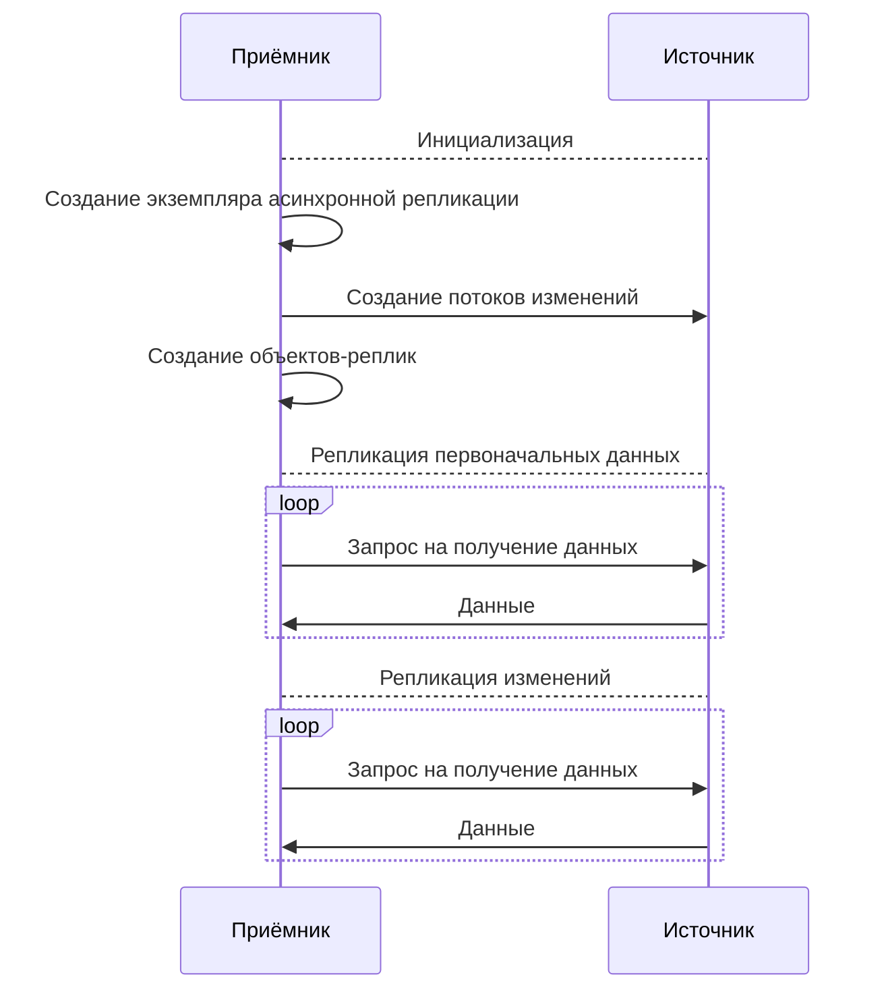

# Асинхронная репликация

Асинхронная репликация позволяет синхронизировать данные между [базами данных](glossary.md#database) {{ ydb-short-name }} почти в реальном времени. Также она может быть использована для миграции данных между базами данных с минимальным простоем работающих с ними приложений. Базы данных могут располагаться как в одном [кластере](glossary.md#cluster) {{ ydb-short-name }}, так и на разных.

## Принцип работы {#how-it-works}

Асинхронная репликация реализована поверх [Change Data Capture](cdc.md) и оперирует логическими данными. Схема процесса репликации:

Как следует из схемы выше, в асинхронной репликации участвуют две базы:

1. **Источник** — база данных с исходными [объектами](glossary.md#replicated-object).
2. **Приёмник** — база данных, в которой будут созданы [экземпляр асинхронной репликации](glossary.md#async-replication-instance) и [объекты-реплики](glossary.md#replica-object).

Процесс асинхронной репликации состоит из следующих стадий:

* [Инициализация](#init).
* [Репликация первоначальных данных](#initial-scan).
* [Репликация изменений](#replication-of-changes).

### Инициализация {#init}

Инициализация асинхронной репликации состоит из:

* Создания экземпляра асинхронной репликации в приемнике с помощью выражения [CREATE ASYNC REPLICATION](../yql/reference/syntax/create-async-replication.md).
* Установки соединения с источником. Для соединения с источником приемник использует [параметры подключения](../yql/reference/syntax/create-async-replication.md#params), указанные при создании экземпляра асинхронной репликации.



Пользователь, от имени которого производится подключение к источнику, должен обладать следующими [правами](../security/short-access-control-notation.md#access-rights):

* просмотр объектов схемы и содержимого каталогов;
* создание, изменение, удаление и чтение потоков изменений.



* Для заданного набора исходных объектов автоматически создаются:
  * [потоки изменений](glossary.md#changefeed) (в источнике);
  * [объекты-реплики](glossary.md#replica-object) (в приемнике).



Объекты-реплики создаются от имени пользователя, создавшего экземпляр асинхронной репликации.



### Репликация первоначальных данных {#initial-scan}

Первоначальные данные исходных таблиц отгружаются в потоки изменений с использованием [первоначального сканирования](cdc.md#initial-scan). В это время в приемнике запускаются [читатели](topic.md#consumer), которые записывают прочитанные данные в объекты-реплики.

Прогресс репликации первоначальных данных можно получить из [описания](../reference/ydb-cli/commands/scheme-describe.md) экземпляра асинхронной репликации.

### Репликация изменений {#replication-of-changes}

После завершения первоначального сканирования читатели получают только данные об изменениях и записывают их в объекты-реплики.

Для каждого изменения известно *время его возникновения* ($created\_at$). В то же время читатели отслеживают *время получения* изменения ($received\_at$). Таким образом, *отставание репликации* может быть вычислено по формуле:

$$
replication\_lag = received\_at - created\_at
$$

Отставание репликации также можно получить из [описания](../reference/ydb-cli/commands/scheme-describe.md) экземпляра асинхронной репликации.

## Ограничения {#restrictions}

* Набор исходных объектов задается при создании экземпляра асинхронной репликации и не может быть изменен.
* В качестве исходных объектов поддерживаются:

  * [строковые таблицы](datamodel/table.md#row-oriented-tables);
  * [директории](datamodel/dir.md) — будут реплицироваться все строковые таблицы, содержащиеся в них (включая содержимое поддиректорий) на момент создания экземпляра асинхронной репликации.

* Во время работы асинхронной репликации в исходных таблицах блокируется возможность [изменения состава столбцов](../yql/reference/syntax/alter_table/columns.md).
* Во время работы асинхронной репликации объекты-реплики доступны только для чтения.

## Обработка ошибок в процессе асинхронной репликации {#error-handling}

В процессе асинхронной репликации возможно возникновение разных классов ошибок:

* **Временные сбои**. Например, транспортные ошибки, перегрузка системы и т.д. Запросы будут повторяться до успешного выполнения.
* **Критичные ошибки**. Например, ошибки прав доступа, ошибки схемы и т.д. Процесс репликации будет остановлен, и в [описании](../reference/ydb-cli/commands/scheme-describe.md) экземпляра репликации будет указан текст ошибки.



На данный момент остановленный из-за критичной ошибки процесс асинхронной репликации не может быть перезапущен. Его нужно [удалить](../yql/reference/syntax/drop-async-replication.md) и [создать](../yql/reference/syntax/create-async-replication.md) заново.



Подробнее про классы ошибок и политики их обработки см. в разделе [Обработка ошибок](../reference/ydb-sdk/error_handling.md).

## Уровни согласованности реплицируемых данных {#consistency-levels}

### Согласованность данных уровня строк {#consistency-level-row}

Механизм Change Data Capture, используемый для асинхронной репликации, [гарантирует](cdc.md#guarantees), что изменения по одному и тому же [первичному ключу](datamodel/table.md) доставляются в том же порядке, в котором они происходили в источнике. Таким образом обеспечивается согласованность данных уровня строк.

Данные, записанные в объекты-реплики в этом режиме, сразу становятся доступными для чтения.

### Глобальная согласованность данных {#consistency-level-global}

При выполнении [транзакций](transactions.md) в источнике могут быть атомарно изменены несколько строк таблицы или, более того, строки в разных партициях таблиц(ы). Глобальная согласованность данных в приемнике подразумевает сохранение свойства атомарности — изменения "проявляются" (становятся доступными для чтения) согласованно.

Для обеспечения глобальной согласованности данных необходимо создавать потоки изменений с включенными [барьерами](cdc.md#barriers). Между барьерами данные буферизируются непосредственно на партициях объектов-реплик. При получении очередной порции барьеров от всех топиков записанные изменения фиксируются и становятся доступными для чтения. При этом данные в приемнике оказываются согласованными на момент времени, указанном в барьере. Если считать, что в источнике барьеры создаются каждые 10 секунд (значение по умолчанию), то в нормальном режиме приемник коммитит и публикует набор изменений от источника также каждые 10 секунд.

#### Периодичность фиксации изменений {#commit-interval}

По умолчанию изменения фиксируются (коммитятся) не чаще, чем раз в 10 секунд. Периодичность фиксации изменений можно переопределить, указав опцию [COMMIT_INTERVAL](../yql/reference/syntax/create-async-replication.md#params) при создании экземпляра асинхронной репликации.



Периодичность фиксации изменений напрямую влияет на периодичность выгрузки барьеров в потоки изменений — значения параметров синхронизированы. Таким образом, обычно, изменения фиксируются с той же частотой, с которой в потоках изменений появляются барьеры. Однако, в некоторых случаях, например, в случае неравномерной нагрузки между таблицами, барьеры в потоках изменений могут появляться с существенной разницей во времени, что приведёт к увеличению периодичности фиксации изменений. Отставание можно получить из [описания](../reference/ydb-cli/commands/scheme-describe.md) экземпляра асинхронной репликации.



## Завершение асинхронной репликации {#done}

Завершение асинхронной репликации может быть конечной целью процедуры миграции данных из одной базы данных в другую. В таком случае клиент останавливает пишущую нагрузку в источнике, дожидается нулевого отставания репликации и завершает её. При завершении объекты-реплики становятся доступными как для чтения, так и для записи. После этого можно переключить нагрузку с источника на приемник и завершить процедуру миграции.



Завершённый процесс асинхронной репликации не может быть возобновлён.





На данный момент поддерживается только **принудительное** завершение асинхронной репликации, при котором не производится никаких дополнительных проверок (на согласованность данных, на отставание и т.д.).



Для завершения асинхронной репликации используйте выражение [ALTER ASYNC REPLICATION](../yql/reference/syntax/alter-async-replication.md).

## Удаление асинхронной репликации {#drop}

При удалении асинхронной репликации:

* В исходных таблицах удаляются потоки изменений.
* В исходных таблицах разблокируется возможность изменения состава столбцов.
* Опционально могут быть удалены все объекты-реплики.
* Удаляется экземпляр асинхронной репликации.

Для удаления асинхронной репликации используйте выражение [DROP ASYNC REPLICATION](../yql/reference/syntax/drop-async-replication.md).
