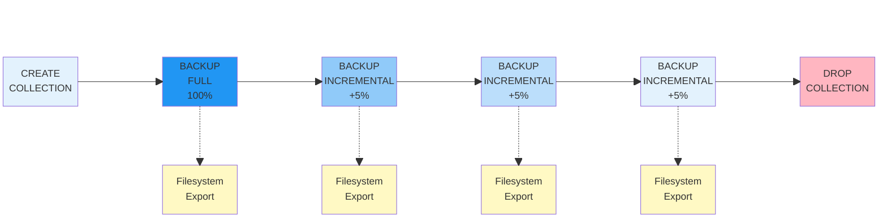
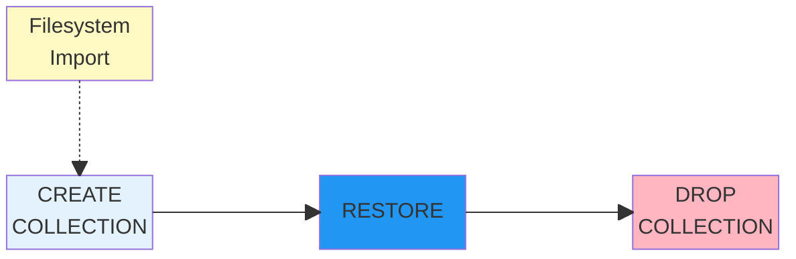

# Коллекции резервных копий

Коллекции резервных копий обеспечивают продвинутое решение для резервного копирования в YDB, которое организует полные и инкрементальные резервные копии в управляемые коллекции. Этот подход предназначен для производственных нагрузок, требующих эффективного аварийного восстановления и возможностей восстановления на момент времени.

## Что такое коллекции резервных копий? {#what-are-backup-collections}

Коллекция резервных копий — это именованный набор скоординированных резервных копий для выбранных объектов базы данных. Коллекции организуют связанные резервные копии и обеспечивают их согласованное восстановление, предоставляя:



В настоящее время поддерживаются только таблицы. Поддержка других объектов запланирована на будущие выпуски.



- **Организацию**: Связанные резервные копии группируются в логические коллекции
- **Гибкость восстановления**: Позволяет восстановление на любой момент времени, в который был сделан один из бэкапов в коллекции

## Основные концепции {#core-concepts}

### Коллекция резервных копий {#backup-collection}

Именованный контейнер, который группирует резервные копии для определенного набора объектов базы данных (в настоящее время только таблицы). Коллекции обеспечивают согласованное резервное копирование всех включенных объектов.

### Полная резервная копия {#full-backup}

Полный снимок всех выбранных таблиц в определенный момент времени. Служит базовой линией для последующих инкрементальных резервных копий и содержит все данные, необходимые для независимого восстановления.

### Инкрементальная резервная копия {#incremental-backup}

Захватывает только изменения (вставки, обновления, удаления) с момента предыдущей резервной копии в цепочке. Значительно меньше полных резервных копий для наборов данных с ограниченными изменениями.

### Цепочка резервных копий {#backup-chain}

Упорядоченная последовательность резервных копий, начинающаяся с полной резервной копии, за которой следует ноль или более инкрементальных резервных копий. Каждая инкрементальная резервная копия зависит от всех предыдущих резервных копий в цепочке для полного восстановления.

## Процесс резервного копирования {#backup-workflow}



### Создание коллекции {#collection-creation}

Создает именованный контейнер, который координирует резервные копии нескольких объектов базы данных. Все объекты в коллекции используют одинаковую конфигурацию резервного копирования и место хранения. После создания список объектов фиксируется и не может быть изменен.

[См. руководство по операциям](../maintenance/manual/backup-collections.md#create-collection)

### Начальная полная резервная копия {#initial-full-backup}

Создает транзакционно согласованный снимок всех объектов в коллекции в определенный момент времени. Эта базовая резервная копия содержит все данные и схемы и может быть восстановлена независимо без необходимости в других резервных копиях. Полная резервная копия требуется перед созданием любых инкрементальных резервных копий.

[См. руководство по операциям](../maintenance/manual/backup-collections.md#create-backup)

### Инкрементальные резервные копии {#incremental-backups-creation}

Захватывает только данные, которые изменились с момента предыдущей резервной копии, что значительно снижает требования к хранилищу. **Важно**: Встроенный планировщик отсутствует, поэтому вы должны запускать инкрементальные резервные копии вручную или использовать внешнюю систему планирования. Для восстановления из инкрементальной резервной копии вам нужна вся цепочка резервных копий, начиная с начальной полной резервной копии.

[См. руководство по операциям](../maintenance/manual/backup-collections.md#create-backup)

### Удаление коллекции {#backup-collection-cleanup}

Когда коллекция резервных копий больше не нужна, удалите её, чтобы убрать все связанные метаданные и освободить ресурсы. Это безвозвратно удаляет определение коллекции и все резервные копии в цепочке. Удаляйте коллекции только после того, как убедитесь, что резервные копии вам больше не нужны или вы безопасно заархивировали их во внешнее хранилище.

[См. руководство по операциям](../maintenance/manual/backup-collections.md#cleanup)

## Процесс восстановления {#restore-workflow}



### Импорт из файловой системы {#restore-import}

Если ваши резервные копии хранятся во внешнем хранилище (файловой системе или объектном хранилище), импортируйте их обратно в кластер с помощью операций импорта YDB CLI. Импортируйте все резервные копии в цепочке в правильном порядке, начиная с полной резервной копии, за которой следуют инкрементальные резервные копии. Этот шаг необходим только при восстановлении из внешнего хранилища.

[См. экспорт/импорт YDB CLI](../reference/ydb-cli/export-import/index.md)

### Создание коллекции для восстановления {#restore-collection-creation}

Создайте новую коллекцию, которая определяет, куда будут помещены восстановленные данные. Структура коллекции должна соответствовать исходной коллекции резервных копий, включая те же имена таблиц и пути. Это подготавливает целевое расположение для процесса восстановления.

[См. руководство по операциям](../maintenance/manual/backup-collections.md#restore-backup)

### Восстановление резервной копии {#restore-execution}

Выполните операцию восстановления для восстановления данных из определенной резервной копии в цепочке. Вы можете восстановить из любой точки резервного копирования (полной или инкрементальной), и система автоматически применит все необходимые изменения из цепочки резервных копий до этой точки. Операция восстановления обеспечивает транзакционную согласованность всех таблиц в коллекции.

[См. руководство по операциям](../maintenance/manual/backup-collections.md#restore-backup)

### Удаление коллекции {#restore-cleanup}

После успешного восстановления и проверки ваших данных удалите коллекцию восстановления, чтобы очистить метаданные и освободить ресурсы. Это необязательный шаг очистки, который помогает поддерживать порядок в каталоге резервных копий.

[См. руководство по операциям](../maintenance/manual/backup-collections.md#cleanup)

## Операционное руководство {#operational-guidance}

### Управление цепочкой {#chain-management-details}

Вы несете ответственность за отслеживание и поддержку ваших цепочек резервных копий. Используйте `ydb scheme ls` для просмотра структуры цепочки и определения резервных копий, которые можно безопасно удалить. Будьте осторожны при удалении резервных копий, чтобы не нарушить зависимости цепочки, так как инкрементальные резервные копии зависят от доступности своих родительских резервных копий.

Для перемещения резервных копий во внешнее хранилище (файловую систему или объектное хранилище, такое как S3), используйте операции ручного экспорта или дампа через YDB CLI. Каждая резервная копия в цепочке должна экспортироваться/дампироваться отдельно. При восстановлении из внешнего хранилища используйте операции импорта и восстановления через YDB CLI. Сохраняйте порядок цепочки при экспорте/импорте для обеспечения успешного восстановления.

[См. экспорт/импорт YDB CLI](../reference/ydb-cli/export-import/index.md) | [См. руководство по мониторингу](../maintenance/manual/backup-collections.md#monitoring) | [См. процедуры очистки](../maintenance/manual/backup-collections.md#cleanup)

## Архитектура и компоненты {#architecture}

### Структура хранения {#storage-structure}

Коллекции резервных копий хранятся в выделенной структуре каталогов в базе данных:

```text
/.backups/collections/
├── collection_name_1/
│   ├── backup_20240315_120000/     # Полная резервная копия
│   ├── backup_20240315_180000/     # Инкрементальная резервная копия
│   └── backup_20240316_060000/     # Инкрементальная резервная копия
├── collection_name_2/
│   └── backup_20240316_000000/     # Полная резервная копия
```

Каждая резервная копия содержит:

- Схемы таблиц на момент резервного копирования
- Файлы данных (полные или инкрементальные изменения)

### Бэкенды хранения {#storage-backends}

#### Кластерное хранилище {#cluster-storage}

Резервные копии хранятся в том же кластере YDB с использованием распределенного файлового хранения:

```sql
WITH ( STORAGE = 'cluster' )
```

#### Внешнее хранилище {#external-storage}

В настоящее время внешнее хранилище требует ручных операций экспорта/импорта. Используйте [операции export/import](../reference/ydb-cli/export-import/index.md) для перемещения резервных копий во внешние системы хранения.

Пример команд для экспорта коллекции резервных копий:

```bash
# Экспорт всей директории коллекции в S3
ydb export s3 --s3-endpoint storage.yandexcloud.net \
  --bucket my-backups \
  --item src=.backups/collections/my_collection,dst=my_collection

# Или экспорт в файловую систему
ydb tools dump --path .backups/collections/my_collection \
  --output /path/to/local/backup
```

### Фоновые операции {#background-operations}

Все операции резервного копирования выполняются асинхронно в фоновом режиме, позволяя:

- Продолжать обычные операции с базой данных во время резервного копирования
- Отслеживать прогресс с помощью команд операций YDB CLI
- Обрабатывать большие наборы данных без блокировки других действий

## Как работают коллекции резервных копий внутри {#how-they-work}

### Процесс создания резервной копии {#backup-creation-process}

1. **Изоляция транзакций**: Резервное копирование начинается с согласованной точки снимка
2. **Отслеживание изменений**: Для инкрементальных резервных копий захватываются только изменения с последней резервной копии и сохраняются в [changefeed](cdc.md)
3. **Материализация изменений**: При вызове инкрементального резервного копирования changefeed компактируется в таблицы инкрементальной резервной копии

### Механизм инкрементального резервного копирования {#incremental-backup-mechanism}

Инкрементальные резервные копии основываются на отслеживании изменений на уровне данных:

- **Новых строк**: Добавленных с последней резервной копии
- **Измененных строк**: Измененных данных в существующих строках  
- **Удаленных строк**: Удаленных данных (записи tombstone)
- **Изменений схемы**: Модификаций структуры таблиц

### Отношение к инкрементальным резервным копиям {#relation-to-incremental-backups}

Коллекции резервных копий являются основой для функциональности инкрементального резервного копирования:

- **Коллекции разрешают инкрементальность**: Необходимо иметь коллекцию для создания инкрементальных резервных копий
- **Управление цепочкой**: Коллекции управляют последовательностью полных и инкрементальных резервных копий
- **Согласованность**: Все таблицы в коллекции создаются согласованно

Без коллекций резервных копий доступны только операции полного экспорта/импорта.

### Валидация цепочки и целостность {#chain-validation-integrity}

Система обеспечивает целостность цепочки резервных копий через:

- **Отслеживание зависимостей**: Каждая инкрементальная резервная копия записывает своего родителя
- **Проверки валидации**: Полнота цепочки проверяется перед операциями
- **Гарантии согласованности**: Все таблицы создаются из одной точки транзакции
- **Обнаружение ошибок**: Поврежденные или отсутствующие резервные копии определяются автоматически

## Когда использовать коллекции резервных копий {#when-to-use}

**Рекомендуемые сценарии:**

- Производственные среды, требующие регулярного планирования резервного копирования (примечание: планирование должно быть реализовано внешне с использованием cron или аналогичных инструментов)
- Большие наборы данных, где инкрементальные изменения намного меньше общих данных
- Сценарии, требующие цепочек резервных копий для эффективности

**Рассмотрите традиционный экспорт/импорт для:**

- Небольших баз данных или отдельных таблиц
- Одноразовых задач миграции данных
- Сред разработки/тестирования
- Простых сценариев резервного копирования без инкрементальных потребностей
- Требований внешнего хранилища (до поддержки автоматического внешнего хранилища)

## Преимущества и ограничения {#benefits-limitations}

### Преимущества {#benefits}

- **Эффективность хранения**: Инкрементальные резервные копии используют значительно меньше места для хранения по сравнению с хранением нескольких полных резервных копий
- **Более быстрое резервное копирование**: После начальной полной резервной копии обрабатываются только изменения (примечание: захват изменений все еще требует затрат на хранение и процессор)
- **SQL интерфейс**: Знакомые SQL команды для управления резервным копированием
- **Фоновая обработка**: Неблокирующие операции

### Текущие ограничения {#current-limitations}

- **Только кластерное хранилище**: Внешнее хранилище требует ручного экспорта/импорта
- **Нет модификации коллекций**: Нельзя добавлять/удалять таблицы после создания
- **Нет частичного восстановления**: Частичное восстановление из коллекций должно управляться внешне

## Следующие шаги {#next-steps} {#next-steps}

- **Начать работу**: Следуйте [руководству по операциям](../maintenance/manual/backup-collections.md) для пошаговых инструкций
- **Посмотреть примеры**: Изучите [общие сценарии](../recipes/backup-collections.md) и лучшие практики

## См. также {#see-also}

- [Общие концепции резервного копирования](backup.md) - Обзор всех подходов резервного копирования в YDB
- [Руководство по операциям](../maintenance/manual/backup-collections.md) - Практические инструкции и примеры
- [Общие рецепты](../recipes/backup-collections.md) - Сценарии реального использования
