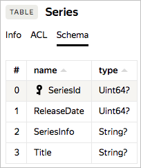

# Таблица

Таблица в {{ ydb-short-name }} — это [реляционная таблица](https://en.wikipedia.org/wiki/Table_(database)), содержащая набор связанных данных, состоящий из строк и столбцов. Каждая из строк представляет собой набор ячеек, предназначенных для хранения значений определенных типов в соответствии со схемой данных. Схема данных определяет имена (names) и типы (types) столбцов таблицы. Пример схемы данных показан на рисунке ниже. Таблица `Series` состоит из четырех столбцов c именами `SeriesId`, `ReleaseDate`, `SeriesInfo` и `Title` и типами данных `Uint64?` для первых двух и `String?` для последних. Первичным ключом объявлен столбец `SeriesId`.

{{ ydb-short-name }} использует типы данных [YQL](../../datatypes.md), в качестве типов столбцов могут использоваться [простые типы данных YQL](../../../yql/reference/types/primitive.md). По умолчанию все столбцы [опциональные](../../../yql/reference/types/optional.md) и могут иметь значение `NULL`. При создании для столбцов, входящих в первичный ключ, можно указать ограничение `NOT NULL`, тогда им нельзя будет присвоить пустое значение. 

Таблица {{ ydb-short-name }} всегда имеет один или несколько столбцов, составляющих ключ ([primary key](https://en.wikipedia.org/wiki/Unique_key)). Строки таблицы уникальны по ключу, то есть для одного значения ключа может быть не больше одной строки. Таблица {{ ydb-short-name }} всегда упорядочена по ключу. Это означает, что точечное чтение по ключу, а также диапазонные запросы по ключу или префиксу ключа выполняются эффективно (фактически используя индекс). В примере выше ключевые столбцы выделены серым цветом и отмечены специальным знаком. Допускаются таблицы, состоящие только из ключевых столбцов. Таблицы без первичного ключа создавать нельзя.

Часто при проектировании схемы таблицы имеется набор полей, естественным образом подходящий для использования в качестве первичного ключа. Тем не менее, к выбору ключа нужно подходить аккуратно, чтобы не создать хотспоты. Например, если вы вставляете в таблицу данные с монотонно возрастающим ключом, то вы будете писать в конец таблицы. А так как {{ ydb-short-name }} разбивает данные таблицы по диапазонам ключей, это означает, что ваши вставки будут обрабатываться одним конкретным сервером, и перестанут использоваться основные преимущества распределенной БД. Для того, чтобы нагрузка равномерно распределялась по различным серверам и при обработке больших таблиц не было хотспотов, рекомендуется применять: хеширование естественного ключа и использование хеша в качестве первой компоненты первичного ключа, изменение порядка следования компонент первичного ключа.

## Партиционирование {#partitioning}

Таблица в БД может быть шардирована по диапазонам значений первичного ключа. Каждый шард таблицы отвечает за свой диапазон первичных ключей. Диапазоны ключей, обслуживаемых разными шардами, не пересекаются. Различные шарды таблицы могут обслуживаться разными серверами распределенной БД (в том числе расположенными в разных локациях), а также могут независимо друг от друга перемещаться между серверами для перебалансировки или поддержания работоспособности шарда при отказах серверов или сетевого оборудования.

При малом объеме данных или небольшой нагрузке таблица может состоять из одного шарда. При росте объема данных, обслуживаемых шардом, или нагрузки на шард, {{ ydb-short-name }} автоматически разбивает его на два. Разбиение происходит по медианному значению первичного ключа, если размер шарда превышает порог. В случае разбиения по нагрузке шард сначала собирает сэмпл запрашиваемых ключей (читаемых, записываемых и удаляемых), и на основании этого сэмпла выбирает для разбиения такой ключ, чтоб нагрузка распределилась поровну между новыми шардами. Таким образом в случае разбиения по нагрузке новые шарды могут иметь существенно отличающийся размер.

Порог разделения шарда по размеру и включение/выключение автоматического разделения могут быть настроены индивидуально для каждой таблицы базы данных.

Помимо автоматического разделения предоставляется возможность создать пустую таблицу с предопределенным количеством шардов. При этом можно вручную задать точные границы разделения ключей по шардам или указать равномерное разделение на предопределенное количество шардов. В этом случае границы создадутся по первой компоненте первичного ключа. Равномерное распределение можно указать для таблиц, у которых первая компонента первичного ключа — целое число Uint64 или Uint32.

Параметры партиционирования относятся к самой таблице, но не к построенным на ее данных вторичным индексам. Каждый индекс обслуживается своим набором шардов, и решения о разделении или объединении его партиций принимаются независимо на основании настроек по умолчанию. В будущем эти настройки могут быть сделаны доступными пользователям, аналогично настройкам основной таблицы.

Характерное время операции разделения или объединения — порядка 500 мс. На это время вовлеченные в операцию данные становятся кратковременно недоступны для чтения и записи. Специализированные методы-обертки в {{ ydb-short-name }} SDK автоматически выполняют повторные попытки при получении информации о том, что шард находится в состоянии разделения или объединения, не поднимая ее до уровня приложения. Стоит отметить, что если система по каким-то причинам перегружена (например, из-за общей нехватки CPU или пропускной способности выделенных базе дисковых ресурсов) то операции разделения и объединения могут длиться дольше.

В схеме данных определяются следующие параметры партиционирования таблицы:

#### AUTO_PARTITIONING_BY_SIZE

* Тип: `Enum` (`ENABLED`, `DISABLED`).
* Значение по умолчанию: `ENABLED`.

Режим автоматического партиционирования по размеру партиции. Если размер партиции превысил значение, заданное параметром [AUTO_PARTITIONING_PARTITION_SIZE_MB](#auto_partitioning_partition_size_mb), то она встает в очередь на разделение (split). Если суммарный размер двух или более соседних партиции меньше 50% от значения параметра [AUTO_PARTITIONING_PARTITION_SIZE_MB](#auto_partitioning_partition_size_mb), то они встают в очередь на объединение (merge).

#### AUTO_PARTITIONING_BY_LOAD

* Тип: `Enum` (`ENABLED`, `DISABLED`).
* Значение по умолчанию: `DISABLED`.

Режим автоматического партиционирования по нагрузке. Если в течение нескольких десятков секунд шард потребляет более 50% CPU, то он ставится в очередь на разделение (split). Если в течение часа суммарная нагрузка на два или более соседних шарда утилизировала менее 35% одного ядра CPU, то они ставятся в очередь на объединение (merge).

Выполнение операций разделения или объединения само по себе утилизирует CPU, и занимает время. Поэтому, при работе с плавающей нагрузкой рекомендуется вместе с включением данного режима устанавливать отличное от 1 значение параметра минимального количество партиций [AUTO_PARTITIONING_MIN_PARTITIONS_COUNT](#auto_partitioning_min_partitions_count), чтобы спады нагрузки не приводили к снижению количества партиций ниже необходимого, и не было потребности их заново делить при появлении нагрузки.

При выборе минимального количества партиций имеет смысл руководствоваться соображениями, что одна партиция таблицы может находиться только на одном сервере и использовать не более 1 ядра CPU для операций изменения данных. Исходя из этого, для таблицы на которой может ожидаться высокая нагрузка, можно указывать минимальное количество партиций не менее количества узлов (серверов), а лучше порядка количества ядер CPU, выделенных базе.

#### AUTO_PARTITIONING_PARTITION_SIZE_MB

* Тип: `Uint64`.
* Значение по умолчанию: `2000 MB` ( `2 ГБ` ).

Порог размера партиции в мегабайтах, при превышении которого шард будет разделен, имеет значение при включенном режиме [AUTO_PARTITIONING_BY_SIZE](#auto_partitioning_by_size).

#### AUTO_PARTITIONING_MIN_PARTITIONS_COUNT

* Тип: `Uint64`.
* Значение по умолчанию: `1`.

Объединение партиций (merge) производится только в том случае, если их фактическое количество превышает заданное этим параметром значение. При использовании режима автоматического партиционирования по нагрузке рекомендуется устанавливать отличное от 1 значение данного параметра, чтобы периодический спад нагрузки не приводил к снижению количества партиций ниже необходимого.

#### AUTO_PARTITIONING_MAX_PARTITIONS_COUNT

* Тип: `Uint64`.
* Значение по умолчанию: `50`.

Разделение партиций (split) производится только в том случае, если их количество не превышает заданное этим параметром значение. При любых включенных режимах автоматического партиционирования рекомендуется устанавливать осмысленное значение этого параметра, а также отслеживать приближение фактического количества партиций к нему, иначе рано или поздно партиции перестанут разделяться при росте данных или нагрузке, что приведет к сбою.

#### UNIFORM_PARTITIONS

* Тип: `Uint64`.
* Значение по умолчанию: не применимо.

Количество партиций для равномерного начального разделения таблицы. Первая колонка первичного ключа должна иметь тип `Uint64` или `Uint32`. Созданная таблица сразу будет разделена на указанное количество партиций.

При включенном автоматическом партиционировании необходимо также не забыть установить корректное значение параметра [AUTO_PARTITIONING_MIN_PARTITIONS_COUNT](#auto_partitioning_min_partitions_count), чтобы все партиции не объединились в одну сразу после создания таблицы.

#### PARTITION_AT_KEYS

* Тип: `Expression`.
* Значение по умолчанию: не применимо.

Граничные значения ключей для начального разделения на партиции. Представляется списком граничных значений, разделенных запятыми и обрамленными в скобки. Каждое граничное значение может быть либо набором значений ключевых колонок (также разделенных запятыми и обрамленными в скобки), либо единичным значением, если указываются только значения первой ключевой колонки. Примеры: `(100, 1000)`, `((100, "abc"), (1000, "cde"))`.

При включенном автоматическом партиционировании необходимо также не забыть установить корректное значение параметра [AUTO_PARTITIONING_MIN_PARTITIONS_COUNT](#auto_partitioning_min_partitions_count), чтобы все партиции не объединились в одну сразу после создания таблицы.

## Чтение с реплик {#read_only_replicas}

При выполнении запросов в {{ ydb-short-name }} фактическое выполнение запроса к каждому шарду осуществляется в единой точке, обслуживающей протокол распределенных транзакций. Но благодаря хранению данных на разделяемом хранилище возможен запуск одного или нескольких фолловеров шарда, без выделения дополнительного места на сторадже — данные уже хранятся реплицированно и возможно обслуживание более одного читателя (но писатель при этом все еще в каждый момент строго один).

Применение чтения с фолловеров дает следующие возможности:

* Обслуживать клиентов, критичных к минимальным задержкам, недостижимым иными способами в мульти-ДЦ кластере. Достигается за счет приближения точки выполнения запроса к точке задания запроса, что отсекает задержку на меж-ДЦ пересылки. В результате, сохраняя все гарантии мульти-ДЦ кластера по надежности хранения, отвечать на точечные читающие запросы за единицы миллисекунд.
* Обслуживать читающие запросов с фолловеров без влияния на модифицирующие запросы, выполняющиеся на шарде. Это может быть полезно как для изоляции разных сценариев, так и для увеличения пропускной способности партиции.
* Продолжать обслуживание при переездах лидера партиции (как штатной при балансировке, так и при сбоях). Позволяет переживать процессы в кластере без влияния на читающих клиентов.
* В целом повышать предел производительности чтения шардов, если множество читающих запросов попадают на одни и те же ключи.

В схеме данных таблицы можно указать необходимость запуска реплик для чтения для каждого шарда таблицы. Обращения к репликам для чтения (фолловерам) типично происходят не покидая сети датацентра, что позволяет обеспечить время ответа в единицы миллисекунд:

| Имя параметра | Описание | Тип | Допустимые значения | Возможность изменения | Возможность сброса |
| ------------- | --------- | --- | ------------------- | --------------------- | ------------------ |
| `READ_REPLICAS_SETTINGS` | `PER_AZ` означает использование указанного количества реплик в каждом AZ, `ANY_AZ` — во всех AZ суммарно. | String | `"PER_AZ:<count>"`, `"ANY_AZ:<count>"` где `<count>` — число реплик | Да | Нет |

Внутреннее состояние каждого из фолловеров восстанавливается в точности по состоянию лидера и полностью консистентно.

Кроме состояния данных в сторадже на фолловеров отправляется и поток обновлений с лидера. Обновления отправляются в реальном времени, сразу после коммита в лог. Но отправляются асинхронно, что приводит к некоторой задержке применения обновлений на фолловерах относительно их коммита на лидере (типично в десятки миллисекунд, но может увеличиваться в случае проблем связности в кластере). В связи с этим, чтение с фолловеров обеспечивается только в [режиме транзакций](../../transactions.md#modes) `StaleReadOnly()`.

Если фолловеров несколько, то отставание их от лидера может различаться, т.е. хотя каждый фолловер каждого из шардов сохраняет внутреннюю консистентность, между разными шардами могут наблюдаться артефакты. Код приложения должен быть к этому готов. По этой же причине на данный момент невозможно и выполнение с фолловеров кроссшардовых транзакций.

## Автоматическое удаление устаревших данных (TTL) {#ttl}

{{ ydb-short-name }} поддерживает функцию автоматического фонового удаления устаревших данных. В схеме данных таблицы может быть определена колонка [подходящего типа](../../../concepts/ttl.md#restrictions), значение которой у всех строк будет сравниваться в фоновом режиме с текущим временем. Строки, для которых текущее время стало больше, чем значение в колонке с учетом заданной задержки, будут удалены.

| Имя параметра | Тип | Допустимые значения | Возможность изменения | Возможность сброса |
| ------------- | --- | ------------------- | --------------------- | ------------------ |
| `TTL` | Expression | `Interval("<literal>") ON <column> [AS <unit>]` | Да | Да |

Где `<unit>`:
* `SECONDS`;
* `MILLISECONDS`;
* `MICROSECONDS`;
* `NANOSECONDS`.

Подробнее об удалении устаревших данных читайте в разделе [Time to Live (TTL)](../../../concepts/ttl.md).

## Переименование {#rename}

{{ ydb-short-name }} позволяет переименовать существующую таблицу, переместить ее в другую директорию этой же базы данных, а также заменить одну таблицу другой, при этом данные заменяемой таблицы будут удалены. При выполнении операций изменяются только метаданные таблицы, например ее путь и имя. Данные таблицы не переносятся и не перезаписываются.

Операции выполняются изолированно, внешний процесс видит только два состояния таблицы: до и после выполнения операции. Это важно, например, при замене таблицы — данные заменяемой таблицы удаляются в той же транзакции, в которой заменяющая таблица переименовывается. Во время выполнения операции замены возможны ошибки запросов к заменяемой таблице с [retryable-статусами](../../../reference/ydb-sdk/error_handling.md#termination-statuses).

Скорость выполнения переименования определяется типом дата-транзакций, которые выполняются в данный момент на таблице, и не зависит от количества данных в таблице.

* [Переименование таблицы в YQL](../../../yql/reference/syntax/alter_table.md#rename)
* [Переименование таблицы через CLI](../../../reference/ydb-cli/commands/tools/rename.md)

## Фильтр Блума {#bloom-filter}

Использование [фильтра Блума](https://en.wikipedia.org/wiki/Bloom_filter) позволяет эффективнее определять отсутствие ключей в таблице при множественных точечных запросах по первичному ключу, снижая количество необходимых операций ввода-вывода с диска, ценой увеличения объема потребляемой памяти.

| Имя параметра | Тип | Допустимые значения | Возможность изменения | Возможность сброса |
| ------------- | --- | ------------------- | --------------------- | ------------------ |
| `KEY_BLOOM_FILTER` | Enum | `ENABLED`, `DISABLED` | Да | Нет |

## Группы колонок {#column-groups}

{{ ydb-short-name }} позволяет группировать колонки в таблице для оптимизации их хранения и использования. Механизм групп колонок позволяет увеличить производительность операций неполного чтения строк путем разделения хранения колонок таблицы на насколько групп. Наиболее часто используемый сценарий — организация хранения редко используемых атрибутов в отдельной группе колонок (и, возможно, с использованием сжатия и на более медленных устройствах хранения данных).

У каждой группы колонок есть собственное имя, уникальное в рамках таблицы. Состав групп колонок устанавливается при [создании таблицы](../../../yql/reference/syntax/create_table.md#column-family), а также может быть [изменен](../../../yql/reference/syntax/alter_table.md#column-family) позднее. Удаление групп колонок из существующей таблицы не предусмотрено.

Группа колонок может содержать произвольное число колонок своей таблицы, в том числе не содержать ни одной. Каждая колонка таблицы принадлежит одной, и только одной группе колонок (группы колонок не пересекаются). Принадлежность колонок группам устанавливается при создании таблицы, но может быть изменена позднее.

Для каждой таблицы существует основная группа колонок с именем `default`, в которую входят все колонки, для которых не указана явным образом другая группа колонок. Колонки первичного ключа всегда принадлежат основной группе колонок и не могут быть перемещены в другую группу.

Для группы колонок устанавливаются атрибуты, влияющие на хранение данных:

* используемый тип устройств хранения данных (SSD или HDD, доступность типов зависит от конфигурации кластера {{ ydb-short-name }});
* режим сжатия данных (без сжатия или сжатие алгоритмом [LZ4](https://ru.wikipedia.org/wiki/LZ4)).

Атрибуты группы колонок устанавливаются при создании таблицы (в том числе могут быть явно определены для основной группы колонок), а также могут быть изменены впоследствии. Изменения атрибутов хранения не применяются немедленно к хранимым данным, вместо этого они применяются при последующей ручной либо автоматической компактификации (LSM compaction).

Доступ к данным, хранящимся в полях основной группы колонок, является более быстрым и требует меньше ресурсов, чем доступ к данным той же самой строки таблицы, хранящимся в полях дополнительно созданных групп колонок. Поиск по первичному ключу всегда осуществляется в основной группе колонок. При обращении к полям в других группах колонок помимо поиска по первичному ключу необходимы дополнительные поисковые операции для определения конкретной позиции хранения этих полей.

Таким образом, вынос части колонок таблицы в отдельную группу колонок позволяет ускорить чтение наиболее важных и часто используемых колонок (входящих в состав основной группы колонок) ценой некоторого замедления доступа к остальным колонкам. Кроме того, на уровне групп колонок осуществляется управление параметрами хранения данных — выбор типа устройств хранения и режима сжатия.

## Пользовательские атрибуты {#users-attr}

Пользовательские атрибуты позволяют добавлять произвольную информацию к метаданным таблицы. Эта информация не интерпретируется сервером, однако может быть интерпретирована клиентом БД (человеком или, чаще, программой).

Атрибуты задаются в виде пары ключ-значение. Ключом и значением атрибута может быть только строка или тип, который может быть представлен строкой (например, используя base64-кодирование).

Ключи и значения пользовательских атрибутов имеют следующие ограничения:

* длина ключа — 1–100 байт;
* длина значения — 1–4096 байт;
* максимальный общий размер атрибутов (сумма длин всех ключей и значений) — 10240 байт.

О том, как добавить, изменить, получить текущие значения или удалить атрибуты читайте в статье [{#T}](../../../operations/manage-users-attr.md).

