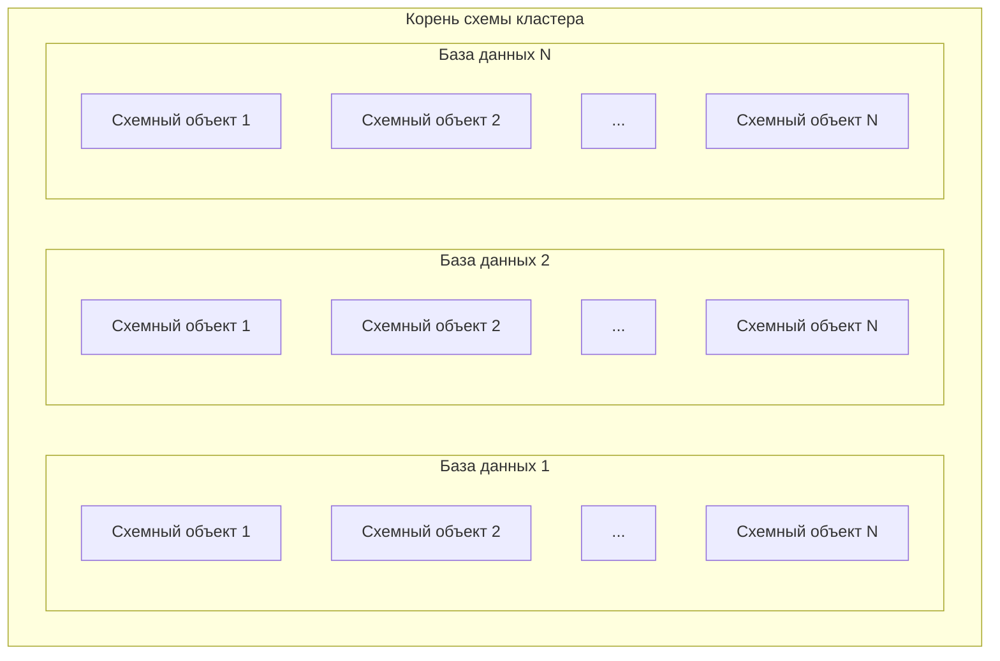

# Модель данных и схема

В разделе собраны описания сущностей, которыми оперирует {{ ydb-short-name }} в рамках БД. Ядро {{ ydb-short-name }} позволяет гибко реализовывать различные примитивы хранения, поэтому возможно появление в будущем новых сущностей.

## Схема кластера {{ ydb-short-name }} {#cluster-scheme}

Схема кластера {{ ydb-short-name }} — это логическая древовидная структура кластера {{ ydb-short-name }}. Корневым элементом схемы кластера {{ ydb-short-name }} является **корень схемы кластера**. Дочерними элементами корня схемы кластера выступают [базы данных](../../concepts/glossary.md#database). В свою очередь, базы данных содержат [схемные объекты](../../concepts/glossary.md#scheme-object), которые образуют произвольную иерархию с помощью вложенных директорий.

## Модель данных

{{ ydb-short-name }} – это реляционная база данных, в которой данные хранятся в таблицах, состоящих из рядов и колонок. Объекты баз данных {{ ydb-short-name }} могут быть организованы в иерархию директорий.

* [Директории](dir.md)
* [Таблицы](table.md)


* [Представления (VIEW)](view.md)


* [Топики](../topic.md)
* [Секреты](secrets.md)
* [Подключения к внешним БД](external_data_source.md)
* [Внешние источники данных](external_table.md)

Все [схемные объекты](../../concepts/glossary.md#scheme-object) в {{ ydb-short-name }} имеют одинаковые требования к своим наименованиям. Но правила наименования колонок немного отличаются от правил для схемных объектов.


