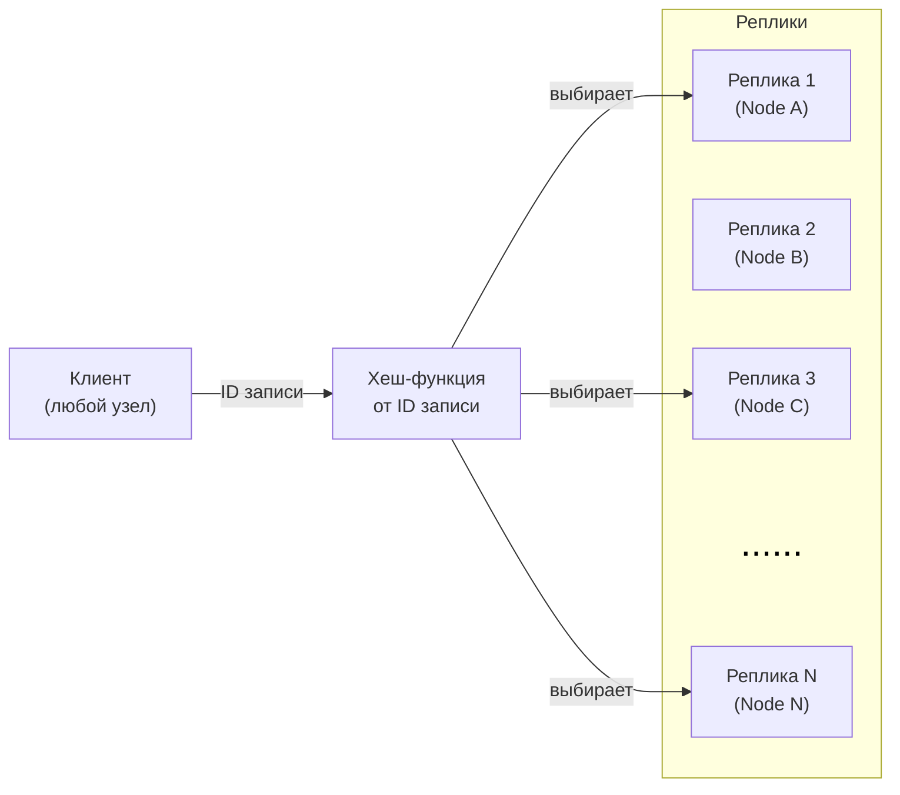
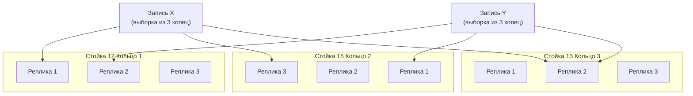
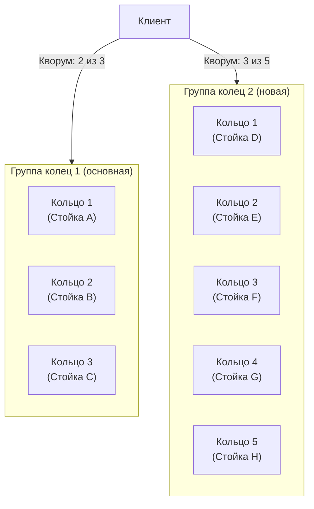

# Подсистемы распространения метаданных: StateStorage, Board, SchemeBoard

В кластере {{ ydb-short-name }} работают три взаимосвязанные подсистемы, которые обеспечивают распространение метаданных между узлами: **StateStorage**, **Board** и **SchemeBoard**. Каждая из них решает свою задачу, но все три построены на одном архитектурном принципе — распределённом кворумном сервисе с детерминированной адресацией реплик.

Эта статья объясняет, зачем нужны эти подсистемы, как они устроены и как работают. Инструкции по конфигурированию и изменению конфигурации описаны в разделе [Конфигурирование подсистем распространения метаданных](../devops/configuration-management/configuration-v2/state-storage-reconfiguration.md).

## Зачем нужны подсистемы распространения метаданных {#why}

Кластер {{ ydb-short-name }} — это распределённая система, в которой одновременно могут работать миллионы [таблеток](glossary.md#tablet) на тысячах узлов. Чтобы компоненты кластера могли взаимодействовать друг с другом, им необходимо знать:

- где сейчас работает лидер конкретной таблетки и как к нему обратиться (**StateStorage**);
- какие узлы предоставляют те или иные сервисы, например, точки подключения для клиентов (**Board**);
- какова актуальная схема базы данных (**SchemeBoard**).

Распространять эти данные с одного узла кластера плохо — это создает высокую нагрузку и проблемы при выходе из строя этого узла. Поэтому метаданные распределяются по множеству узлов кластера с помощью трёх специализированных подсистем.

## Подсистемы {#subsystems}

### StateStorage — хранилище состояния таблеток {#state-storage}

**StateStorage** — это распределённый сервис, который хранит актуальное состояние [таблеток](glossary.md#tablet): где работает лидер, каков его идентификатор актора, поколение и шаг.

#### Что хранит StateStorage {#state-storage-data}

Для каждой таблетки StateStorage хранит:

- **Текущий лидер** — идентификатор актора ([ActorId](glossary.md#actorid)) лидера таблетки.
- **Поколение и шаг** (`generation:step`) — монотонно возрастающие счётчики, используемые для разрешения конфликтов при выборе лидера.
- **Список фолловеров** — идентификаторы акторов реплик таблетки (если они есть).
- **Блокировка** — признак того, что таблетка заблокирована в процессе выбора нового лидера.

#### Как используется StateStorage {#state-storage-usage}

StateStorage выполняет роль **службы разрешения имён таблеток**: любой узел кластера может по `TabletId` узнать `ActorId` текущего лидера и напрямую обратиться к нему.

StateStorage также участвует в **процессе выбора лидера таблетки**. Когда таблетка запускается или перезапускается, она регистрирует себя в StateStorage и получает подтверждение от кворума реплик.



Данные в StateStorage являются **волатильными**: они хранятся только в памяти реплик и теряются при перезапуске процессов. StateStorage не является постоянным хранилищем — он содержит только ту информацию, которую легко восстановить как при запуске таблеток так и запуске самих реплик.



#### Адресация в StateStorage {#state-storage-addressing}

Выборка реплик для конкретной таблетки вычисляется по её `TabletId`. Это означает, что реплики разных таблеток могут находиться на разных узлах, что обеспечивает равномерное распределение нагрузки.

### Board — доска объявлений сервисов {#board}

**Board** — это распределённый сервис для публикации и поиска метаданных в формате «путь → набор записей». Он работает по модели «публикация — подписка»: один или несколько акторов публикуют информацию по некоторому пути, а другие акторы подписываются на этот путь и получают актуальный список публикаций.

#### Что хранит Board {#board-data}

Board хранит пары «путь → полезная нагрузка» (payload). Несколько акторов могут одновременно публиковать данные по одному пути — Board хранит все публикации и предоставляет их подписчикам в виде списка.

#### Как используется Board {#board-usage}

Основное применение Board — **хранение информации об эндпоинтах** (точках подключения) баз данных. Когда узел базы данных запускается, он публикует свой адрес в Board по пути, соответствующему имени базы данных. Клиенты и другие компоненты кластера подписываются на этот путь и получают актуальный список доступных эндпоинтов.

Механизм работы:

1. Актор-публикатор регистрирует запись в Board по заданному пути.
2. Актор-подписчик запрашивает список записей по пути и получает уведомления об изменениях.

В отличие от StateStorage, Board не привязан к конкретным таблеткам — он предназначен для произвольных сервисов, которым нужно сделать некоторые данные легко доступными в кластере.

#### Адресация в Board {#board-addressing}

Выборка реплик для конкретного пути вычисляется по хешу от этого пути. Это обеспечивает детерминированную маршрутизацию: все публикации и подписки по одному пути попадают на одни и те же реплики.

### SchemeBoard — распространение схемных метаданных {#scheme-board}

**SchemeBoard** — это распределённый сервис для хранения и распространения метаданных о схеме баз данных: таблицах, индексах, правах доступа и других схемных объектах.

#### Что хранит SchemeBoard {#scheme-board-data}

SchemeBoard хранит описания схемных объектов: таблиц, директорий, индексов, топиков и других объектов схемы. Для каждого объекта хранится его полное описание, включая структуру, настройки и права доступа.

#### Как используется SchemeBoard {#scheme-board-usage}

SchemeBoard является **кешем схемных метаданных** для всех компонентов кластера. Когда узел базы данных получает запрос, ему необходимо знать структуру таблиц, с которыми работает запрос. Вместо того чтобы каждый раз обращаться к [SchemeShard](glossary.md#scheme-shard) (таблетке, которая является источником истины для схемы), узел читает схему из локального кеша, который синхронизируется через SchemeBoard.

Механизм работы:

1. При изменении схемы SchemeShard публикует обновление в SchemeBoard.
2. Узлы баз данных подписываются на изменения нужных им схемных объектов и получают уведомления об обновлениях.

Это позволяет узлам баз данных работать с актуальной схемой без постоянных обращений к SchemeShard, что существенно снижает нагрузку на него и уменьшает задержки при выполнении запросов.

#### Адресация в SchemeBoard {#scheme-board-addressing}

Выборка реплик для конкретного схемного объекта вычисляется по хешу от пути к этому объекту. Это обеспечивает детерминированную маршрутизацию запросов к схемным метаданным.

## Сравнение подсистем {#comparison}

| Характеристика | StateStorage | Board | SchemeBoard |
|---|---|---|---|
| **Назначение** | Хранение состояния таблеток | Публикация метаданных сервисов | Распространение схемных метаданных |
| **Тип данных** | Состояние лидера таблетки (ActorId, generation:step) | Произвольные пары путь → payload | Описания схемных объектов |
| **Ключ адресации** | TabletId | Путь (строка) | Путь к схемному объекту |
| **Основные потребители** | Tablet Pipe  | gRPC-прокси, клиенты (поиск эндпоинтов) | Узлы баз данных (кеш схемы) |
| **Источник данных** | Сами таблетки (при запуске/выборе лидера) | Акторы-публикаторы | SchemeShard |

### Детерминированная выборка реплик {#replica-selection}

Каждая запись в подсистеме адресуется по идентификатору — например, `TabletId` для StateStorage или путь к схемному объекту для SchemeBoard. По этому идентификатору с помощью хеш-функции вычисляется фиксированный набор реплик, на которых хранится данная запись.

Это ключевое свойство: **любой узел кластера может самостоятельно вычислить, на каких репликах хранится нужная ему запись**. Это делает подсистемы масштабируемыми и устойчивыми к отказам.

### Кворум {#quorum}

Для работы с каждой записью выбирается определенное количество реплик `nto_select`. Операции записи система пытается выполнять со всеми `nto_select` репликами, но при этом допускается отказ меньшинства реплик, и такой отказ не приводит к временной недоступности или приостановке работы.
Для успешного выполнения операции с записью достаточно получить ответ от **большинства** выбранных реплик — то есть от `nto_select / 2 + 1` реплик, где `nto_select` — общее число реплик в выборке. Это означает, что часть реплик может быть недоступна, и подсистема продолжит работать.

Именно кворумный принцип позволяет безопасно выводить узлы на обслуживание и выполнять роллинг-рестарты кластера без потери работоспособности.

## Ключевые понятия {#key-concepts}

### Реплика {#replica}

**Реплика** — это актор, работающий на узле кластера и хранящий часть метаданных подсистемы. Реплика принимает запросы на чтение и запись, участвует в формировании кворума.

Каждая реплика независима: она продолжает обслуживать запросы, даже если другие реплики временно недоступны. При восстановлении работоспособности и связи с репликами, за конечное время пользователи подсистемы предпринимают повторную попытку наполнения реплик которые до этого наполнить не удалось.

### Кольцо {#ring}

#### Мотивация {#ring-motivation}

Для равномерного распределения нагрузки по узлам кластера подсистемам может потребоваться большое количество реплик: чем их больше, тем меньше запросов приходится на каждую реплику. Однако с ростом числа реплик возникает вопрос отказоустойчивости: при отказе домена отказа (серверной стойки) из строя одновременно может выйти несколько реплик, и это скажется на кворуме.

#### Определение и принцип работы {#ring-definition}

**Кольцо** — это группа реплик, из которых для каждой конкретной записи выбирается **не более одной** реплики. Выбор реплики внутри кольца детерминирован и основан на хеш-функции от идентификатора записи. Таким образом, разные записи обслуживаются разными репликами внутри одного кольца, что обеспечивает равномерное распределение запросов.

#### Кольца и домены отказа {#ring-fail-domain}

Реплики каждого кольца размещаются в пределах одного **домена отказа** (fail domain) — одной, или нескольких серверных стойках. Реплики из разных колец при этом размещаются в разных стойках. Не допускается чтобы в одной стойке оказались реплики из разных колец. Это гарантирует, что при выходе из строя любой стойки из каждой выборки потеряется **не более одной реплики** — той, что принадлежит кольцу, чьи реплики находились в этой стойке.

#### Кольца и области отказа {#ring-fail-realm}

В кластерах с несколькими **областями отказа** (fail realm) — например, дата-центрами — применяются дополнительные ограничения на размещение реплик по кольцам:

- в одно кольцо не включают реплики из разных областей отказа;
- количество колец в каждой области отказа ограничивается.

Эти ограничения позволяют контролировать, сколько колец затронет выход из строя целого дата-центра: если каждая область отказа содержит не более `k` колец, то при её отказе из строя выйдет не более `k` реплик из каждой выборки.

```mermaid
graph TD
    subgraph DC1["Дата-центр 1 (Fail realm 1)"]
        subgraph "Стойка A (Кольцо 1)"
            R1A["Реплика 1"]
            R1B["Реплика 2"]
            R1C["Реплика 3"]
        end
        subgraph "Стойка B (Кольцо 2)"
            R2A["Реплика 1"]
            R2B["Реплика 2"]
            R2C["Реплика 3"]
        end
    end
    subgraph DC2["Дата-центр 2 (Fail realm 2)"]
        subgraph "Стойка C (Кольцо 3)"
            R3A["Реплика 1"]
            R3B["Реплика 2"]
            R3C["Реплика 3"]
        end
        subgraph "Стойка D (Кольцо 4)"
            R4A["Реплика 1"]
            R4B["Реплика 2"]
            R4C["Реплика 3"]
        end
    end
    subgraph DC3["Дата-центр 3 (Fail realm 3)"]
        subgraph "Стойка E (Кольцо 5)"
            R5A["Реплика 1"]
            R5B["Реплика 2"]
            R5C["Реплика 3"]
        end
        subgraph "Стойка F (Кольцо 6)"
            direction TD
            R6A["Реплика 1"]
            R6B["Реплика 2"]
            R6C["Реплика 3"]
        end
    end
    Record["Запись X\n(по одной реплике из каждого кольца)"]
    Record --> R1B
    Record --> R2A
    Record --> R3C
    Record --> R4A
    Record --> R5B
    Record --> R6B
```

### Группа колец {#ring-group}

**Группа колец** — это набор колец, по которому собирается **отдельный кворум**. Подсистема может одновременно работать с несколькими группами колец, собирая кворум в каждой из них независимо.

Группы колец — это механизм **бесшовного изменения конфигурации**. Они позволяют вводить новые наборы реплик и выводить старые без остановки кластера. Подробнее об этом — в разделе [Группы колец и смена конфигурации](#ring-groups-reconfiguration).

## Группы колец и смена конфигурации {#ring-groups-reconfiguration}

### Бесшовная смена конфигурации {#seamless-reconfiguration}

Изменение конфигурации подсистем — например, перенос реплик на другие узлы или изменение числа реплик — выполняется через добавление и удаление групп колец. Это позволяет менять конфигурацию без остановки кластера и без потери доступности.

Процесс смены конфигурации состоит из нескольких шагов:

1. Добавляется новая группа колец с нужной конфигурацией. На этом этапе она помечается флагом `write_only` — это означает, что новая группа получает все записи (синхронизируется с данными), но **не участвует в кворуме на чтение**. Запросы на чтение по-прежнему обслуживает старая группа.
2. После того как новая группа синхронизировалась и стала полноценной, флаг `write_only` снимается. Теперь обе группы участвуют в кворуме.
3. Старая группа помечается флагом `write_only`, а новая становится основной.
4. Старая группа удаляется.

Между шагами необходимо выдерживать паузу (не менее одной минуты), чтобы конфигурация успела распространиться по всем узлам кластера.

Подробные инструкции по ручной смене конфигурации приведены в разделе [Конфигурирование подсистем распространения метаданных](../devops/configuration-management/configuration-v2/state-storage-reconfiguration.md).

### Автоматическая реконфигурация (Self Heal) {#self-heal}

В кластерах с конфигурацией V2 доступен механизм **Self Heal State Storage** — автоматическое управление конфигурацией подсистем. Он отслеживает состояние узлов кластера и при необходимости:

- переносит реплики с вышедших из строя узлов на работоспособные;
- добавляет новые реплики при расширении кластера.

Self Heal работает через тот же механизм групп колец, что и ручная реконфигурация, но выполняет все шаги автоматически. Подробнее — в разделе [Self Heal State Storage](../maintenance/manual/selfheal_statestorage.md).

### Группы колец в конфигурации двух дата-центров {#two-dc}

В конфигурации с двумя дата-центрами (режим [bridge](glossary.md#bridge)) каждый дата-центр (pile) имеет **собственную группу колец**. Это позволяет:

- каждому дата-центру работать автономно, собирая кворум внутри своей группы;
- быстро и бесшовно переключать, какой дата-центр является основным (primary), без изменения конфигурации реплик.

Подробнее о режиме bridge описано в разделе [Режим bridge](bridge.md).

## Отказоустойчивость и модель отказа {#fault-tolerance}

Подсистемы распространения метаданных спроектированы с учётом [модели отказа](glossary.md#fail-domain) {{ ydb-short-name }}, основанной на концепциях доменов отказа (обычно — серверных стоек) и областей отказа (обычно — дата-центров).

Правило размещения реплик по стойкам (одна стойка - одно кольцо, разные кольца — разные стойки) обеспечивает следующие гарантии:

- **Отказ отдельного узла**: теряется не более одной реплики из каждой выборки. Кворум сохраняется.
- **Отказ целой стойки**: поскольку все реплики одного кольца находятся в одной стойке, теряется ровно одна реплика из каждой выборки. При `nto_select = 5` кворум (3 из 5) сохраняется даже при потере целой стойки.
- **Роллинг-рестарт**: последовательный перезапуск узлов не нарушает кворум, так как в каждый момент времени недоступна лишь часть реплик.

## Связанные материалы {#related}

- [Конфигурирование подсистем распространения метаданных](../devops/configuration-management/configuration-v2/state-storage-reconfiguration.md) — инструкции по ручному изменению конфигурации.
- [Self Heal State Storage](../maintenance/manual/selfheal_statestorage.md) — автоматическое управление конфигурацией подсистем.
- [Режим bridge](bridge.md) — конфигурация с двумя дата-центрами и роль групп колец в ней.
- [Топология кластера](topology.md) — модель отказа, домены и области отказа.
- [Глоссарий](glossary.md) — определения терминов: StateStorage, Board, SchemeBoard, таблетка, ActorId.
