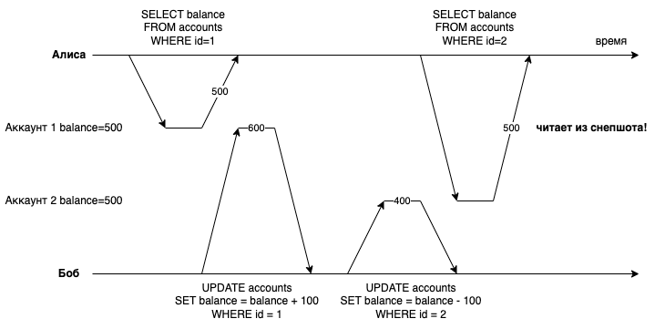
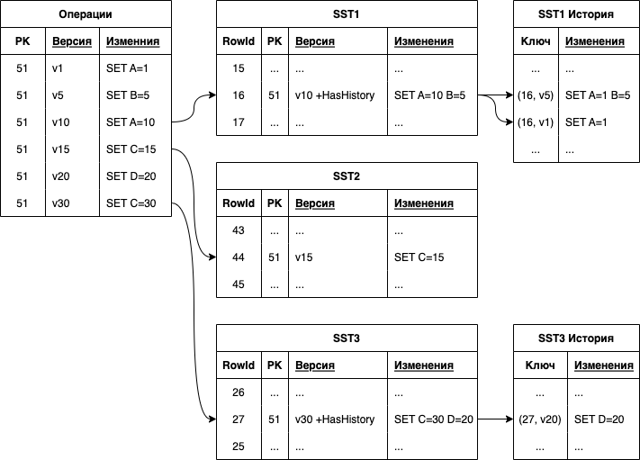
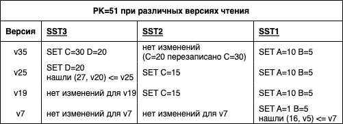

# Многоверсионное управление конкурентным доступом (MVCC)

Эта статья описывает, как многоверсионное управление конкурентным доступом (MVCC, Multi-Version Concurrency Control) используется в {{ ydb-short-name }}.

## Транзакции в {{ ydb-short-name }}

По умолчанию транзакции {{ ydb-short-name }} выполняются с уровнем изоляции "serializable" (сериализуемость). С некоторой степенью упрощения сериализуемость транзакций означает, что они могут быть с тем же самым результатом выполнены в виде строгой последовательности операций без пересечений во времени. С технической точки зрения порядок выполнения транзакций может быть произвольным, однако {{ ydb-short-name }} дополнительно гарантирует отсутствие устаревших чтений: все изменения данных, закоммиченные до начала транзакции, будут видимы в этой транзакции. {{ ydb-short-name }} поддерживает интерактивное выполнение транзакций (участки логики приложения могут выполняться между отдельными запросами в рамках транзакции), и использует оптимистичные блокировки для обнаружения конфликтов в работе конкурентно выполняемых модифицирующих транзакций. Если две транзакции пересекаются во времени и конфликтуют (например, обе транзакции читают запись по одному и тому же ключу, а затем пытаются изменить прочитанную запись), то одна из двух транзакций будет успешно подтверждена, а другая будет прервана, и должна быть повторена позднее.

{{ ydb-short-name }} - распределенная СУБД, в которой таблицы делятся на шарды на основе диапазонов значений первичного ключа. Каждый шард может содержать до 2 Гигабайт пользовательских даных. Управление данными шарда таблицы реализуется специальным программным компонентом - таблеткой DataShard, экземпляр которого запускается на одном из вычислительных узлов кластера {{ ydb-short-name }}. Таблетка DataShard представляет собой отказоустойчивую реплицируемую машину состояний (RSM, replicated state machine), использующую надежное общекластерное хранилище (blob storage) для данных и журнала изменений. Таблетки DataShard могут быстро перемещаться между вычислительными узлами, и реализуют низкоуровневые программные интерфейсы (API) для доступа к данным и поддержки распределенных транзакций.

Реализация распределенных транзакций в {{ ydb-short-name }} основана на идеях Calvin, в котором распределение детерминированных транзакций между несколькими участниками осуществляется с использованием предопределенного порядка выполнения транзакций. Каждый участник получает на обработку подмножество общего потока транзакций, отбирая транзакции, затрагивающие конкретного участника. Поскольку каждый участник получает детерминированные транзакции в одном и том же относительном порядке, и принимает одинаковое решение - подтвердить или отменить её выполнение, вся база данных в конечном итоге достигает согласованного детерминированного состояния, несмотря на то, что разные участники могут обрабатывать свои подмножества потока транзакций с разными скоростями. Важно понимать, что транзакции {{ ydb-short-name }} всегда работают с согласованным состоянием данных на момент своего выполнения.

У детерминированных распределенных транзакций есть ограничение: необходимо заранее знать состав участников. Однако {{ ydb-short-name }} использует их только как "строительные блоки", разбивая пользовательские транзакции на фазы, и гарантируя корректность через блокировки. В современном {{ ydb-short-name }} выполнение в виде распределенной транзакции требуется только для итоговой операции подтверждения изменений в конце пользовательской транзакции. Все остальные фазы выполнения {{ ydb-short-name }} трансформирует в простые операции, затрагивающие только один шард, не нарушая при этом гарантии уровня изоляции "serializable".

Наличие предопределенного порядка выполнения транзакций может стать узким местом для параллельного выполнения операций. Например, при наличии в последовательности медленной транзакции, содержащей ожидание внешнего условия или доступности данных, более поздние транзакции в той же последовательности также оказываются ожидающими. Тем самым возникает потребность поддержать возможность изменения порядка выполнения не конфликтующих друг с другом транзакций без нарушения видимых пользователю гарантий.

Опыт практической эксплуатации ранних версий {{ ydb-short-name }} показал, что для обеспечения высокой производительности важно обеспечить параллельное выполнение не только для полностью независимых, но и для частично конфликтующих транзакций. Например, выполнение широкого (многострочного) чтения данных одной транзакцией ранее могло блокировать операции записи данных в тот же диапазон ключей в других транзакциях, фактически останавливая их выполнение на период чтения данных с диска первой транзакцией. Реализация MVCC в {{ ydb-short-name }} позволила снять это ограничение.

## Что такое MVCC

Многоверсионное управление конкурентным доступом (MVCC, Multi-Version Concurrency Control) -- это способ повысить параллелизм обращений к базе данных за счет хранения нескольких версий данных одной и той же строки в том виде, в каком они были в разные моменты времени. Это позволяет читателям продолжать чтение из снимка состояния данных, не блокируя писателей. Базы данных, реализующие MVCC, не перезаписывают существующие строки, вместо этого они создают модифицированные копии изменяемых строк с добавлением версионной информации. Старые версии строк удаляются процессами сборки мусора в тот момент, когда они оказываются не нужны ни одному из активных или потенциальных читателей.

Простым и прямолинейным вариантом добавления поддержки MVCC в отсортированное хранилище пар ключ-значение является хранение нескольких значений для каждого ключа. Это может быть обеспечено добавлением суффикса с данными о версии к значению ключа записи и пропуском неактуальных для текущей транзакции или снимка версий при чтении данных. Многие базы данных в том или ином виде используют этот подход для реализации MVCC. Стоит помнить, что описанный прямолинейный подход ведет не только к раздуванию объема хранимых данных (поскольку требуется хранить множество копий одних и тех же данных, а поиск и удаление старых версий записей - ресурсоёмкая задача). Что важнее, производительность запросов может снижаться из-за необходимости сканирования и пропуска не подходящих под запрос версий обрабатываемых записей.

## Почему поддержка MVCC необходима в {{ ydb-short-name }}

Шарды таблиц {{ ydb-short-name }} хранят данные в отсортированном хранилище пар ключ-значение, реализованном как оптимизированное для записи [LSM-дерево](glossary.md#lsm-tree). Ранние версии {{ ydb-short-name }} не использовали MVCC. Последовательность выполнения транзакций является предопределенной (что обеспечивается Координаторами -- аналогами компонентов "sequencer" в оригинальной публикации Calvin), но {{ ydb-short-name }} активно меняет последовательность выполнения операций на каждом участнике, что допустимо при соблюдении внешних гарантий и отсутствии изменений конечного результата обработки. При отсутствии поддержки MVCC возможности по изменению порядка выполнения транзакций ограничены конфликтами между операциями чтения и записи данных: например, операция записи не может быть начата до завершения операции широкого чтения. Применение MVCC позволяет выполнять операции записи, не дожидаясь завершения конфликтующих операций чтения, и только операции чтения должны дождаться завершения предшествующих им операций записи. Таким образом, MVCC упрощает механизм изменения последовательности выполнения операций и повышает общую пропускную способность.

| Время | Оператор | Без MVCC | MVCC | Описание |
| --- | --- | --- | --- | --- |
| v1000:123 | `UPSERT` | ☑️ | ☑️ | Выполнен |
| v1010:124 | `SELECT` | ⏳ | ⏳ | Чтение данных |
| v1020:126 | `UPSERT` | ❌ | ☑️ | UPSERT без MVCC ждет завершения SELECT |
| v1030:125 | `SELECT` | ❌ | ⏳ | SELECT ждет завершения UPSERT перед чтением данных |

Отсутствие поддержки MVCC заставляло ранние версии {{ ydb-short-name }} применять дополнительные меры для обеспечения согласованности данных. Интерактивная транзакция может состоять из нескольких операций чтения, каждая из которых выполняется в свой момент времени. Чтобы исключить изменение уже прочитанных данных конфликтующими транзакциями в период времени между выполненной операцией чтения и моментом подтверждения текущей транзакции, {{ ydb-short-name }} выполняла дополнительные проверки с использованием оптимистических блокировок. Использование этого механизма достаточно часто приводило к принудительной отмене и вынужденному повтору читающих транзакций на стороне приложения из-за ошибок сериализации, что неудобно для пользователей и снижает производительность.

Реализация MVCC с использованием глобальных номеров версий (доступных для использования при выполнении детерминированных распределенных транзакций) позволяет {{ ydb-short-name }} выполнять операции чтения с использованием глобально согласованного снимка данных. Использование снимка для чтения данных позволяет избежать конфликтов между операциями чтения и записи, и полностью исключить возможность ошибок сериализации для операций чтения. Это улучшает пропускную способность баз данных в нагрузках с интенсивным чтением. MVCC также позволяет обеспечить повторяемость чтения в транзакциях, когда несколько операций чтения данных из одной и той же таблицы в транзакции всегда возвращают одинаковый (глобально согласованный) результат.

## Организация хранения данных MVCC

Таблетка DataShard хранит один шард таблицы в виде оптимизированного для записи LSM-дерева, в котором для каждого первичного ключа хранится список операций изменения значений колонок строки. Актуальное состояние строки формируется каждый раз при обращении путем объединения индивидуальных операций изменения значений. Фоновая компактификация аналогичным образом объединяет изменения значений на нескольких уровнях LSM-дерева, и записывает агрегированное состояние каждой строки.

При добавлении поддержки MVCC в {{ ydb-short-name }} одной из целей было исключить деградацию производительности для существующих нагрузок, типичным примером которых являются запросы актуального состояния записей в таблице с указанием диапазона значений первичного ключа. Наивный метод реализации MVCC с добавлением версионного суффикса к первичному ключу не рассматривался разработчиками, поскольку он неизбежно ведет к снижению производительности запросов. Вместо этого {{ ydb-short-name }} всегда хранит в основной [SST-структуре](glossary.md#sst) (sorted string table, часть LSM-дерева) актуальные версии строк. При наличии нескольких версий строки ее наиболее актуальная версия помечается специальным флагом наличия "истории изменения". Более старые версии помеченных таким образом строк хранятся в дополнительной SST-структуре, при этом версионные данные для каждой строки отсортированы в порядке убывания номера версии.

При чтении данных из снимка {{ ydb-short-name }} проверяет, не является ли актуальная версия строки в основной SST-структуре "слишком свежей", и при необходимости выполняет двоичный поиск в SST-структуре с историческими данными. Изменения, содержащиеся в найденной версии строки, соответствующей текущему снимку, используется для восстановления актуального состояния данных строки. Поскольку уровни LSM-дерева примерно соответствуют времени их создания, поиск версий строки в SST-структуре для текущего уровня можно прекратить, как только удается обнаружить подходящую версию. Для построения полного состояния строки на момент снимка необходимо найти в каждом из более старых уровней LSM-дерева наиболее свежую версию этой строки. Таким образом, количество операций объединения версий строки оказывается ограничено количеством уровней LSM-дерева, которое обычно невелико.

Строки, хранимые в SST-структурах, не содержат полного набора атрибутов, а фактически содержат только изменения данных. Каждая строка при хранении в конкретной SST-структуре содержит полный набор изменений данных строки относительно наиболее актуальной версии той же строки в предыдущей SST-структуре в рамках LSM-дерева. Такой избыточный формат хранения помогает сделать поиск данных и компактификацию более эффективными.

Представим себе гипотетическую ситуацию, когда пользователь выполняет 1 миллион обновлений строки с ключом K, каждый раз изменяя лишь одну из множества колонок таблицы. Для повышения эффективности операций записи {{ ydb-short-name }} избегает считывания состояния строки в момент обновления данных, а вместо этого фиксирует изменение в формате "обновить колонку C для ключа K". Версии строки накапливаются в оперативной памяти в структуре MemTable, и с некоторой периодичностью сбрасываются в новые SST-структуры, каждая из которых в нашем примере будет содержать некоторое (скорее всего, достаточно большое) количество версий изменяемой строки. Если бы каждая версия строки содержала лишь изменения по сравнению с предыдущей версией, то в итоге для построения актуального состояния строки потребовалось бы объединить данные из 1 миллиона накопленных версий, просканировав значительный объём данных. Вместо этого {{ ydb-short-name }} на уровне каждой SST-структуры хранит агрегированные изменения строк, начиная с MemTable как нулевого уровня LSM (в котором предыдущее состояние строки всегда доступно в оперативной памяти, что исключает необходимость чтения с диска).

При компактификации, когда нескольких уровней SST собираются в новую SST-структуру, каждая измененная строка объединяется со своими наиболее актуальными версиями из более старых SST. Тем самым сложность сокращается в части количества операций объединения строк (количество которых для каждой строки оказывается ограничено количеством уровней LSM-дерева) как при компактификации, так и при чтении данных. В то же время сохраняется возможность выполнять "слепую запись", не восстанавливая состояние строки при изменении ее колонок.

В конечном счете старые диапазоны версий помечаются как устаревшие и недоступные для чтения, что позволяет автоматически удалять неиспользуемые версии строк в процессе компактификации: недоступные версии пропускаются при компактификациях и не попадают в новые SST-структуры. Для каждой SST-структуры {{ ydb-short-name }} поддерживает небольшую гистограмму хранимых версий, что позволяет своевременно обнаруживать накопление излишнего количества неиспользуемых версий в LSM-дереве и автоматически запускать дополнительные операции компактификации для сборки версионного мусора.

## Как MVCC используется в {{ ydb-short-name }}

Применение MVCC позволяет таблеткам DataShard более свободно изменять порядок выполнения транзакций. Работа с глобальными снимками данных дает еще больше возможностей, поэтому {{ ydb-short-name }} использует глобально-координируемые значения системного времени в качестве меток версий, которые соответствуют глобальному логическому порядку выполнения операций, поддерживаемому механизмом детерминированных распределенных транзакций. Это позволяет создавать глобальные снимки путем выбора корректного значения системного времени.  Чтение данных из таблеток DataShard с указанием снимка позволяет получить согласованное состояние всей базы данных по состоянию на конкретный момент времени.

Перед выполнением первой операции чтения в интерактивной (многошаговой) транзакции {{ ydb-short-name }} выбирает метку времени снимка данных, для которой гарантировано завершение всех ранее подтвержденных транзакций. В существующей реализации метка времени снимка вычисляется на основе последней метки времени, разосланной Координаторами. Вычисленная метка времени может оказаться в недалеком будущем из-за того, что часть передаваемых от Координаторов в таблетки DataShard транзакций могла не успеть начать свое выполнение. Сдвиг метки времени в будущее обычно оказывается очень небольшим, а для передаваемых транзакций {{ ydb-short-name }} ожидает, что они вскоре начнут свое выполнение просто в силу того, что они уже передаются. {{ ydb-short-name }} предоставляет важную гарантию, что выбранная метка времени будет больше или равна всех меток времени подтверждения транзакций, которые могли быть видимы пользователю. Таким образом, при генерации меток времени для новых операций чтения обеспечивается видимость всех ранее завершенных (подтвержденных) операций записи.

Снимок, соответствующий вычисленной метке времени, используется для всех последующих операций чтения в этой же транзакции без какой-либо дополнительной координации между участниками, поскольку снимки обеспечивают глобальную согласованность на уровне базы данных в целом. Чтобы гарантировать, что все значимые изменения учтены в снимке, таблетка DataShard проверяет наличие потенциально конфликтующих пишущих транзакций, которые должны завершиться перед выбранным снимком, и дожидается их завершения перед началом чтения. Снимок гарантирует отсутствие изменений в данных со стороны конкурентно выполняемых транзакций (повторяемость чтения), но эта гарантия относится только к уже наблюдаемым изменениям. Данные за пределами текущей области наблюдения снимка могут меняться до тех пор, пока системное время не продвинется достаточно далеко за границу этого снимка для каждого из участников. Как интересный побочный эффект, некоторые более поздние (по отношению к снимку) пишущие транзакции могут быть переупорядочены перед фактическим доступом к данным снимка, что допускается на уровне изоляции Serializable.

Все изменения данных, выполняемые интерактивной транзакцией, буферизуются до момента подтверждения транзакции. В момент подтверждения распределенной транзакции выполняется проверка (с использованием оптимистических блокировок) на отсутствие конфликтующих изменений, выполненных конкурирующими транзакциями между моментом создания снимка и моментом подтверждения транзакции. Такая проверка имитирует перемещение всех операций чтения во времени к моменту подтверждения транзакции. Подтверждение транзакции производится только тогда, когда конфликтующие изменения отсутствуют.

Интерактивные транзакции, выполняющие чтение исторических (заведомо устаревших) данных из своего снимка, автоматически помечаются флагом "только для чтения", поскольку для них заранее известно, что соответствующие операции чтения нельзя будет переместить во времени на будущий момент подтверждения транзакции. При попытке выполнения в такой транзакции операций записи возвращается ошибка сериализации без каких-либо буферизаций или дополнительных взаимодействий. Если же транзакция в конечном итоге оказывается только читающей, то при ее завершении производится освобождение ресурсов и возврат успешного статуса пользователю, поскольку чтение из согласованного снимка данных не приводит к нарушению гарантий сериализации. До реализации в {{ ydb-short-name }} поддержки основанных на MVCC глобальных снимков данных требовалось проверять состояние блокировок для всех транзакций, что создавало сложности с выполнением многострочных операций чтения на фоне высокой нагрузки на запись.

## Сохранение высокой производительности на нагрузках ключ-значение

Наличие в {{ ydb-short-name }} поддержки сложных распределенных транзакций, затрагивающих множество таблиц и их шардов, не отменяет потребности в высокой производительности простых одношардовых транзакций. Такие транзакции применительно к {{ ydb-short-name }} называются "немедленными" ("immediate"), и исторически (до реализации MVCC) для них не использовалась какая-либо дополнительная координация. Например, если транзакция читает или пишет данные по одному конкретному ключу в одной таблице, то при ее выполнении требуется взаимодействие с единственным шардом таблицы, к которому принадлежит этот ключ, и больше ни с чем.

На первый взгляд, такой подход противоречит использованию глобальных меток времени для реализации MVCC. Но если транзакция ограничена рамками конкретного шарда, то оказывается достаточным использование локальных (не координируемых) меток времени, которые могут отличаться для разных шардов. Метки времени транзакций присваиваются таким образом, чтобы используемые локальные метки времени можно было использовать как корректные глобальные метки времени.

Для каждой распределенной транзакции присваиваемая метка времени представляет собой пару чисел (step, txId). В этой паре step - номер шага координатора (coordination tick), обычно автоматически увеличиваемый каждые 10 миллисекунд, а txId - глобально уникальный идентификатор транзакции. Немедленные транзакции не могут заполнить поле step корректным значением, поскольку они не обрабатываются координаторами. Для значения txId обеспечивается уникальность, но не предоставляется гарантий монотонного возрастания значений, поэтому их нельзя использовать при записи данных из-за возможного отнесения данных к моментам времени в прошлом.

Поскольку для немедленных транзакций отсутствует требование повторяемости, их меткам времени не обязательно быть уникальными. Это позволяет использовать в качестве метки времени немедленной транзакции метку времени другой существующей транзакции в очереди выполнения, в результате чего немедленная транзакция оказывается выполнена "непосредственно перед" распределенной транзакцией с такой же меткой времени. Если же очередь выполнения оказывается пустой, то в качестве step используется время, разосланное координаторами (подтвержденный всеми шардами максимальный номер шага координации, что гарантирует отсутствие транзакций до конца этого шага), а в качестве txId - максимально возможное значение, что обеспечивает выполнение немедленной транзакции "непосредственно перед" завершением текущего шага координации.

Использование описанных выше неуникальных меток времени для немедленных транзакций гарантирует, что всегда найдется некоторое новое неубывающее значение метки времени, позволяющее выполнить очередную немедленную транзакцию без задержек (если не учитывать другие ограничения, связанные с изменением порядка выполнения операций). Повторное использование меток времени дополнительно облегчает компактификацию для случая быстро меняющихся записей, поскольку все версии строки, порождаемые тысячами немедленных транзакций с одинаковой меткой времени, оказываются сжаты в единственную финальную версию. Таким образом, {{ ydb-short-name }} хранит в истории изменений только те версии строк, для которых требуется согласованность на уровне нескольких шардов.

## Приоритет операций чтения

Когда разработчики {{ ydb-short-name }} впервые включили поддержку снимков MVCC, при тестировании они столкнулись с неожиданной головоломкой: на некоторых рабочих нагрузках произошло серьезное увеличение задержек чтения данных. {{ ydb-short-name }} отсчитывает системное время в виде шагов координации транзакций каждые 10 миллисекунд (такое значение было подобрано в соответствии с типичными задержками взаимодействия между центрами обработки данных, составляющими около 4 миллисекунд). Как было указано в предыдущем разделе, одношардовые операции записи используют "текущее время" для формирования метки времени транзакции. Конкурентные операции чтения из снимков данных должны были ждать следующего шага координации для того, чтобы используемые в них метки времени снимков оказались "закрытыми" для новых операций записи. Результатом изменений стало вполне объяснимое, но неприемлемое увеличение задержек на операциях чтения. 

Для решения проблемы с возросшими задержками операций чтения потребовались дополнительные меры, позволяющие повысить приоритет операций чтения без чрезмерного замедления операций записи. Реализованное в настоящее время решение "закрывает" возможность записи для выбранной метки времени снимка в момент начала чтения из этого снимка. Для одношардовых операций записи выбирается метка времени в "будущем", которая исключает возможность повреждения ранее созданных снимков (что обеспечивает повторяемость чтения). Поскольку метка времени одношардовых операций записи оказывается в "будущем", и поскольку создаваемые новые снимки должны включать в себя данные только подтвержденных транзакций, то {{ ydb-short-name }} задерживает ответы с подтверждением выполненной записи до момента соответствия выбранной "будущей" и актуальной меток времени. В результате {{ ydb-short-name }} ведет себя так, будто такие ожидающие транзакции не подтверждены (например, при выполнении конкурентных одношардовых операций чтения), до момента соответствия метки времени записи транзакции текущему времени.

В момент, когда требуется дополнительное ожидание, изменения одношардовой транзакции уже передаются для записи в хранилище, и обычно должны быть сохранены как минимум в еще одном центре обработки данных, поэтому дополнительное ожидание почти не влияет на средние задержки одношардовых транзакций записи даже при наличии большого количества конкурентных чтений из снимков. В то же время для транзакций чтения величина задержек значительно уменьшилась:

