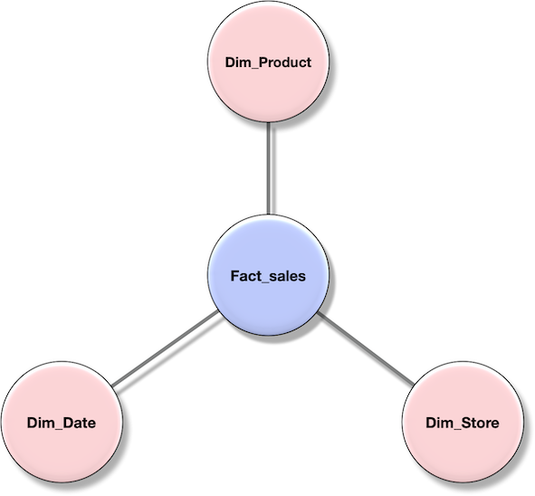

# Оптимзация запросов в YDB

В YDB используются два вида отпимизатора запросов - оптимизатор основанный на правилах и стоимостной оптимизатор. Изначально YDB разрабатывалась для OLTP нагрузок, то есть для выполнения большого потока простых запросов. На таких нагрузках YDB хорошо работает и без стоимостного оптимизатора, обходясь только правилами оптимизации. Для более сложных запросов и особенно для OLAP сценариев уже требуется стоимостной оптимизатор.

## Оптимизатор запросов основанный на правилах

Большое количество оптимизаций в YDB очевидно и не требует анализа альтернатив и их стоимости. Создаются отдельные эвристические правила, которые применяются всегда когда есть такая возможность. Например, в любом запросе практически всегда полезно фильтры применить как можно раньше в плане исполнения. Для этих целей пишутся правила оптимизации, которые итеративно применяются оптимизатором, пока есть такая возможность.

## Стоимостный оптимизатор запросов

Для каждого запроса стоимостной оптимизатор рассматривает большое количество альтернативных планов выполнения и выбирает из них лучший на основе оценки стоимости каждого варианта. На текущий момент этот оптимизатор работает только с планами, где есть операции Join. Он выбирает наилучший порядок исполнения этих операций, а также выбирает самую эффективную реализацию для каждого Join в плане.

Стоимостной оптимизатор состоит из трех основных компонент:
* Модуль перебора альтернативных планов
* Модуль оценки стоимости плана
* Модуль статистики, на которую опирается оценка стоимости

### Перебор порядка соединений

Текущий стоимостный оптимизатор в YDB перебирает возможные порядки соединения таблиц с помощью оператора Join.
Оптимизатор реализован на основе современных алгоритмов перебора планов, и хоть задача выбора оптимального порядка Joins очень нетривиальная, мы решаем эту задачу для достаточно сложных планов. Сложность плана зависит не только от количества операций Join, но и от топологии этих соединений. Например, если все Join-ы делаются в цепочке, то такой план достаточно простой и мы способны оптимизировать планы с более чем 100 таких операций. С другой стороны, если топология допускает Join между всеми парами таблиц в запросе, то мы оптимизируем планы с 15 такими операциями.

Топология графа джоинов определяется тем, как разные таблицы и промежуточные результаты соединяются в исходном SQL запросе. Например, вот типичный пример популярной топологии «звезда», где основная таблица фактов соединяется с многочисленными таблицами измерений:

```sql
SELECT
	P.Brand,
	S.Country AS Countries,
	SUM(F.Units_Sold)

FROM Fact_Sales F
INNER JOIN Dim_Date D    ON (F.Date_Id = D.Id)
INNER JOIN Dim_Store S   ON (F.Store_Id = S.Id)
INNER JOIN Dim_Product P ON (F.Product_Id = P.Id)

WHERE D.Year = 1997 AND  P.Product_Category = 'tv'

GROUP BY
	P.Brand,
	S.Country
```

В графе этого запроса все таблицы `Dim...` соединяются c таблицей фактов `Fact_Sales`:


Топология «цепочка» — это когда все таблицы соединены друг с другом последовательно и каждая таблица участвует не более, чем в одном соединении. «Клика» — полностью связанный граф, где каждая таблица соединяется с другой. Возможности точной оптимизации YDB приведены в следующей таблице:

| Топология | Кол-во поддерживаемых соединений |
| --------- | -------------------------------- |
| Цепочка | 110 |
| Звезда | 18 |
| Клика | 15 |

YDB использует модифиуацию известного алгоритма DPHyp для перебора порядка соединений.

### Оценка стоимости планов

Сравнение сложностей планов основывается на стоимостной функции, которая оценивает ресурсоёмкость каждой операции плана. Самые главные параметры стоимостной функции — это предсказания размера входных данных для каждого оператора и размера его результата. Эти предсказания делаются на основе статистики, собранной по таблицам YDB, и анализа самого плана.

### Статистики для стоимостного оптимизатора

Стоимостный оптимизатор использует как простые базовые статистики, так и более точные по-колоночные статистики. Текущий набор базовых статистик:

* Количество записей таблицы
* Размер таблицы в байтах

Текущий набор по-колоночных статистик:

* Count-min sketch по каждому атрибуту таблицы

### Текущие уровни стоимостной оптимизации

В YDB можно выставить уровень стоимостной оптимизации через прагму ```CostBasedOptimizationLevel```. Текущие уровни стоимостной оптимизации следующие:

| Уровень | Поведение оптимизатора |
| ------- | ---------------------- |
| 0 | Cтоимостный оптимизатор выключен |
| 1 | Cтоимостный оптимизатор выключен, считаются предсказания оптимизатора |
| 2 | Cтоимостный оптимизатор включается только для запросов, где есть OLAP таблицы |
| 3 | Cтоимостный оптимизатор включается для всех запросов, но для строчных таблиц предпочитается LookupJoin |
| 4 | Cтоимостный оптимизатор включен в полном виде всегда |