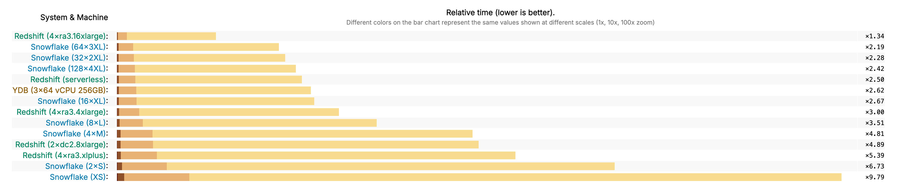

# BI-аналитика и визуализация данных

Интерактивность BI-дешбордов напрямую зависят от производительности базы данных, на которой они построены. {{ydb-short-name}} спроектирована как высокопроизводительная аналитическая платформа, выполняющая запросы за доли секунды, что позволяет аналитикам работать с данными в интерактивном режиме.

Это достигается за счет ключевых архитектурных особенностей:

- Колоночное хранение: запросы читают с диска только те столбцы, которые указаны в запросе, что сокращает объем дисковых операций.
- MPP-архитектура: каждый запрос распараллеливается на все доступные вычислительные узлы кластера, что позволяет утилизировать все ресурсы для его выполнения.
- Децентрализованная архитектура: отсутствие единого мастер-узла позволяет выполнять множество параллельных запросов от пользователей BI-систем.

## Производительность в независимых бенчмарках

Хотя синтетические тесты не всегда отражают реальную нагрузку, они служат хорошей отправной точкой для сравнения производительности. [ClickBench](https://benchmark.clickhouse.com/#system=+Rf%7Cnof%7CYD&type=-&machine=-ca2%7Cgle%7C6ax%7Cae-%7C6ale%7Cgel%7C3al&cluster_size=-&opensource=-&tuned=+n&metric=hot&queries=-) — это независимый бенчмарк для аналитических СУБД, разработанный создателями ClickHouse.

На наборе из 43 аналитических запросов {{ydb-short-name}} показывает конкурентные результаты, опережая многие популярные open-source и облачные аналитические базы данных. Это подтверждает высокую производительность движка на типовых OLAP-запросах.

## Интеграции с BI-платформами

{{ydb-short-name}} поддерживается следующие BI-платформы:

- [Yandex DataLens](../../../../integrations/visualization/datalens.md).
- [Apache SuperSet](../../../../integrations/visualization/superset.md)
- [Grafana](../../../../integrations/visualization/grafana.md)
- [Polymatica](https://wiki.polymatica.ru/display/PDTNUG1343/YDB+Server)
