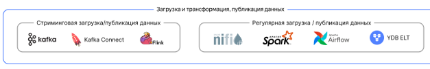
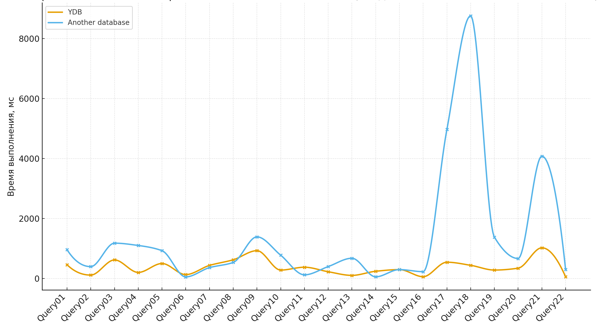

# Трансформация и подготовка данных (ETL/ELT)

Подготовка данных для анализа — ключевой этап в построении хранилища. {{ydb-short-name}} поддерживает все стандартные подходы к трансформации данных, позволяя вам выбрать инструмент, наиболее подходящий для конкретной задачи: от чистого SQL до сложных пайплайнов на Apache Spark.

## SQL-трансформации (ELT)

Трансформации данных с помощью SQL часто являются наиболее производительным, так как вся обработка происходит непосредственно в движке {{ydb-short-name}}, без перемещения данных во внешние системы и обратно. Вы описываете логику на SQL, и она выполняется распределенным MPP-движком, который оптимизирован для таких операций.

### Производительность в TPC-H бенчмарке

Производительность ELT-операций напрямую зависит от того, насколько быстро база данных способна выполнять сложные аналитические запросы. Стандартным индустриальным тестом для таких запросов является [TPC-H](https://www.tpc.org/tpch/).

Сравнение с другой распределенной аналитической СУБД на наборе запросов TPC-H показывает, что {{ydb-short-name}} демонстрирует более стабильную производительность, особенно на запросах, которые содержат:

- Соединения (`JOIN`) большого количества таблиц (5 и более).
- Вложенные подзапросы, используемые для фильтрации.
- Агрегации (`GROUP BY`) с последующей сложной фильтрацией по их результатам.

{width=600}

Такая стабильность указывает на то, что стоимостной оптимизатор запросов в {{ydb-short-name}} эффективно строит планы для комплексных SQL-паттернов, которые часто встречаются в реальной ELT-логике. Для DWH-платформы это означает предсказуемое время выполнения пайплайнов по обновлению данных и снижение рисков неконтролируемой деградации производительности в продакшн-среде.

### Основные сценарии

- Построение витрин данных: Используйте привычный синтаксис [`INSERT INTO ... SELECT FROM ...`](../../../../yql/reference/syntax/insert_into.md) для создания агрегированных таблиц (витрин) из "сырых" данных.
- Объединение OLTP и OLAP данных: {{ydb-short-name}} позволяет в одном запросе объединять данные как из транзакционных (строковых), так и из аналитических (колоночных) таблиц. Это дает возможность обогащать "холодные" аналитические данные актуальной информацией из OLTP-системы без необходимости их дублирования.
- Массовое обновление: Для "слепой" записи больших объемов данных без проверки существования можно использовать оператор [`UPSERT INTO`](../../../../yql/reference/syntax/upsert_into.md).

## Управление SQL-пайплайнами с помощью dbt

Для управления сложными SQL-пайплайнами используйте [плагин к dbt](../../../../integrations/migration/dbt.md). Плагин позволяет дата-инженерам описывать модели данных в виде `SELECT`-запросов, а dbt автоматически строит граф зависимостей между моделями и выполняет их в правильном порядке. Этот подход помогает реализовать принципы `software engineering` (тестирование, документирование, версионирование) при работе с SQL-кодом.

## Сложные трансформации с помощью Apache Spark (ETL) {#spark}

Для задач, требующих сложной логики на языках программирования (Python, Scala, Java) или интеграции с ML-пайплайнами, рекомендуется использовать Apache Spark.

Специализированный [коннектор для Apache Spark](../../../../integrations/ingestion/spark.md) обеспечивает высокопроизводительную параллельную работу с данными. В отличие от многих других баз, в {{ydb-short-name}} нет выделенного мастер-узла для экспорта данных. Spark читает данные напрямую со всех узлов хранения {{ydb-short-name}}, что обеспечивает высокую скорость и линейную масштабируемость чтения.

## Оркестрация пайплайнов

Для запуска пайплайнов по расписанию и управления зависимостями используются оркестраторы.

- Apache Airflow: Для оркестрации данных в {{ydb-short-name}} поддерживается [провайдер к Apache Airflow](../../../../integrations/orchestration/airflow.md). С его помощью можно создавать DAG'и, которые запускают `dbt run`, выполняют YQL-скрипты или инициируют Spark-джобы.
- Встроенные механизмы: Для некоторых задач не требуется внешний оркестратор. {{ydb-short-name}} может выполнять часть операций автоматически:

    - Удаление устаревших данных по TTL: автоматическая очистка партиций по истечении заданного времени.
    - Автоматический сompaction: процессы слияния и оптимизации данных для LSM-дерева происходят в фоновом режиме, что исключает необходимость регулярного запуска команд вроде `VACUUM`.

## Интеграция с другими ETL-инструментами через JDBC

{{ydb-short-name}} предоставляет [JDBC-драйвер](../../../../reference/languages-and-apis/jdbc-driver/index.md), что позволяет использовать широкий спектр существующих ETL-инструментов, таких как [Apache NiFi](https://nifi.apache.org/) и другие JDBC-совместимые системы.
