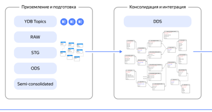

# Выполнение запросов

{{ydb-short-name}} — это распределенная MPP (Massively Parallel Processing) база данных, спроектированная для выполнения сложных аналитических запросов на больших объемах данных. Каждый запрос автоматически распараллеливается на все доступные вычислительные узлы кластера для утилизации ресурсов.

{{ydb-short-name}} поддерживает ряд ключевых технологий, обеспечивающих производительность и стабильность:

- [{#T}](#mpp)
- [{#T}](#cbo)
- [{#T}](#spilling)
- [{#T}](#resource_management)

## Децентрализованная MPP-архитектура {#mpp}

В отличие от MPP-систем с выделенным управляющим узлом (master node), архитектура {{ydb-short-name}} полностью децентрализована. Это дает два фундаментальных преимущества:

- Высокая отказоустойчивость: Любой узел может принять и скоординировать выполнение запроса. Отсутствует единая точка отказа (SPOF). Выход из строя части узлов не приводит к остановке работы всего кластера — нагрузка перераспределяется на оставшиеся в работе узлы.
- Масштабирование вычислений: Вы можете без периодов простоя добавлять или отключать вычислительные узлы, и система начнет распределять на них вычислительную нагрузку, адаптируясь к ее изменению.

## Стоимостной оптимизатор запросов {#cbo}

Перед выполнением запроса {{ydb-short-name}} использует [стоимостной оптимизатор (Cost-Based Optimizer)](../../../../concepts/optimizer.md). Он анализирует текст запроса, метаданные и статистики о распределении данных в таблицах, чтобы построить физический план выполнения с наименьшей расчетной стоимостью.

Оптимизатор способен:

- Выбирать порядок соединения таблиц для запросов с десятками `JOIN`'ов.
- Подбирать алгоритмы распределенных `JOIN`'ов (например, Grace Join, Broadcast Join) в зависимости от размера таблиц.
- "Проталкивать" фильтры (`WHERE`) как можно ближе к источникам данных для уменьшения объема обрабатываемой информации на последующих стадиях.

## Обработка данных, превышающих объем RAM {#spilling}

Аналитические запросы могут требовать для своей работы большие объемы оперативной памяти, особенно на операциях `JOIN` и `GROUP BY`. {{ydb-short-name}} спроектирована для работы с данными, которые могут не помещаться в RAM.

- Спиллинг (Spilling): Если промежуточные результаты выполнения запроса превышают лимит оперативной памяти, {{ydb-short-name}} [автоматически выгружает](../../../../concepts/spilling.md) их на локальный диск узла. Это предотвращает падение запроса с ошибкой "Out of Memory" и позволяет выполнять запросы над большими объемами данных.
- Распределенные алгоритмы JOIN: для соединения таблиц, превышающих память одного узла, используются распределенные алгоритмы, которые обрабатывают данные по частям на разных узлах.

## Изоляция нагрузок и управление ресурсами {#resource_management}

В корпоративном DWH часто работают разные команды с разными типами нагрузки. Чтобы эти нагрузки не мешали друг другу, в {{ydb-short-name}} встроен менеджер управления ресурсами.

- Workload Manager: Встроенный [менеджер нагрузки](../../../../dev/resource-consumption-management) позволяет создавать ресурсные пулы и с помощью [классификаторов](../../../../concepts/glossary#resource-pool-classifier) назначать запросы разных групп пользователей в разные пулы. Этот механизм решает проблему "шумных соседей", когда один ресурсоемкий запрос может замедлять работу системы для остальных пользователей.
