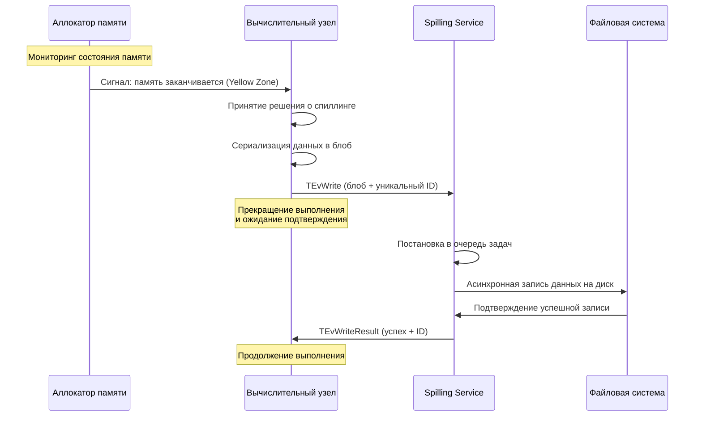
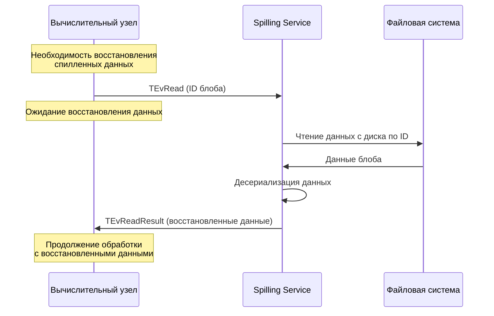

# Спиллинг

## Понятие спиллинга

**Спиллинг** (spilling) — это механизм управления памятью, при котором данные, не помещающиеся в оперативную память, временно сохраняются на диск для освобождения места в RAM. Данный процесс также известен как "выгрузка на диск".

В контексте баз данных и систем обработки данных спиллинг является критически важным механизмом для:

* обработки больших объемов данных, превышающих доступную оперативную память;
* предотвращения ошибок "Out of Memory" (OOM);
* обеспечения стабильной работы системы при пиковых нагрузках;
* оптимизации использования ресурсов.

## Принципы работы спиллинга

### Основные концепции

Спиллинг функционирует на основе принципа иерархии памяти:

1. **Оперативная память (RAM)** — наиболее быстрый уровень доступа к данным
2. **Дисковое хранилище** — менее быстрый, но более объемный уровень хранения

При обнаружении приближения использования памяти к установленным лимитам система автоматически:

* определяет данные для выгрузки на диск;
* сохраняет их в специализированные файлы (spill files);
* освобождает место в оперативной памяти;
* при необходимости восстанавливает данные обратно в память.


## Спиллинг в YDB

### Архитектура спиллинга в YDB

Спиллинг в YDB состоит из двух основных частей: сервиса хранения данных на диске и компонентов, которые используют этот сервис для управления памятью (в некотором роде бэкенд и фронтенд):

#### Сервис спиллинга (Spilling Service)

Данный компонент представляет собой [акторный сервис](glossary.md#actor-service), который инициализируется при старте узла. Сервис обозначается как **Spilling Service**.

Сервис обрабатывает задачи (или [события](glossary.md#event) в терминах [акторной системы](glossary.md#actor-system)). События могут содержать следующие типы заданий:

* сохранение блоба данных;
* загрузка блоба данных;
* удаление блоба данных по указанному идентификатору.

Основная функция сервиса заключается в реализации хранилища, которое сохраняет блоб данных по предоставленному клиентом идентификатору и обеспечивает получение блоба по этому идентификатору.

#### Архитектура Spilling Service

Spilling Service реализован как отдельный [актор](glossary.md#actor), функционирующий в рамках [акторной системы](glossary.md#actor-system) YDB. Основные компоненты сервиса:

**Очередь задач**: Сервис поддерживает внутреннюю очередь операций записи и чтения. Все запросы на спиллинг помещаются в данную очередь и обрабатываются асинхронно.

**Пул потоков**: Для выполнения операций ввода-вывода используется пул рабочих потоков. Количество потоков конфигурируется и влияет на производительность сервиса.

**Управление файлами**: Сервис автоматически создает, удаляет и управляет spill-файлами на диске. Файлы организуются по сессиям и транзакциям для обеспечения изоляции данных.

**Мониторинг ресурсов**: Сервис осуществляет мониторинг использования дискового пространства, количества активных операций и других метрик производительности.

#### Хранение данных

Данные сохраняются в файлах на локальной файловой системе. Spilling Service обеспечивает:

* распределение блобов между файлами;
* удаление файлов;
* управление жизненным циклом данных.

При непредвиденном перезапуске устаревшие файлы удаляются автоматически.

#### Компоненты, использующие спиллинг

Компоненты системы интегрированы с Spilling Service и взаимодействуют с ним через события акторной системы:

**Мониторинг состояния памяти**: Вычислительные узлы осуществляют постоянный мониторинг состояния памяти через аллокатор. Аллокатор информирует узлы о снижении объема свободной памяти. Система не ожидает полного исчерпания памяти, поскольку процесс спиллинга требует дополнительных ресурсов памяти для сериализации и буферизации данных.

**Отправка событий**: При обнаружении необходимости спиллинга данных вычислительный компонент (канал передачи данных или вычислительное ядро) выполняет следующие действия:

1. Сериализует данные в блоб
2. Генерирует уникальный идентификатор для блоба
3. Создает событие спиллинга (`TEvWrite`) с блобом и сгенерированным идентификатором
4. Отправляет событие в Spilling Service
5. **Приостанавливает выполнение** и переходит в состояние ожидания

**Ожидание результатов**: После отправки события вычислительный компонент блокируется и ожидает подтверждения записи. Продолжение работы невозможно до получения ответа, поскольку требуется подтверждение успешного сохранения данных на диск.

**Обработка ответов**: Spilling Service обрабатывает событие и возвращает событие `TEvWriteResult` с подтверждением записи по указанному идентификатору или `TEvError` в случае ошибки. Продолжение работы вычислительного компонента возможно только после получения подтверждения.

**Схема взаимодействия при спиллинге:**

**Процесс записи данных (спиллинг):**



**Процесс чтения данных (восстановление):**



**Чтение данных**: При необходимости восстановления данных компонент отправляет событие `TEvRead` с идентификатором блоба. Spilling Service читает данные с диска и возвращает событие `TEvReadResult` с восстановленными данными.

**Операции обработки данных**:

* **Запись**: Данные сериализуются, разделяются на фрагменты и записываются в spill-файлы. Сервис может применять компрессию для оптимизации использования дискового пространства.
* **Чтение**: Сервис локализует соответствующий файл, читает данные, десериализует их и возвращает компоненту.
* **Удаление**: После чтения данных сервис может автоматически удалить spill-файл для освобождения дискового пространства.

**Преимущества асинхронной модели**:
* Обеспечение надежности операций — гарантия сохранения данных перед продолжением работы
* Возможность параллельной обработки множества запросов в рамках Spilling Service
* Эффективное использование системных ресурсов

### Типы спиллинга в YDB

В YDB реализованы два основных типа спиллинга, функционирующие на различных уровнях вычислительного процесса:

#### 1. Спиллинг внутри вычислительных ядер (Compute Node Spilling)

Вычислительные ядра YDB автоматически выгружают промежуточные данные на диск при выполнении операций, требующих значительного объема памяти. Данный тип спиллинга реализован на уровне отдельных вычислительных операций и активируется при достижении лимитов памяти.

**Основные сценарии использования:**

* **Агрегации** — при группировке больших объемов данных система выгружает промежуточные хеш-таблицы на диск
* **Сортировки** — при сортировке результатов, превышающих доступную память, применяется внешняя сортировка с использованием временных файлов
* **Join операции** — при объединении таблиц большого размера используется алгоритм Grace Hash Join с разделением данных на партиции и их выгрузкой на диск
* **Оконные функции** — спиллинг промежуточных буферов данных для вычисления оконных функций

**Механизм функционирования:**

Вычислительные узлы содержат специализированные объекты для мониторинга использования памяти. При приближении объема данных к установленному лимиту:

1. Система переключается в режим спиллинга
2. Данные сериализуются и разделяются на блоки (бакеты)
3. Блоки передаются в Spilling Service для сохранения на диск
4. В памяти сохраняется только метаинформация о расположении данных
5. При необходимости данные загружаются обратно и обрабатываются

```sql
-- Пример запроса, который может инициировать спиллинг в вычислительных ядрах
SELECT 
    user_id,
    COUNT(*) as orders_count,
    SUM(amount) as total_amount
FROM orders 
GROUP BY user_id 
ORDER BY total_amount DESC;
```

#### 2. Спиллинг в каналах между задачами (Task Channel Spilling)

Данный тип спиллинга функционирует на уровне передачи данных между различными этапами выполнения запроса. Каналы передачи данных автоматически буферизуют и выгружают данные при переполнении буферов.

**Основные сценарии:**

* **Межзадачная передача данных** — когда одна задача производит данные с более высокой скоростью, чем их потребляет следующая задача
* **Промежуточные результаты** — буферизация данных между этапами сложного запроса
* **Потоковая обработка** — управление потоками данных между распределенными вычислениями
* **Балансировка нагрузки** — временное хранение данных при неравномерной нагрузке на узлы

**Механизм функционирования:**

Каналы передачи данных осуществляют постоянный мониторинг своего состояния:

1. **Буферизация**: Входящие данные накапливаются во внутренних буферах канала
2. **Контроль заполнения**: Система отслеживает уровень заполнения буферов (NoLimit, SoftLimit, HardLimit)
3. **Автоматический спиллинг**: При достижении лимитов данные автоматически сериализуются и передаются в Spilling Service
4. **Продолжение функционирования**: Канал продолжает прием новых данных после освобождения места в памяти
5. **Восстановление**: При готовности следующего этапа данные читаются с диска и передаются далее

**Преимущества канального спиллинга:**
* Автоматическое управление памятью без вмешательства в логику запроса
* Возможность обработки данных, превышающих доступную память в несколько раз
* Обеспечение стабильной работы при неравномерной нагрузке между этапами запроса

#### Интеграция типов спиллинга

Оба типа спиллинга функционируют совместно и могут активироваться одновременно в рамках одного запроса. Например, при выполнении сложного аналитического запроса:

1. **Канальный спиллинг** обеспечивает передачу больших объемов данных между узлами
2. **Вычислительный спиллинг** позволяет каждому узлу обрабатывать данные, превышающие его локальную память
3. **Координация** между типами обеспечивает оптимальное использование ресурсов всего кластера

### Мониторинг и метрики

YDB предоставляет детализированную информацию о функционировании спиллинга по каждому типу:

**Метрики вычислительного спиллинга:**
* Количество переключений в режим спиллинга для операций агрегации и join
* Объем данных, выгруженных из вычислительных ядер
* Время выполнения операций с использованием спиллинга и без него
* Количество и размер блоков данных

**Метрики канального спиллинга:**
* Количество операций спиллинга в каналах передачи данных
* Уровни заполнения каналов (SoftLimit/HardLimit)
* Время ожидания при восстановлении данных из каналов
* Общий объем данных, переданных через спиллинг

**Общие метрики системы:**
* **Общий объем выгруженных данных** — суммарный размер всех spill файлов
* **Производительность операций ввода-вывода** — скорость записи и чтения spill файлов
* **Влияние на производительность** — сравнение времени выполнения запросов с использованием спиллинга и без него
* **Использование дискового пространства** — мониторинг доступного места для операций спиллинга

## Оптимизация спиллинга

### Рекомендации по конфигурации

1. **Выделение отдельного диска** для spill файлов для предотвращения конкуренции за операции ввода-вывода
2. **Использование высокопроизводительных накопителей** (SSD/NVMe) для директории спиллинга
3. **Конфигурация размера spill файлов** в соответствии с объемом доступной памяти
4. **Мониторинг производительности** и корректировка настроек

### Рекомендуемые практики

* Регулярная очистка устаревших spill файлов
* Мониторинг использования дискового пространства
* Настройка оповещений при превышении лимитов
* Использование компрессии для оптимизации использования дискового пространства
* Рассмотрение возможности использования RAM-дисков для критически важных операций

## Ограничения и особенности

### Текущие ограничения

* Спиллинг может снижать производительность выполнения запросов
* Не все типы данных поддерживают эффективный спиллинг
* При сбое системы spill файлы могут быть утрачены
* Требуется дополнительное дисковое пространство

### Планы развития

В будущих версиях YDB планируется:

* Улучшение алгоритмов выбора данных для спиллинга
* Поддержка инкрементального спиллинга
* Интеграция с облачными хранилищами
* Автоматическая оптимизация параметров спиллинга

## См. также

- [Конфигурация спиллинга](../../devops/configuration-management/configuration-v2/config-settings.md#конфигурация-спиллинга)
- [Мониторинг YDB](../../devops/maintenance/monitoring.md)
- [Настройка производительности](../../devops/configuration-management/performance-tuning.md)

## Справочные материалы

Для углубленного изучения работы со спиллингом в YDB рекомендуется ознакомиться со следующими материалами:

* [Настройка спиллинга для высоконагруженных систем](../recipes/spilling/high-load.md)
* [Мониторинг и диагностика проблем со спиллингом](../recipes/spilling/monitoring.md)
* [Оптимизация запросов для минимизации спиллинга](../recipes/spilling/query-optimization.md) 