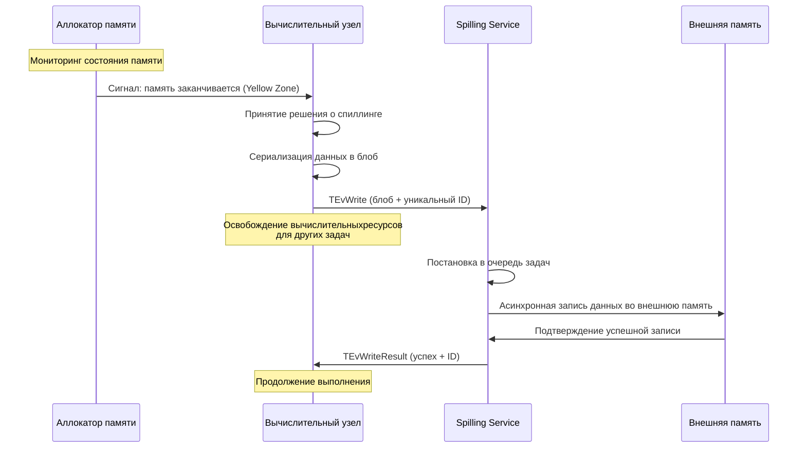
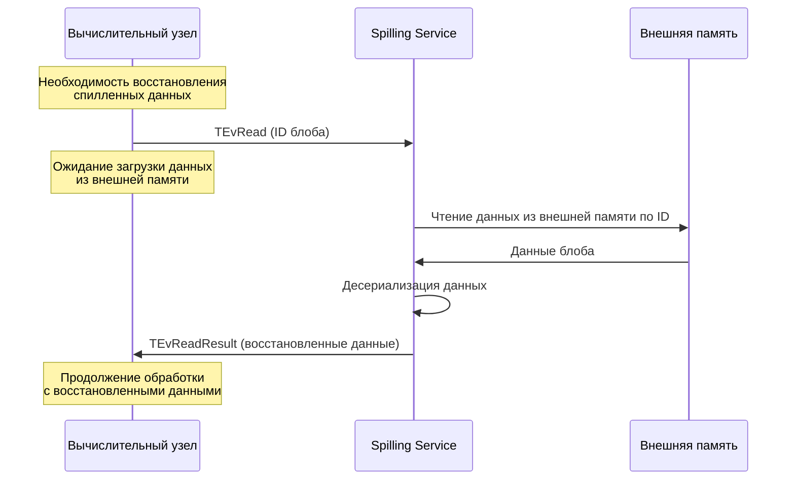

# Спиллинг

## Понятие спиллинга

**Спиллинг** (от англ. *spilling*) - это механизм управления памятью, при котором данные, превышающие доступный объём оперативной памяти кластера, временно выгружаются во внешнее хранилище. Спиллинг обеспечивает выполнение пользовательских запросов, которые требуют обработки больших объёмов данных, превышающих доступную оперативную память.

В системах обработки данных, включая {{ ydb-short-name }}, спиллинг важен для:

- обработки запросов с большими объёмами данных, когда промежуточные результаты не помещаются в оперативную память;
- выполнения сложных аналитических операций (агрегации, сортировки, соединения таблиц) над большими наборами данных;
- оптимизации производительности запросов за счет промежуточной материализации части данных во внешней памяти, что в определенных сценариях может ускорить общее время выполнения.

## Принципы работы спиллинга

### Основные концепции

Спиллинг функционирует на основе принципа иерархии памяти:

1. **Оперативная память (RAM)** - быстрый, но ограниченный ресурс.
2. **Внешняя память** - медленнее, но более ёмкая.

Когда использование памяти приближается к лимиту, система:

- сериализует часть данных;
- сохраняет их во внешней памяти;
- освобождает соответствующую память;
- при необходимости - загружает данные обратно в память для продолжения вычислений.


## Спиллинг в {{ ydb-short-name }}

### Архитектура спиллинга в {{ ydb-short-name }}

Механизм спиллинга в {{ ydb-short-name }} включает два основных уровня: бэкенд - сервис для хранения данных во внешней памяти, и фронтенд - компоненты, которые взаимодействуют с этим сервисом и управляют памятью. В качестве внешнего хранилища используется диск.

#### Сервис спиллинга (Spilling Service)

Данный компонент представляет собой [акторный сервис](glossary.md#actor-service), который инициализируется при старте узла. Сервис обозначается как **Spilling Service**.

Сервис обрабатывает задачи (или события в терминах [акторной системы](glossary.md#actor-system)). События могут содержать следующие типы заданий:

* сохранение блоба данных.
* загрузка блоба данных.
* удаление блоба данных.

Главная функция сервиса заключается в реализации хранилища, которое сохраняет блоб данных по предоставленному клиентом идентификатору и обеспечивает получение блоба по этому идентификатору.

Основные компоненты сервиса:

**Очередь задач**: Сервис поддерживает внутреннюю очередь операций записи и чтения. Все запросы на спиллинг помещаются в данную очередь и обрабатываются асинхронно.

**Пул потоков**: Для выполнения операций ввода-вывода используется пул рабочих потоков. Количество потоков [конфигурируется](../devops/configuration-management/configuration-v2/spilling-config.md#workerscount) и влияет на производительность сервиса.


**Управление данными**: Сервис автоматически создает, удаляет и управляет данными во внешней памяти.

**Мониторинг ресурсов**: Сервис осуществляет мониторинг использования внешних хранилищ, количества активных операций и других метрик производительности.

#### Хранение данных

Данные сохраняются во внешней памяти. Spilling Service обеспечивает:

* распределение записей в постоянном хранилище;
* удаление данных;
* управление жизненным циклом данных.

При непредвиденном перезапуске устаревшие данные удаляются автоматически.

#### Компоненты, использующие спиллинг

Компоненты системы интегрированы с Spilling Service и взаимодействуют с ним через события акторной системы:

**Мониторинг состояния памяти**: Вычислительные узлы осуществляют постоянный мониторинг состояния памяти через аллокатор. Аллокатор информирует узлы о снижении объема свободной памяти. Однако, система не дожидается полного исчерпания памяти, поскольку процесс спиллинга также требует дополнительных ресурсов памяти для сериализации и буферизации данных.

**Отправка событий**: При обнаружении необходимости спиллинга данных вычислительный компонент (канал передачи данных или вычислительное ядро) выполняет следующие действия:

1. Сериализует данные в блоб
2. Генерирует уникальный идентификатор для блоба
3. Создает событие спиллинга (`TEvWrite`) с блобом и сгенерированным идентификатором
4. Отправляет событие в Spilling Service
5. Освобождает ресурсы и переходит в режим ожидания, давая возможность другим задачам использовать вычислительные ресурсы

**Ожидание результатов**: После отправки события вычислительный компонент освобождает ресурсы для других задач и переходит в режим ожидания, позволяя системе оптимально использовать вычислительные мощности кластера до завершения записи во внешнее хранилище.

**Обработка ответов**: Spilling Service обрабатывает событие и возвращает новое событие `TEvWriteResult` с подтверждением записи по указанному идентификатору или `TEvError` в случае ошибки. Продолжение работы вычислительного компонента возможно только после получения подтверждения.

**Схема взаимодействия при спиллинге:**

**Процесс записи данных (спиллинг):**



**Процесс чтения данных (восстановление):**



**Чтение данных**: При необходимости восстановления данных компонент отправляет событие `TEvRead` с идентификатором блоба. Spilling Service читает данные из внешней памяти и возвращает событие `TEvReadResult` с восстановленными данными. Во время ожидания загрузки данных освободившиеся вычислительные ресурсы используются для обработки других задач.

### Типы спиллинга в {{ ydb-short-name }}

В {{ ydb-short-name }} реализованы два основных типа спиллинга, функционирующие на различных уровнях вычислительного процесса. Эти типы работают независимо друг от друга и могут активироваться одновременно в рамках одного запроса, обеспечивая комплексное управление памятью.

#### 1. Спиллинг внутри вычислительных ядер (Compute Node Spilling)

Вычислительные ядра {{ ydb-short-name }} автоматически выгружают промежуточные данные во внешнюю память при выполнении операций, требующих значительного объема памяти. Данный тип спиллинга реализован на уровне отдельных вычислительных операций и активируется при достижении лимитов памяти.

**Основные сценарии использования:**

* **Агрегации** - при группировке больших объемов данных система выгружает промежуточные хеш-таблицы во внешнюю память
* **Сортировки** - при сортировке результатов, превышающих доступную память, применяется внешняя сортировка с использованием долговременного хранилища
* **Join операции** - при объединении таблиц большого размера используется алгоритм Grace Hash Join с разделением данных на партиции и их выгрузкой на внешние накопители

**Механизм функционирования:**

Вычислительные узлы содержат специализированные объекты для мониторинга использования памяти. При приближении объема данных к установленному лимиту:

1. Система переключается в режим спиллинга
2. Данные сериализуются и разделяются на блоки (бакеты)
3. Часть блоков передается в Spilling Service для сохранения во внешней памяти
4. В памяти сохраняется метаинформация о расположении данных
5. При необходимости данные загружаются обратно и обрабатываются

```sql
-- Пример запроса, который может инициировать спиллинг в вычислительных ядрах
SELECT
    user_id,
    COUNT(*) as orders_count,
    SUM(amount) as total_amount
FROM orders
GROUP BY user_id
ORDER BY total_amount DESC;
```

#### 2. Спиллинг в каналах между задачами (Channel Spilling)

Данный тип спиллинга функционирует на уровне передачи данных между различными этапами выполнения запроса. Каналы передачи данных автоматически буферизуют и выгружают данные при переполнении буферов. Это помогает не блокировать выполнение узла, генерирующего данные, даже в ситуациях, когда принимающий узел не готов принять данные.

**Механизм функционирования:**

Каналы передачи данных осуществляют постоянный мониторинг своего состояния:

1. **Буферизация**: Входящие данные накапливаются во внутренних буферах канала
2. **Контроль заполнения**: Система отслеживает уровень заполнения буферов (NoLimit, SoftLimit, HardLimit)
3. **Автоматический спиллинг**: При достижении лимитов данные автоматически сериализуются и передаются в Spilling Service
4. **Продолжение функционирования**: Канал продолжает прием новых данных после освобождения места в памяти
5. **Восстановление**: При готовности следующего этапа данные читаются из временного хранилища и передаются далее

## См. также

- [Конфигурация спиллинга](../devops/configuration-management/configuration-v2/spilling-config.md)
- [Мониторинг {{ ydb-short-name }}](../devops/observability/monitoring.md)
- [Диагностика производительности](../troubleshooting/performance/index.md)
