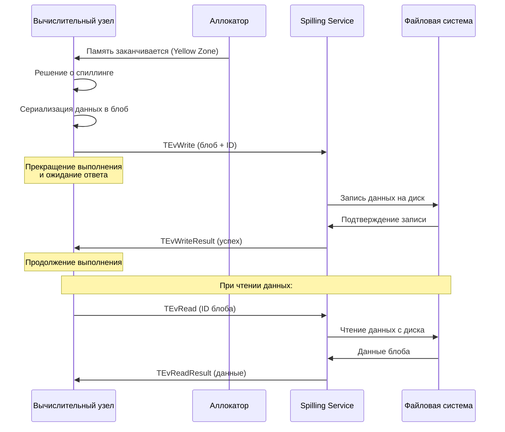

# Спиллинг

## Понятие спиллинга

**Спиллинг** (spilling) — это механизм управления памятью, при котором данные, не помещающиеся в оперативную память, временно сохраняются на диск для освобождения места в RAM. Этот процесс также известен как "выгрузка на диск" или "сваппинг".

В контексте баз данных и систем обработки данных спиллинг является критически важным механизмом для:

* обработки больших объемов данных, превышающих доступную оперативную память;
* предотвращения ошибок "Out of Memory" (OOM);
* обеспечения стабильной работы системы при пиковых нагрузках;
* оптимизации использования ресурсов.

## Принципы работы спиллинга

### Основные концепции

Спиллинг работает по принципу иерархии памяти, где:

1. **Оперативная память (RAM)** — самый быстрый уровень доступа
2. **Дисковое хранилище** — более медленный, но объемный уровень

Когда система обнаруживает, что использование памяти приближается к лимитам, она автоматически:

* выбирает данные для выгрузки на диск;
* сохраняет их в специальные файлы (spill files);
* освобождает место в RAM;
* при необходимости восстанавливает данные обратно в память.


## Спиллинг в YDB

### Архитектура спиллинга в YDB

Спиллинг в YDB состоит из двух основных частей: сервиса хранения данных на диске и компонентов, которые используют этот сервис для управления памятью (в некотором роде бэкенд и фронтенд):

#### Бэкенд спиллинга (Spilling Service)

Бэкенд представляет собой [акторный сервис](glossary.md#actor-service), который запускается в момент старта узла. Мы называем его **Spilling Service**.

Этот сервис умеет принимать задачи (или [события](glossary.md#event) в терминах [акторной системы](glossary.md#actor-system)). В этих событиях могут быть задания:

* сохранить какой-то блоб данных;
* загрузить какой-то блоб данных;
* удалить какой-то блоб данных по некоторому ID.

То есть основная задача этого сервиса — работать как некоторое хранилище, куда можно отдать блоб и получить обратно ключ, а по ключу получить блоб.

#### Устройство Spilling Service

Spilling Service реализован как отдельный [актор](glossary.md#actor), который работает в рамках [акторной системы](glossary.md#actor-system) YDB. Основные компоненты сервиса:

**Очередь задач**: Сервис поддерживает внутреннюю очередь операций записи и чтения. Все запросы на спиллинг попадают в эту очередь и обрабатываются асинхронно.

**Пул потоков**: Для выполнения I/O операций используется пул рабочих потоков. Количество потоков настраивается и влияет на производительность сервиса.

**Управление файлами**: Сервис автоматически создает, удаляет и управляет spill-файлами на диске. Файлы организуются по сессиям и транзакциям для изоляции данных.

**Мониторинг ресурсов**: Сервис отслеживает использование дискового пространства, количество активных операций и другие метрики производительности.

#### Хранение данных

Данные хранятся в обычных файлах на локальной файловой системе. Spilling Service берет на себя работу по:

* разделению блобов между файлами;
* удалению файлов;
* управлению жизненным циклом данных.

При непредвиденном рестарте старые файлы автоматически удаляются.

#### Фронтенд спиллинга

Фронтенд интегрирован в различные компоненты системы и взаимодействует с Spilling Service через события акторной системы:

**Мониторинг состояния памяти**: Вычислительные узлы постоянно отслеживают состояние памяти через аллокатор. Аллокатор сообщает узлам, когда свободной памяти остается мало. Важно, что система не дожидается полного исчерпания памяти, поскольку сам процесс спиллинга требует дополнительных накладных расходов на память для сериализации и буферизации данных.

**Отправка событий**: Когда вычислительный компонент (например, канал передачи данных или вычислительное ядро) обнаруживает, что нужно спиллить данные, он:

1. Сериализует данные в блоб
2. Создает событие спиллинга (`TEvWrite`) с уникальным идентификатором
3. Отправляет событие в Spilling Service
4. **Прекращает выполнение** и переходит в состояние ожидания

**Ожидание результатов**: После отправки события вычислительный компонент блокируется и ждет подтверждения записи. Он не может продолжить работу до получения ответа, поскольку нужно убедиться, что данные успешно сохранены на диск.

**Обработка ответов**: Spilling Service обрабатывает событие и отправляет обратно событие `TEvWriteResult` с подтверждением записи или `TEvError` в случае ошибки. Только после получения подтверждения вычислительный компонент может продолжить работу.

**Схема взаимодействия при спиллинге:**



**Чтение данных**: Когда нужно восстановить данные, компонент отправляет событие `TEvRead` с идентификатором блоба. Spilling Service читает данные с диска и отправляет обратно событие `TEvReadResult` с восстановленными данными.

**Что происходит во время операций**:

* **Запись**: Данные сериализуются, разбиваются на чанки и записываются в spill-файлы. Сервис может использовать компрессию для экономии места.
* **Чтение**: Сервис находит соответствующий файл, читает данные, десериализует их и возвращает компоненту.
* **Удаление**: После чтения данных сервис может автоматически удалить spill-файл для освобождения места.

**Преимущества асинхронной модели**:
* Надежность операций — гарантия сохранения данных перед продолжением работы
* Возможность параллельной обработки множества запросов в рамках Spilling Service
* Эффективное использование ресурсов системы

### Типы спиллинга в YDB

В YDB реализованы два основных типа спиллинга, которые работают на разных уровнях вычислительного процесса:

#### 1. Спиллинг внутри вычислительных ядер (Compute Node Spilling)

Вычислительные ядра YDB автоматически выгружают промежуточные данные на диск при выполнении операций, требующих большого объема памяти. Этот тип спиллинга реализован на уровне отдельных вычислительных операций и активируется при достижении лимитов памяти.

**Основные сценарии использования:**

* **Агрегации** — при группировке больших объемов данных система может выгружать промежуточные хеш-таблицы на диск
* **Сортировки** — при сортировке результатов, превышающих доступную память, используется внешняя сортировка с временными файлами
* **Join операции** — при объединении таблиц большого размера используется Grace Hash Join алгоритм с разбиением данных на партиции и выгрузкой их на диск
* **Оконные функции** — промежуточные буферы данных для вычисления оконных функций

**Механизм работы:**

Вычислительные узлы содержат специальные объекты, которые отслеживают использование памяти. Когда объем данных приближается к лимиту:

1. Система переключается в режим спиллинга
2. Данные сериализуются и разбиваются на блоки (бакеты)
3. Блоки отправляются в Spilling Service для сохранения на диск
4. В памяти остается только метаинформация о расположении данных
5. При необходимости данные подгружаются обратно и обрабатываются

```sql
-- Пример запроса, который может вызвать спиллинг в вычислительных ядрах
SELECT 
    user_id,
    COUNT(*) as orders_count,
    SUM(amount) as total_amount,
    AVG(amount) OVER (PARTITION BY region ORDER BY order_date) as rolling_avg
FROM orders 
GROUP BY user_id 
ORDER BY total_amount DESC;
```

#### 2. Спиллинг в каналах между задачами (Task Channel Spilling)

Этот тип спиллинга работает на уровне передачи данных между различными этапами выполнения запроса. Каналы передачи данных автоматически буферизуют и выгружают данные при переполнении.

**Основные сценарии:**

* **Межзадачная передача данных** — когда одна задача производит данные быстрее, чем их потребляет следующая задача
* **Промежуточные результаты** — буферизация данных между этапами сложного запроса
* **Потоковая обработка** — управление потоками данных между распределенными вычислениями
* **Балансировка нагрузки** — временное хранение данных при неравномерной нагрузке на узлы

**Механизм работы:**

Каналы передачи данных постоянно мониторят свое состояние:

1. **Буферизация**: Входящие данные накапливаются во внутренних буферах канала
2. **Контроль заполнения**: Система отслеживает уровень заполнения буферов (NoLimit, SoftLimit, HardLimit)
3. **Автоматический спиллинг**: При достижении лимитов данные автоматически сериализуются и отправляются в Spilling Service
4. **Продолжение работы**: Канал продолжает принимать новые данные, освободив место в памяти
5. **Восстановление**: При готовности следующего этапа данные читаются с диска и передаются дальше

**Преимущества канального спиллинга:**
* Автоматическое управление памятью без вмешательства в логику запроса
* Возможность обработки данных, превышающих доступную память в разы
* Плавная работа при неравномерной нагрузке между этапами запроса

#### Интеграция типов спиллинга

Оба типа спиллинга работают совместно и могут активироваться одновременно в рамках одного запроса. Например, при выполнении сложного аналитического запроса:

1. **Канальный спиллинг** обеспечивает передачу больших объемов данных между узлами
2. **Вычислительный спиллинг** позволяет каждому узлу обрабатывать данные, превышающие его локальную память
3. **Координация** между типами обеспечивает оптимальное использование ресурсов всего кластера

### Мониторинг и метрики

YDB предоставляет детальную информацию о работе спиллинга по каждому типу:

**Метрики вычислительного спиллинга:**
* Количество переключений в режим спиллинга для операций агрегации и join
* Объем данных, выгруженных из вычислительных ядер
* Время выполнения операций с использованием спиллинга и без него
* Количество и размер бакетов данных

**Метрики канального спиллинга:**
* Количество операций спиллинга в каналах передачи данных
* Уровни заполнения каналов (SoftLimit/HardLimit)
* Время ожидания при восстановлении данных из каналов
* Общий объем данных, переданных через спиллинг

**Общие метрики системы:**
* **Общий объем выгруженных данных** — суммарный размер всех spill файлов
* **Производительность I/O** — скорость записи и чтения spill файлов
* **Влияние на производительность** — сравнение времени выполнения запросов с спиллингом и без него
* **Использование дискового пространства** — мониторинг доступного места для spill операций

## Оптимизация спиллинга

### Рекомендации по настройке

1. **Выделение отдельного диска** для spill файлов для избежания конкуренции за I/O
2. **Использование быстрых накопителей** (SSD/NVMe) для spill директории
3. **Настройка размера spill файлов** в зависимости от доступной памяти
4. **Мониторинг производительности** и корректировка настроек

### Лучшие практики

* Регулярно очищайте старые spill файлы
* Мониторьте использование дискового пространства
* Настройте алерты при превышении лимитов
* Используйте компрессию для экономии места
* Рассмотрите возможность использования RAM-дисков для критически важных операций

## Ограничения и особенности

### Текущие ограничения

* Спиллинг может замедлить выполнение запросов
* Не все типы данных поддерживают эффективный спиллинг
* При сбое системы spill файлы могут быть потеряны
* Требуется дополнительное дисковое пространство

### Планы развития

В будущих версиях YDB планируется:

* Улучшение алгоритмов выбора данных для спиллинга
* Поддержка инкрементального спиллинга
* Интеграция с облачными хранилищами
* Автоматическая оптимизация настроек спиллинга

## Рецепты работы со спиллингом

Для эффективной работы со спиллингом в YDB можно воспользоваться следующими рецептами:

* [Настройка спиллинга для высоконагруженных систем](../recipes/spilling/high-load.md)
* [Мониторинг и диагностика проблем со спиллингом](../recipes/spilling/monitoring.md)
* [Оптимизация запросов для минимизации спиллинга](../recipes/spilling/query-optimization.md) 