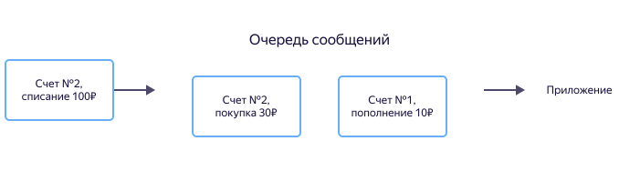
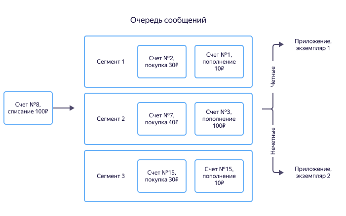

# Топик

Топик в {{ ydb-short-name }} — это сущность для хранения неструктурированных сообщений, предназначенная для их доставки множеству подписчиков. Фактически, топик — это именованный набор сообщений.

Приложение-писатель записывает сообщения в топик. Приложения-читатели независимы друг от друга, они получают, "считывают", сообщения из топика в том порядке, в котором они были записаны. С помощью топика реализуется архитектурный шаблон [издатель-подписчик](https://en.wikipedia.org/wiki/Publish–subscribe_pattern)(https://ru.wikipedia.org/wiki/Издатель-подписчик_(шаблон_проектирования)).

Топик {{ ydb-short-name }} обладает следующими свойствами:

* Гарантиями at-least-once при чтении сообщений подписчиками.
* Гарантиями exactly-once при публикации сообщений (дедупликация сообщений).
* Гарантиями последовательной обработки сообщений ([FIFO](https://en.wikipedia.org/wiki/Message_queue))), опубликованных с одинаковым [идентификатором источника](#producer-id).
* Масштабирование пропускной способности передачи сообщений, публикуемых с разными идентификаторами последовательности.

## Сообщения {#message}

Данные передаются в виде потоков сообщений. Сообщение — это минимальная неделимая единица пользовательской информации. Сообщения состоят из тела и атрибутов, а также из дополнительных системных свойств. Содержимое сообщений представляет собой набор байт, которое никак не интерпретируется {{ydb-short-name}}.

Сообщения могут содержать пользовательские атрибуты в формате "ключ-значение". Они возвращаются вместе с телом сообщения при чтении. Пользовательские атрибуты позволяют читателю принять решение о необходимости обработки сообщения, не распаковывая тело сообщения.Атрибуты сообщения задаются при инициализации сессии записи. Это означает, что все сообщения, записанные в рамках одной сессии записи, будут обладать одинаковыми атрибутами при чтении.

## Партиционирование {#partitioning}

Для горизонтального масштабирования топик разделяется на отдельные элементы, `партиции`, являющиеся единицами параллелизма. Каждая партиция имеет ограниченную пропускную способность, рекомендуемая скорость записи до 1 МБ/с.



В настоящий момент уменьшение количества партиций в топике поддерживается только при помощи удаления и повторного создания топика с меньшим количеством партиций.



### Офсет {#offset}

Все сообщения внутри партиции имеют уникальный порядковый номер, называемый `офсетом`. Офсет монотонно возрастает при записи новых сообщений. 

## Источники и группы сообщений {#producer-id}

Идентификатор источника, `producer_id`, и идентификатор группы сообщений, `message_group_id`, — это способ упорядочить набор сообщений. Порядок записанных сообщений сохраняется в пределах пар: <идентификатор источника, идентификатор группы сообщений>.

При первом использовании пара <идентификатор источника, группа сообщений> привязывается к [партиции](#partition) топика по алгоритму round-robin и все сообщения с этой парой попадают в одну и ту же партицию. Привязка удаляется при отсутствии новых сообщений, использующих этот идентификатор источника, в течение 14 дней.



Рекомендуемое максимальное количество пар <идентификатор источника, идентификатор группы сообщений> - до 100'000 на одну партицию за последние 14 дней.



### Когда важен порядок обработки сообщений

Рассмотрим финансовое приложение, задача которого вычислять остаток на счете пользователя и разрешать либо запрещать списание средств.

Для решения подобных задач можно использовать [очередь сообщений](https://ru.wikipedia.org/wiki/Очередь_сообщений). При пополнении счета, снятии средств или совершении покупки в очередь записывается сообщение с идентификатором счета, суммой и типом операции. Приложение обрабатывает поступающие сообщения и вычисляет баланс.

Для правильного вычисления баланса важен порядок обработки сообщений. Если пользователь сначала пополняет счет, а затем совершает покупку, то и сообщения с информацией об этих операциях должны быть обработаны приложением в такой же последовательности. Иначе может произойти ошибка бизнес-логики, и, например, приложение отклонит покупку из-за нехватки средств. В очередях сообщений есть механизмы гарантированного порядка доставки, но они не могут обеспечить порядок сообщений внутри одной очереди на произвольных объемах данных.

Когда сообщения из потока читают несколько экземпляров приложения, сообщение о пополнении счета может получить один, а о списании — другой. В этом случае не существует экземпляра, который гарантированно содержит верную информацию о балансе. Для решения этой проблемы можно сохранять данные в СУБД, обмениваться информацией между экземплярами приложения, строить распределенный кеш и пр.

В {{ ydb-short-name }} можно так записывать данные, чтобы сообщения от одного источника (например, сообщения о транзакциях по одному счету) приходили в один и тот же экземпляр приложения. Источник сообщения определяется идентификатором источника (source_id), а для защиты от дублей используется порядковый номер сообщения от источника. {{ydb-short-name}} так настраивает потоки данных, чтобы сообщения от одного источника попадают в одну и ту же партицию. Таким образом сообщения о транзакциях по заданному счету будут попадать всегда в одну и ту же партицию и обрабатываться экземпляром приложения, который связан с этим сегментом. Каждый из экземпляров обслуживает свое подмножество партиций и задача синхронизации между экземплярами не возникает.

Ниже приведен пример, когда все транзакции по счетам с четными идентификаторами передаются в первый экземпляр приложения, а с нечетными — во второй.

### Если порядок обработки не важен {#no-dedup}

Для некоторых задач порядок обработки сообщений не критичен. Например, иногда важно просто доставить данные, а упорядочение выполнит система хранения.

Для таких случаев можно использовать упрощенный режим записи, называемый "записью без дедупликации". В этом режиме не нужно указывать идентификаторы источника сообщений ( [`producer_id`](#producer-id) или [`source_id`](#source-id) ), и порядковые номера сообщений — [`sequence number`](#seqno). Запись без дедупликации работает быстрее и потребляет меньше ресурсов на сервере, но упорядочение и дедупликация сообщений на сервере не происходит. Это значит, что если отправить одно и то же сообщение повторно (например, при падении и последующем перезапуске пишущего процесса), оно может быть записано больше одного раза.



Настоятельно не рекомендуем использовать случайные или псевдослучайные идентификаторы источников. Рекомендуем использовать не более 100000 различных идентификаторов источников на одну партицию.



#### Идентификатор источника {#source-id}

Идентификатор источника является произвольной строкой длины до 2048 символов, обычно в качестве идентификатора источника используют идентификатор сервера с файлами или другой идентификатор.

#### Примеры идентификаторов источников {#source-id-examples}

Тип | Идентификатор | Описание
--- | --- | ---
Файл | Идентификатор сервера | Для хранения журналов работы приложений используют файлы. В этом случае удобно в качестве идентификатора источника использовать идентификатор сервера.
Действия пользователя | Идентификатор класса действий пользователя: "просмотр страницы", "покупка" и тд. | Важно обрабатывать действия пользователя в порядке их выполнения пользователем, при этом нет необходимости обрабатывать в одном приложении абсолютно все действия пользователя. В таком случае удобно действия пользователя группировать по классам.

### Идентификатор группы сообщений {#group-id}

Идентификатор группы сообщений является произвольной строкой длины до 2048 символов, обычно в качестве идентификатора группы сообщений используют имя файла или идентификатор пользователя.

#### Примеры идентификаторов групп сообщений {#group-id-examples}

Тип | Идентификатор | Описание
--- | --- | ---
Файл | Полный путь к файлу | Все данные с сервера и файла на нем будут отправлены в одну партицию.
Действия пользователя | Идентификатор пользователя | Важно обрабатывать действия пользователя в порядке их выполнения, в этом случае в качестве идентификатора источника удобно использоваться идентификатор самого пользователя.

## Порядковые номера сообщений {#seqno}

Все сообщения от одного источника имеют порядковый номер, [`sequence number`](#seqno), используемый для дедупликации. Порядковый номер сообщения должен монотонно возрастать в рамках пары `топик`, `источник`. При получении сервером сообщения с порядковым номером, меньшим или равным максимальному записанному по паре `топик`, `источник`, сообщение будет пропущено как дубликат. При этом допускается наличие пропусков в последовательности порядковых номеров сообщений. Порядковые номера сообщений должны быть уникальны только в пределах пары `топик`, `источник`.

Не используются, если выбран [режим записи без дедупликации](#no-dedup).

### Примеры порядковых номеров сообщений {#seqno-examples}

Тип | Пример | Описание
--- | --- | ---
Файл | Смещение передаваемых данных от начала в файле | Нельзя удалять строки из начала файла, так как это приведет или пропуску части данных, как к дублям, либо к потере части данных.
Таблица базы данных | Автоинкрементный идентификатор записи |

## Время хранения сообщений {#retention-time}

Для каждого топика определено время хранения сообщений. После истечения времени хранения сообщения автоматически удаляются. Исключение составляют данные, которые еще не были прочитаны ["важным"](#important-consumer) читателем — они будут храниться до тех пор, пока читатель их не прочитает.

## Сжатие данных {#message-codec}

При передаче приложение-писатель указывает, что сообщение может быть сжато одним из поддерживаемых кодеков. Название кодека передается при записи и сохраняется вместе с сообщением, а также возвращается на чтении. Сжатие сообщений происходит по каждому сообщению в отдельности, сжатие пакета сообщений не поддерживается. Операции сжатия-разжатия данных производятся на стороне приложений-читателей и -писателей.

Список поддерживаемых кодеков явно указывается в каждом топике. При попытке записи данных в топик с неподдерживаемым кодеком, это приведет к ошибке записи.

Кодек | Описание
--- | ---
`raw` | Без сжатия.
`gzip`| Сжатие алгоритмом [gzip](https://en.wikipedia.org/wiki/Gzip).

`lzop` | Сжатие алгоритмом [lzop](https://en.wikipedia.org/wiki/Lzop).

`zstd` | Сжатие алгоритмом [zstd](https://en.wikipedia.org/wiki/Zstd).

## Читатель {#consumer}

Читатель — это именованная сущность для чтения данных из топика. Читатель содержит позиции чтения, подтвержденные читателем по каждому топику, читаемого от его имени.

### Позиция чтения {#consumer-offset}

Позиция чтения — это сохраненный [офсет](#offset) читателя по каждой партиции топика. Позиция чтения сохраняется читателем после отправки подтверждения прочитанных данных. При установке новой сессии чтения сообщения поступают читателю начиная с сохраненной позиции чтения. Это позволяет пользователям не хранить позицию чтения на своей стороне.

### Важный читатель {#important-consumer}

Читатель может обладать признаком "важный". Наличие этого признака означает, что сообщения в топике не будут удаляться до тех пор, пока читатель не прочитает и не подтвердит сообщения. Этот признак можно устанавливать для самых критичных читателей, которые должны обработать все данные даже при длительном простое.



Так как длительный простой важного читателя может привести к использованию всего свободного места хранения данных непрочитанными сообщениями, необходимо следить за отставанием чтения важных читателей



## Протоколы для работы с топиками {#topic-protocols}

Для работы с топиками используется YDB SDK (см. [Работа с топиками](../reference/ydb-sdk/topic.md)).

Также ограниченно поддержан протокол Kafka API версии 3.4.0. (см. [Работа с Kafka API](../reference/kafka-api/index.md)).

