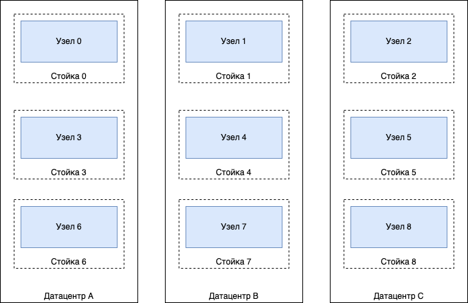

# Топология кластера {{ ydb-short-name }}

Кластер {{ ydb-short-name }} состоит из [узлов хранения](glossary.md#storage-node) и [узлов баз данных](glossary.md#database-node). Работоспособность обоих типов узлов важна для обеспечения доступности баз данных {{ ydb-short-name }}: узлы баз данных реализуют логику управления данными, а узлы хранения обеспечивают их сохранность. При этом наибольшее влияние на отказоустойчивость кластера и его способность обеспечивать надёжное хранение данных оказывает подсистема [распределённого хранилища](glossary.md#distributed-storage), состоящая из набора узлов хранения. При развёртывании кластера необходимо выбрать [режим работы](#cluster-config) распределённого хранилища в соответствии с ожидаемой нагрузкой и требованиями к [доступности баз данных](#database-availability). Режим работы нельзя изменить после первоначальной настройки кластера, что делает его выбор одним из ключевых решений при планировании нового развёртывания {{ ydb-short-name }}.

## Режимы работы кластера {#cluster-config}

Топология кластера строится в соответствии с режимом работы распределённого хранилища, который должен быть выбран на основе требований к уровню отказоустойчивости. Модель отказа, используемая в {{ ydb-short-name }}, основана на концепциях [домена отказа](glossary.md#fail-domain) и [области отказа](glossary.md#fail-realm). {{ ydb-short-name }} предоставляет следующие режимы работы распределённого хранилища:

- `mirror-3-dc`. Данные реплицируются между 3 областями отказа (обычно зонами доступности или дата-центрами) с использованием как минимум 3 доменов отказа (обычно серверных стоек) в каждой области отказа. Кластер {{ ydb-short-name }} остаётся доступным при выходе из строя любой области отказа; кроме того, дополнительно может выйти из строя ещё один домен отказа в любой из 2 работоспособных областей отказа без прекращения работы кластера. Этот режим рекомендуется для кластеров с высокими требованиями к отказоустойчивости, размещённых в трёх и более дата-центрах.

  

- `block-4-2`. Избыточность по схеме [стирающего кода](https://ru.wikipedia.org/wiki/Стирающий_код). На каждые 4 блока исходных данных формируются 2 дополнительных блока с кодами избыточности. Узлы хранения размещаются как минимум в 8 доменах отказа (обычно серверных стойках). Кластер {{ ydb-short-name }} остаётся полностью доступным при недоступности двух любых доменов отказа, продолжая записывать все 6 частей данных в оставшихся доменах. Этот режим рекомендуется для кластеров, размещённых в одном дата-центре или зоне доступности.

  

- `none`. Избыточность отсутствует. Любой отказ приводит к временной недоступности или потере всех или части хранимых данных. Этот режим рекомендуется использовать только для разработки приложений или проведения функциональных тестов.



Под выходом из строя сервера подразумевается как полная, так и частичная его недоступность, например выход из строя одного диска на сервере.



Отказоустойчивые режимы работы распределённого хранилища требуют значительного количества оборудования для обеспечения максимальных гарантий доступности, поддерживаемых {{ ydb-short-name }}. Однако в некоторых сценариях использования подобные затраты на оборудование могут быть слишком высокими на начальном этапе. В связи с этим {{ ydb-short-name }} предлагает вариации данных режимов, которые требуют меньше оборудования, но при этом обеспечивают определённый уровень отказоустойчивости. Требования и гарантии всех режимов работы и их вариаций представлены в таблице ниже, а последствия выбора конкретного режима обсуждаются далее в статье.

| Режим | Множитель объёма хранения | Минимальное количество узлов | Домен отказа | Область отказа | Кол-во дата-центров | Кол-во серверных стоек |
| --- | --- | --- | --- | --- | --- | --- |
| `mirror-3-dc`, переживает отказ дата-центра и ещё 1 стойки в оставшихся дата-центрах | 3 | 9 ([12 рекомендовано](*recommended-node-count)) | Стойка | Дата-центр | 3 | 3 в каждом дата-центре |
| `mirror-3-dc` *(упрощённый)*, переживает отказ дата-центра и ещё 1 сервера в оставшихся дата-центрах | 3 | 12 | ½ стойки | Дата-центр | 3 | 6 |
| `mirror-3-dc` *(3 узла)*, переживает отказ 1 узла или 1 дата-центра | 3 | 3 | Сервер | Дата-центр | 3 | Не важно |
| `block-4-2`, переживает отказ 2 стоек | 1.5 | 8 ([10 рекомендовано](*recommended-node-count)) | Стойка | Дата-центр | 1 | 8 |
| `block-4-2` *(упрощённый)*, переживает отказ 1 стойки | 1.5 | 10 | ½ стойки | Дата-центр | 1 | 5 |
| `none`, избыточность отсутствует | 1 | 1 | Узел | Узел | 1 | 1 |



Приведённый выше множитель объёма хранения относится только к фактору обеспечения отказоустойчивости. Для планирования размера хранилища необходимо учитывать и другие влияющие на него факторы, такие как фрагментация и гранулярность [слотов](glossary.md#slot).



О том, как задать топологию кластера {{ ydb-short-name }}, читайте в разделе [{#T}](../reference/configuration/index.md#domains-blob).

### Режим bridge {#bridge}

Режим bridge — это особый режим работы кластера, существенно отличающийся от перечисленных ранее режимов распределённого хранилища. В [режиме bridge](glossary.md#bridge) узлы кластера разделяются на несколько [пайлов](glossary.md#pile) (обычно соответствующих дата-центрам), в каждом из которых данные хранятся с использованием одного из описанных выше режимов распределённого хранилища, а между пайлами организуется синхронная репликация.

Важно понимать, что пайлы не являются независимыми кластерами {{ ydb-short-name }}, а представляют собой части единого кластера со сложной топологией.

В режиме bridge предусмотрено явное управление остановкой и возобновлением репликации. Кластер {{ ydb-short-name }} становится недоступным при отказе любого из пайлов до тех пор, пока не будет выполнена команда остановки репликации в этот пайл. После её выполнения кластер восстанавливает работоспособность. Таким образом, кластер остаётся доступным до тех пор, пока не откажет последний пайл.

Возобновление репликации в пайл после её отключения может занять значительное время, поскольку {{ ydb-short-name }} выполняет синхронизацию хранилища в этом пайле с остальными, реплицируя недостающие данные. В процессе синхронизации кластер остаётся доступным.

Режим bridge рекомендуется использовать для кластеров, размещённых в двух дата-центрах, а также для систем с высокими требованиями к отказоустойчивости — например, когда необходимо сохранять доступность при отказе трёх дата-центров из четырёх.

При использовании режима bridge в каждом пайле должно быть достаточно узлов, доменов и областей отказа для корректной работы выбранного режима хранения. При этом результирующий множитель объёма хранения будет равен сумме множителей объёмов хранения всех пайлов.

Время отклика кластера в режиме bridge для большинства операций ограничено временем отклика самого медленного пайла.

### Упрощённые конфигурации {#reduced}

В случаях, когда невозможно использовать [рекомендованное количество](#cluster-config) оборудования, можно разделить серверы одной стойки на 2 фиктивных домена отказа. В такой конфигурации отказ одной стойки будет означать отказ не одного, а сразу двух доменов. При использовании таких упрощённых конфигураций {{ ydb-short-name }} сохраняет работоспособность при отказе сразу двух доменов. Минимальное количество стоек в кластере для режима `block-4-2` составляет 5, а для `mirror-3-dc` — по 2 в каждом дата-центре (т.е. суммарно 6 стоек).

Минимальная отказоустойчивая конфигурация кластера {{ ydb-short-name }} представляет собой вариант режима работы `mirror-3-dc` с 3 узлами, который требует всего три сервера с тремя дисками на каждом. В этой конфигурации каждый сервер выступает как домен отказа, так и как область отказа. Таким образом, кластер может выдержать отказ только одного сервера. Каждый сервер должен находиться в своём независимом дата-центре для обеспечения должного уровня отказоустойчивости.

Кластеры {{ ydb-short-name }}, настроенные с использованием одного из этих подходов, могут использоваться в production окружениях, если в них не требуются повышенные гарантии отказоустойчивости.

## Доступный объём ресурсов и производительность {#capacity}

Система может работать с доменами отказа любого размера, однако при малом количестве доменов и неодинаковом количестве дисков в разных доменах количество групп хранения, которые можно будет создать, окажется ограничено. В таких условиях часть оборудования в слишком больших доменах отказа может оказаться недоиспользованной. В случае полной утилизации оборудования значительный перекос в размерах доменов может сделать невозможной реконфигурацию.

Например, в кластере с режимом отказоустойчивости `block-4-2` имеется 15 стоек. В первой из них расположено 20 серверов, а в остальных 14 стойках — по 10 серверов. Для полноценной утилизации всех 20 серверов из первой стойки {{ ydb-short-name }} будет создавать группы так, что в каждой из них будет участвовать 1 диск из этого самого большого домена отказа. В результате, при выходе из строя оборудования в любом другом домене отказа нагрузка не сможет быть распределена на оборудование в первой стойке.

{{ ydb-short-name }} может объединять в группу хранения диски разных производителей, с различной ёмкостью и скоростью. Результирующие характеристики всей группы будут ограничены наихудшими характеристиками оборудования, которое в неё входит. Обычно лучших результатов удаётся добиться при использовании однотипного оборудования.



При создании больших кластеров следует учитывать, что оборудование из одной партии с большей вероятностью может иметь одинаковый дефект и отказать одновременно.



Таким образом, в качестве оптимальных аппаратных конфигураций кластеров {{ ydb-short-name }} для промышленного применения рекомендуются следующие:

* **Кластер в одной зоне доступности**: использует режим отказоустойчивости `block-4-2` и состоит из 9 или более стоек с равным количеством одинаковых серверов в каждой.
* **Кластер в трёх зонах доступности**: использует режим отказоустойчивости `mirror-3-dc` и расположен в трёх дата-центрах с четырьмя или более стойками в каждом. Стойки укомплектованы равным количеством одинаковых серверов.

## Обеспечение доступности баз данных {#database-availability}

[База данных](glossary.md#database) в кластере {{ ydb-short-name }} доступна, если её хранилище и вычислительные ресурсы находятся в рабочем состоянии:

- Все выделенные базе данных [группы хранения](glossary.md#storage-group) должны быть доступны, что означает соблюдение допустимого уровня отказов для каждой группы.
- Вычислительные ресурсы доступных в данный момент [узлов базы данных](glossary.md#database-node) (в первую очередь объём оперативной памяти) должны быть достаточны для запуска всех [таблеток](glossary.md#tablet), управляющих пользовательскими объектами, такими как [таблицы](glossary.md#table) или [топики](glossary.md#topic), и для обработки пользовательских сессий.

Чтобы база данных могла пережить отказ одного из дата-центров в кластере, использующем режим работы `mirror-3-dc`, должны быть выполнены следующие условия:

- [Узлы хранения](glossary.md#storage-node) должны обеспечивать как минимум двойной запас пропускной способности ввода-вывода и дисковой ёмкости по сравнению с необходимыми для работы в обычных условиях. В худшем случае нагрузка на сохранившиеся узлы при длительном отключении одного из дата-центров может утроиться, но лишь на ограниченный период времени — до завершения восстановления ставших недоступными дисков в оставшихся дата-центрах.
- [Узлы базы данных](glossary.md#database-node) должны быть равномерно распределены между всеми тремя дата-центрами и содержать достаточно ресурсов для обработки полной нагрузки при сохранении двух из трёх дата-центров. Это означает наличие как минимум 35% запаса по ресурсам CPU и оперативной памяти в обычных условиях, то есть при отсутствии каких-либо отказов. Если узлы базы данных обычно нагружены более чем на 65%, следует рассмотреть возможность добавления дополнительных узлов либо увеличения вычислительной мощности каждого узла.

## Дополнительная информация

* [Документация для DevOps-инженеров](../devops/index.md)
* [{#T}](../reference/configuration/index.md#domains-blob)
* [Примеры конфигурационных файлов кластера](https://github.com/ydb-platform/ydb/tree/main/ydb/deploy/yaml_config_examples/)

* [{#T}](../contributor/distributed-storage.md)


[*recommended-node-count]: Использование меньшего количества узлов приведёт к ограничению способности кластера к [автоматическому восстановлению](../maintenance/manual/selfheal.md).
