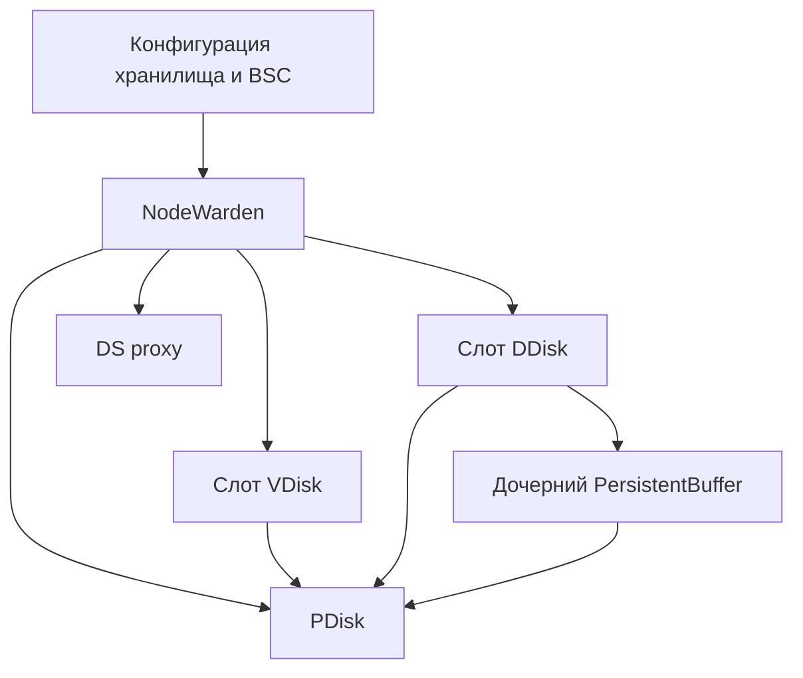

# NodeWarden

NodeWarden управляет дисковой подсистемой на отдельном узле. Он преобразует конфигурацию хранилища в работающие сервисы и обеспечивает их взаимодействие с контроллером и механизмами конфигурации групп. Эта страница объясняет, с чего начать при изменении логики создания и замены сервисов или распространения конфигурации.

## Владение ресурсами

NodeWarden управляет локальными PDisk, слотами VDisk и DDisk, а также DS proxy. Он получает сведения о наборе сервисов и группах, запрашивает недостающую конфигурацию групп и запускает или обновляет соответствующие акторы. Код поддержки распределённой конфигурации в `distconf*` находится в том же каталоге; его следует отличать от автомата состояний отдельного дискового актора.

Если для группы слота установлен флаг DDisk, `StartLocalVDisk` создаёт `NDDisk::TDDiskActor` и регистрирует сервисный идентификатор DDisk. Исторические имена с VDisk в коде управления слотами не означают, что этот актор реализует протокол VDisk.

DDisk создаёт собственный дочерний PersistentBuffer после восстановления своего владельца PDisk и состояния карты чанков. Дочерний актор получает параметры PDisk родителя, чанки PB, формат диска и дубликат дескриптора устройства. Родитель регистрирует отдельный сервисный идентификатор PersistentBuffer. Поэтому к PB можно обращаться независимо, но его время жизни и ресурсы хранения принадлежат родительскому DDisk.

Стрелки показывают зависимости управления или владения ресурсами. DDisk и PB могут выполнять ввод-вывод данных через `TUringRouter`; схема не подразумевает, что каждая операция с данными проходит через актор PDisk.

## Идентификаторы и замена акторов

| Идентификатор | Значение |
|---|---|
| `NodeId:PDiskId` | Расположение сервиса физического диска в пределах узла. |
| `NodeId:PDiskId:VSlotId` | Расположение слота, используемое для адресации VDisk или DDisk. |
| `VDiskId` | Идентификатор, поколение и позиция в группе блобов; это не идентификатор занимаемого слота. |
| Владелец PDisk и раунд владельца | Текущий доступ локального владельца хранилища к ресурсам PDisk. |
| GUID экземпляра DDisk и токен соединения | Сведения об экземпляре актора и сессии, возвращаемые клиенту прямого блочного доступа. |

Сервисные идентификаторы формируются функциями `MakeBlobStorage*Id` из [blobstorage_service_id.h](https://github.com/ydb-platform/ydb/blob/main/ydb/core/base/services/blobstorage_service_id.h). Для DDisk и его дочернего PB в одном слоте используются разные функции. Парные записи данных и PB в логической группе прямого блочного доступа могут ссылаться на разные слоты; см. [{#T}](direct-block-groups.md).

При проверке логики перезапуска или замены прослеживайте и незавершённые запросы старого актора, и регистрацию нового. Сохраняйте проверки раунда владельца и соединения, чтобы запоздалые завершения не воспринимались как работа для нового экземпляра. При завершении DDisk также нужно остановить дочерний PB и завершить либо оградить от дальнейших обращений доступ к общим ресурсам PDisk.

## Границы конфигурации

`node_warden_vdisk.cpp` преобразует `DDiskConfig` и `PBufferConfig` в настройки C++, передаваемые DDisk. Сюда относятся выбор резервного пути прямого ввода-вывода, режимы контрольных сумм, ограничения выделения ресурсов и кеша PB, пакетирование записей, резерв для удаления и политика повторных попыток получения списка. Чтобы новый параметр можно было задавать через набор сервисов, он должен дойти и до реализации, и до этого слоя преобразования.

Локальный список DDisk, предоставляемый NodeWarden, содержит сервисные идентификаторы DDisk и PB для каждого локального слота DDisk. Это перечень локальных сервисов; он не описывает, какой таблетке принадлежит [логическая группа прямого блочного доступа](direct-block-groups.md) и какие слоты за ней закреплены.

## Исходный код и тесты

| Задача | Исходный код |
|---|---|
| Жизненный цикл сервисов и общее состояние | [node_warden_impl.h](https://github.com/ydb-platform/ydb/blob/main/ydb/core/blobstorage/nodewarden/node_warden_impl.h), [node_warden_impl.cpp](https://github.com/ydb-platform/ydb/blob/main/ydb/core/blobstorage/nodewarden/node_warden_impl.cpp) |
| Запуск PDisk и владение ресурсами | [node_warden_pdisk.cpp](https://github.com/ydb-platform/ydb/blob/main/ydb/core/blobstorage/nodewarden/node_warden_pdisk.cpp) |
| Запуск и настройки VDisk/DDisk | [node_warden_vdisk.cpp](https://github.com/ydb-platform/ydb/blob/main/ydb/core/blobstorage/nodewarden/node_warden_vdisk.cpp) |
| Обновления групп и прокси | [node_warden_group.cpp](https://github.com/ydb-platform/ydb/blob/main/ydb/core/blobstorage/nodewarden/node_warden_group.cpp), [node_warden_proxy.cpp](https://github.com/ydb-platform/ydb/blob/main/ydb/core/blobstorage/nodewarden/node_warden_proxy.cpp) |
| Перечень локальных DDisk | [node_warden_resource.cpp](https://github.com/ydb-platform/ydb/blob/main/ydb/core/blobstorage/nodewarden/node_warden_resource.cpp) |
| Создание дочернего PB и восстановление | [ddisk_actor_boot.cpp](https://github.com/ydb-platform/ydb/blob/main/ydb/core/blobstorage/ddisk/ddisk_actor_boot.cpp) |

Тесты NodeWarden собираются целью `ydb/core/blobstorage/nodewarden/ut`; тесты последовательностей получения конфигурации находятся в `nodewarden/ut_sequence`. Замена дисков, запуск PB и завершение работы также проверяются отдельными тестами в `ydb/core/blobstorage/ddisk/ut` и `ddisk/ut_large`.

## См. также

- [{#T}](../distributed-storage.md)
- [{#T}](ddisk.md)
- [{#T}](persistent-buffer.md)
