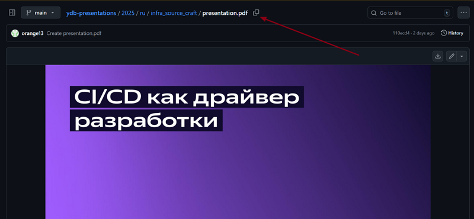

# Добавление медиа в публичные материалы

Эта статья посвящена размещению медиа на [странице «Публичные материалы»](../../public-materials/videos/)

## Видео

### Название

Первым шагом при публикации видеоматериалов является выбор заголовка. Как правило, это заголовок второго уровня, а название полностью идентично названию видео с той площадки, откуда пришла ссылка первоисточника.

### Тег

У каждого видео должен быть свой тег, отражающий категорию и краткое содержание. Все виды тегов расписаны в папке репозитория `/public-materials/_includes/tags.md` и на [странице](../../public-materials/videos.md). Тег ставится следующим после названия.

### Краткое описание

Следующий шаг - небольшое описание в один абзац, отражающее лишь самые основные моменты видео. Необязательно отсматривать видео полностью самостоятельно, можно воспользоваться функцией саммаризации видео с помощью [ИИ](https://300.ya.ru/), однако помните, что ИИ могут совершать ошибки и лучше перепроверять саммари самостоятельно.

### Целевая аудитория

Обязательно следующий абзац должен быть про целевую аудиторию публикуемого видео. Учитывайте их конкретную роль ([разработчики приложений](../../dev/index.md), [DevOps-инженеры](../../dev/index.md), [инженеры по безопасности](../../security/index.md) и т.д.), а если вы не можете сориентироваться самостоятельно, спросите у автора доклада. В случае, если автор недоступен, можно снова спросить совета у ИИ. Тот, скорее всего, не ошибется.

### Прикрепление ссылок

Ссылки на видео оформляются по стандартным md-правилам. `@[название_ресурса](ссылка)`. Например:

- `@[youtube](https://youtu.be/Dy0VtzQatag?)`
- `@[rutube](6840af8411a8be4e7da9f82cb4a25103)`

- `@`

- `@[vk](https://vk.com/video_ext.php?oid=-34475478&id=456239479&hd=2&autoplay=1)`

Для получения ссылки с Youtube достаточно нажать **копировать URL видео**, и использовать полученную ссылку.

С Rutube после получения ссылки видео в формате `https://rutube.ru/video/6840af8411a8be4e7da9f82cb4a25103/?r=plwd` достаточно оставить только часть с ID видео, как было показано в примере выше.

С Yandex достаточно скопировать ссылку на видео, а название хостинга в квадратных скобках указывать необязательно.

При работе со ссылками VK-видео необходимо учитывать, что воспроизводимый формат превью получается только при формате ссылки вида `https://vk.com/video_ext.php?oid=-84793390&id=456239888&hd=2&autoplay=0`
Тогда как при копировании ссылки на видео вк, формат будет выглядеть так:
`https://vkvideo.ru/video-84793390_456239888`.

В данном случае необходимо первую числовую комбинацию до нижнего слеша вставить в поле `oid=`, а вторую комбинацию - в поле `id=`.



При наличии видео на нескольких ресурсах, оформлять ссылки с этих ресурсов необходимо с помощью табов ``



### Добавление слайдов

К некоторым видеоматериалам (например, к докладам с конференций) необходимо прикладывать слайды презентаций, помещённые после ссылки на видео во вкладку **Слайды**.

Для корректного отображения презентацию необходимо загружать в виде ссылки `https://presentations.ydb.tech/2025/ru/infra_source_craft/presentation.pdf`.

Для этого нужно:

- Загрузить презентацию в pdf - формате в [репозиторий](https://github.com/ydb-platform/ydb-presentations).

- Извлечь ссылку на слайды:

Получится ссылка `2025/ru/infra_source_craft/presentation.pdf`.

- Добавить в начало этой ссылки `https://presentations.ydb.tech/`.
