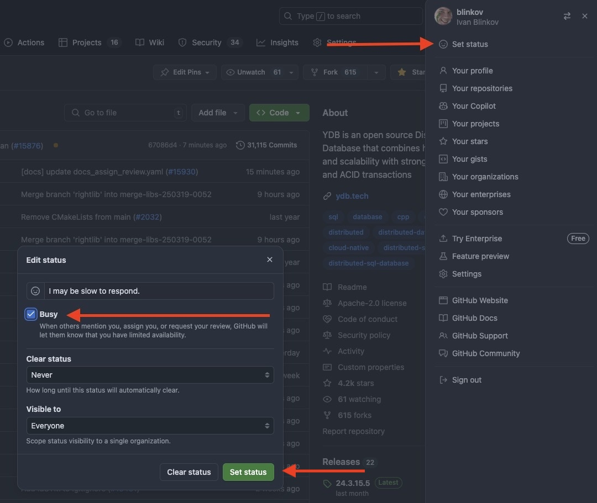
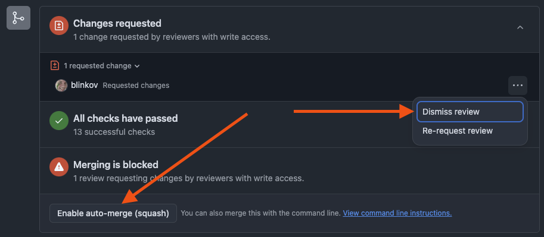

# Процесс ревью документации {{ ydb-short-name }}

Развивая общий обзор из [{#T}](index.md), эта статья подробнее рассматривает, что происходит на этапе ревью pull-запроса c документацией.

## Роли

- **Автор** — человек, предлагающий изменения в документации.
- **Основной ревьюер** — человек, тщательно проверяющий предложенные изменения согласно [контрольному списку](#checklist).
- **Финальный ревьюер** — человек, повторно проверяющий изменения с использованием того же контрольного списка и утверждающий pull-запрос на GitHub.

## Процесс

1. **Автор** открывает pull-запрос на GitHub с предложенными изменениями в [папке ydb/docs](https://github.com/ydb-platform/ydb/tree/main/ydb/docs). Следование [руководству по стилю](style-guide.md) с самого начала делает процесс ревью более гладким.
2. **Автор** обеспечивает, чтобы pull-запрос был в состоянии, готовом к ревью, соответствуя всем следующим критериям:

   1. Pull-запрос имеет `* Documentation` как единственную категорию в changelog. Если всё сделано правильно, автоматизация пометит pull-запрос меткой «documentation».
   2. Pull-запрос *не* помечен как черновик.
   3. Предложенные изменения успешно собираются, и автоматизация оставила комментарий со ссылкой на предпросмотр (вместо ошибок). Предпросмотр показывает изменённый контент как ожидается.

3. *(опционально)* **Автор** делится ссылкой на pull-запрос в [чате сообщества](https://t.me/ydb_ru) или чате, связанном с документацией, для привлечения дополнительного внимания к нему.
4. **Основной ревьюер** назначается автоматически или выбирает pull-запрос из [входящего списка](https://github.com/ydb-platform/ydb/pulls?q=is%3Aopen+is%3Apr+label%3Adocumentation+draft%3Afalse+no%3Aassignee) с помощью кнопки «assign yourself» в правом сайдбаре, а затем предоставляет начальную обратную связь и набор предложений по улучшению.

   

   

   

5. **Автор** и **основной ревьюер** совместно итеративно работают, пока предложенные изменения не пройдут [контрольный список](#checklist). **Основной ревьюер** предоставляет отзывы через комментарии к pull-запросу, а **автор** их учитывает. Ожидаемое время ответа для каждой итерации ревью составляет два рабочих дня, до нескольких недель в случае форс-мажора.
6. Как только **основной ревьюер** подтверждает, что pull-запрос соответствует требованиям контрольного списка, он:

   - Включает auto-merge для pull-запроса.
   - Отклоняет свой устаревший отзыв c комментарием [«lgtm»](https://en.wiktionary.org/wiki/LGTM).
   - Передаёт процесс **финальному ревьюеру** для дополнительной проверки свежим взглядом.

  

7. В зависимости от вердикта **финального ревьюера**:

   - Если **финальный ревьюер** нажимает кнопку Approve, pull-запрос начинает соответствовать одному из обязательных условий для мёрджа. Таким образом, если сборка всё ещё проходит, auto-merge GitHub, вероятно, автоматически вмёрджит pull-запрос. В противном случае любые проблемы должны быть устранены вручную.
   - Если **финальный ревьюер** предоставляет дополнительную обратную связь или предложения, процесс возвращается к шагу 5.

8. Документация {{ ydb-short-name }} многоязычная, и от **авторов** ожидается предоставление синхронизированных изменений для всех поддерживаемых языков (в настоящее время английский и русский), если это применимо. Если **автор** не знает все необходимые языки, допустимо использование [LLM](https://ru.wikipedia.org/wiki/%D0%91%D0%BE%D0%BB%D1%8C%D1%88%D0%B0%D1%8F_%D1%8F%D0%B7%D1%8B%D0%BA%D0%BE%D0%B2%D0%B0%D1%8F_%D0%BC%D0%BE%D0%B4%D0%B5%D0%BB%D1%8C) или машинного перевода. На каком этапе делать перевод зависит от сложности:

   - Для простых изменений обычно лучше перевести в начале и пройти процесс ревью с одним pull-запросом, содержащим изменения на всех языках.
   - Для сложных изменений, вероятно требующих нескольких итераций ревью, допустимо сначала завершить процесс ревью на одном языке, а затем начать отдельный pull-запрос с переводом после утверждения первого.

## Контрольный список {#checklist}

- [ ] Текст понятен целевой аудитории статьи.
- [ ] Текст технически точен.
- [ ] Текст грамматически правильный, без пунктуационных, орфографических или типографских ошибок.
- [ ] Терминология консистентна. Первое упоминание каждого термина, используемого в статье, является ссылкой на его объяснение в [{#T}](../../concepts/glossary.md) или известном доверенном источнике, таком как Википедия.
- [ ] Каждая новая статья правильно размещена в [структуре документации](structure.md).
- [ ] Каждая статья следует одному [жанру](genres.md) и соответствует своему месту в структуре документации.
- [ ] Каждая новая статья включает ссылки на все релевантные существующие страницы документации, либо по ходу текста, либо в конце в разделе «См. также».
- [ ] Релевантные существующие статьи обновлены ссылками на новые статьи.
- [ ] Все новые статьи перечислены в YAML файлах с оглавлением и `index.md` их папки.
- [ ] Все переименованные или перемещённые статьи отражены в [redirects.yaml](https://github.com/ydb-platform/ydb/blob/main/ydb/docs/redirects.yaml).
- [ ] Тон повествования и стиль статьи соответствуют остальной документации или, как минимум, остаются консистентными внутри статьи.



Этот контрольный список является сжатой версией [{#T}](style-guide.md) и служит напоминанием при каждом ревью. Его можно копировать и вставлять в описание pull-запроса и отмечать пункты по мере продвижения процесса ревью. Обращайтесь к полному руководству по стилю для изначального понимания этих пунктов и дополнительных деталей.



## Чем не является ревью документации

### Тестирование

Ревью документации не является заменой тестирования. Если документация включает инструкции, **автор** несёт ответственность за обеспечение их правильности, реализацию автоматизированных тестов для поддержания точности со временем и т.д.

**Основной ревьюер** и/или **финальный ревьюер** могут проверить корректность описанных шагов в инструкции. Но это не является обязательной частью их роли.

### Ревью технического дизайна

Ревью документации не является ревью технического дизайна функциональности. Документация обычно пишется для по большей части реализованной функциональности, поэтому значительные изменения в поведении продукта на этом этапе редко возможны. Однако **основной ревьюер** и/или **финальный ревьюер** могут подсветить любые неконсистентности, странное поведение или проблемы с удобством использования. Устранить их сразу же, если это возможно, или учесть их для будущих итераций развития описываемой функциональности является ответственностью **автора**.

## См. также

- [Документация GitHub](https://docs.github.com/en)
- [Документация Git](https://git-scm.com/doc)