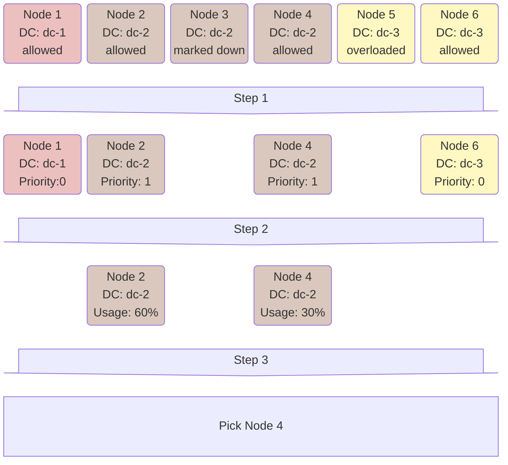

# Запуск таблеток

В данной статье описывается процесс запуска [таблеток](../concepts/glossary.md#tablet) со стороны [Hive](../concepts/glossary.md#hive). Hive принимает решение о запуске таблетки в различных ситуациях:

* Таблетка только что была создана.
* Утрачена связь с узлом, на котором была запущена таблетка.
* Узел, на котором была запущена таблетка, прислал сообщение о том, что она прекратила работу (например, из-за потери связи с дисковой подсистемой кластера).
* При перевозе таблетки в рамках [автобалансировки](hive.md#autobalancing).

В любой из этих ситуаций происходит следующее:

1. Таблетка добавляется в [очередь на запуск](#bootqueue).
1. При обработке очереди для неё [выбирается подходящий узел](#findbestnode).
1. На  узел отправляется команда о [запуске таблетки](#booting).

## Очередь {#bootqueue}

Очередь на запуск, или *Boot queue*, хранится в памяти Hive и является приоритетной. Приоритет таблетки определяется следующими факторами:

1. [Тип таблетки](../concepts/glossary.md#tablet-types) — системные таблетки имеют более высокий приоритет, чем пользовательские.
1. [Метрики потребления ресурсов](hive.md#resources) — таблетки с бóльшим потреблением имеют бóльший приоритет.
1. Таблетки, которые часто перезапускаются, имеют пониженный приоритет.

При обработке очереди за раз обрабатывается ограниченное количество таблеток (`max_boot_batch_size` в [конфигурации](../reference/configuration/hive.md#boot)). Это нужно для того, чтобы при запуске большого числа таблеток Hive не переставал на долгое время отвечать на другие запросы.

Если при обработке очередной таблетки оказывается, что её нельзя запустить ни на одном из узлов, то эта таблетка откладывается в отдельную очередь *Wait queue*. Когда доступность узла меняется (подключается новый узел, или с узла снимается ограничение в [Hive UI](../reference/embedded-ui/hive.md)), Hive возвращается к этим таблеткам и при обработке очереди на запуск чередует таблетки из Boot Queue и таблетки из Wait Queue.



Одновременный запуск множества таблеток может создавать повышенную нагрузку на узел. Поэтому максимальное число одновременно запускаемых таблеток на одном узле ограничено значением `max_tablets_scheduled` из [конфигурации](../reference/configuration/hive.md#boot). При этом, если один из узлов упирается в это ограничение, Hive останавливает запуск новых таблеток и на других узлах тоже, чтобы это не повлияло на равномерность распределения. Это поведение можно регулировать с помощью параметра [`boot_strategy`](../reference/configuration/hive.md#boot).



## Выбор узла {#findbestnode}

Существуют строгие ограничения на то, на каких узлах разрешено запускать таблетку: не каждый узел может запускать каждый тип таблеток; таблетки некоторой базы данных могут быть запущены только на узлах этой базы данных. Дополнительно при **перевозе** таблеток не рассматриваются перегруженные узлы.

1. Из всех подходящих узлов отбираются узлы с максимальным приоритетом. Приоритет определяется исходя из датацентра, в котором находится узел. Явно указать приоритеты датацентров можно в подсекции [`default_tablet_preference`](../reference/configuration/hive.md#boot) в конфигурации. Для [координаторов](../concepts/glossary.md#coordinator) и [медиаторов](../concepts/glossary.md#mediator) приоритеты определяются динамически так, чтобы по возможности поддерживать их в одном датацентре. Дополнительно, если таблетка завершает работу с ошибкой на некотором узле, на следующий запуск этой таблетки приоритет этого узла понижается.

1. Для узлов с максимальным приоритетом считается целевая метрика, которая почти совпадает с метрикой [Node usage](hive.md#node-usage). Она отличается тем, что учитываются только те ресурсы, которые потребляет данная таблетка, а также наличием штрафа за количество таблеток того же [объекта схемы](../concepts/glossary.md#schema-object).

1. Наконец, на основе этой метрики делается выбор узла. Алгоритм выбора на этом этапе определяется параметром `node_select_strategy` в конфигурации. По умолчанию выбирается случайный узел из 7% узлов с минимальным значением метрики.

Ниже приведена иллюстрация процесса.

## Процесс запуска {#booting}

На каждом узле запущен сервис [Local](../concepts/glossary.md#local), отвечающий за взаимодействие с Hive. При запуске таблетки Hive отправляет в Local нужного узла команду старта таблетки, содержащую всю необходимую для запуска информацию: [TabletID](../concepts/glossary.md#tabletid), [поколение](../concepts/glossary.md#tablet-generation), [историю каналов](general-schema.md#history) и режим запуска ([лидер](../concepts/glossary.md#tablet-leader) или [подписчик](../concepts/glossary.md#tablet-follower)). После того, как таблетка запускается, Local сообщает об этом в Hive. С этого момента таблетка считается запущенной с точки зрения Hive и остаётся такой, пока:

* Local не сообщит об остановке её работы;
* связь с Local не будет нарушена.

В этих ситуациях вновь начнётся процесс запуска уже для следующего поколения таблетки.
