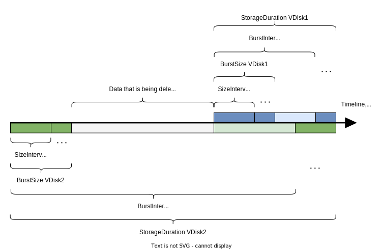

# PDiskLogLoad

Все VDisk, размещенные на некотором PDisk, пишут данные о своей работе в общий лог PDisk. VDisk постепенно удаляют свои устаревшие данные в начале лога для освобождения места на диске. В некоторых случаях между окончанием записи одного VDisk и началом записи другого может образоваться участок, содержащий ненужные устаревшие данные. Такие данные автоматически удаляются. Корректность этой операции тестирует актор PDiskLogLoad.

<center>



</center>



Это узкоспециализированный актор для тестирования конкретной функциональности. Не является нагружающим, его назначение — проверка корректности работы.



## Параметры актора {#options}



Параметр | Описание
--- | ---
`PDiskId` | Идентификатор нагружаемого PDisk на узле.
`PDiskGuid` | Глобально-уникальный идентификатор нагружаемого PDisk.
`VDiskId` | Параметры VDisk, от имени которого подается нагрузка.<ul><li>`GroupID` — идентификатор группы.</li><li>`GroupGeneration` — поколение группы.</li><li>`Ring` — идентификатор кольца в группе.</li><li>`Domain` — идентификатор фэйл-домена в кольце.</li><li>`VDisk` — индекс VDisk в фэйл-домене.</li></ul>
`MaxInFlight` | Количество одновременно обрабатываемых запросов.
`SizeIntervalMin` | Минимальный размер записи в лог в байтах.
`SizeIntervalMax` | Максимальный размер записи в лог в байтах.
`BurstInterval` | Интервал между сеансами записи в лог в байтах.
`BurstSize` | Общее количество данных, которое будет записано в одном сеансе, в байтах.
`StorageDuration` | Виртуальное время в байтах. Показывает, как долго VDisk должен хранить свои данные в логе.
`IsWardenlessTest` | Если PDiskReadLoad запускается на кластере, укажите `false`. Иначе (например, при запуске в юнит-тестах) укажите `true`.

## Примеры {#example}

Следующий актор имитирует работу двух VDisk. Первый VDisk через каждые `65536` байт записывает в лог сообщение размером `65536` байт, удаляет данные свыше `1048576` байт. Второй через каждые `2147483647` байт записывает `1024` байт сообщениями по `128` байт, удаляет данные свыше `2147483647` байт.

```proto
PDiskLogLoad: {
    Tag: 1
    PDiskId: 1
    PDiskGuid: 12345
    DurationSeconds: 60
    Workers: {
        VDiskId: {GroupID: 1 GroupGeneration: 5 Ring: 1 Domain: 1 VDisk: 1}
        MaxInFlight: 1
        SizeIntervalMin: 65536
        SizeIntervalMax: 65536
        BurstInterval: 65536
        BurstSize: 65536
        StorageDuration: 1048576
    }
    Workers: {
        VDiskId: {GroupID: 2 GroupGeneration: 5 Ring: 1 Domain: 1 VDisk: 1}
        MaxInFlight: 1
        SizeIntervalMin: 128
        SizeIntervalMax: 128
        BurstInterval: 2147483647
        BurstSize: 1024
        StorageDuration: 2147483647
    }
    IsWardenlessTest: false
}
```

Тест завершился успешно, если в течение проверки все узлы кластера работали без перезагрузок и тестируемый PDisk имел состояние `Normal`. Убедиться в этом можно c помощью Embedded UI кластера.
