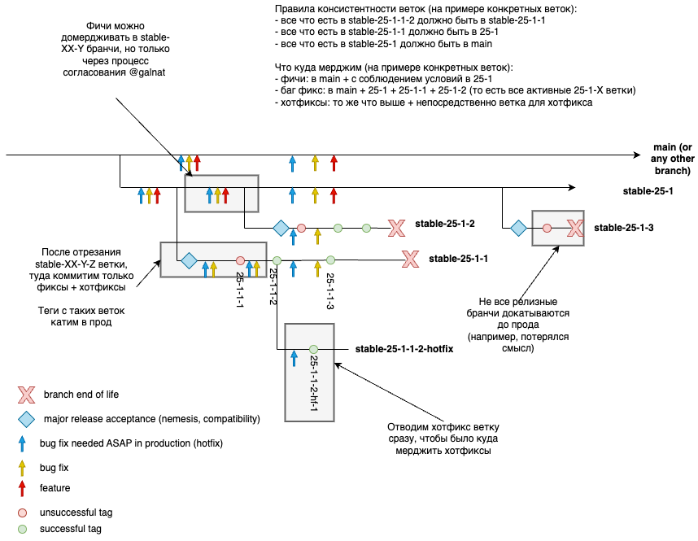

# Manage {{ ydb-short-name }} releases

На базе исходного кода из [репозитория {{ ydb-short-name }}](https://github.com/ydb-platform/ydb) разрабатываются два продукта с независимыми релизными циклами:

- [Сервер {{ ydb-short-name }}](#server)
- [Интерфейс командной строки {{ ydb-short-name }} (CLI)](#cli)

## Релизный цикл сервера {{ ydb-short-name }} {#server}

Данный документ описывает релизный цикл, начиная с мажорного релиза 25.1.

Если у вас возникли вопросы по этому документу, обращайтесь к [команде {{ ydb-short-name }}](https://github.com/orgs/ydb-platform/teams/engineering).

### Номера и расписание релизов {#server-versioning}

Версия сервера {{ ydb-short-name }} состоит из четырех чисел, разделенных точками:

1. Две последние цифры календарного года релиза
2. Порядковый номер мажорного релиза в текущем году
3. Порядковый номер минорного релиза в этом мажорном релизе
4. Порядковый номер патча (релизного тега) в минорном релизе

Таким образом:

* Мажорная версия - это комбинация первых двух чисел (например, `23.3`)
* Минорная версия - это комбинация первых трёх чисел (например, `23.3.1`)
* Полная версия - это комбинация всех четырёх чисел (например, `23.3.5.1`).

В течение года обычно выпускается 4 мажорных релиза сервера {{ ydb-short-name }}: `YY.1` – первый, а `YY.4` - последний в году `YY`. Количество минорных релизов и патчей не является постоянным и может варьироваться от одного мажорного релиза к другому.

### Совместимость {#server-compatibility}

{{ ydb-short-name }} обеспечивает совместимость между смежными мажорными версиями. Это гарантирует, что кластер сможет работать, даже если на его узлах выполняются две смежные мажорные версии исполняемого файла сервера {{ ydb-short-name }}. Подробнее о процедуре обновления кластера вы можете прочитать в статье [Обновление {{ ydb-short-name }}](../devops/manual/upgrade.md).

Для обеспечения такой совместимости мажорные релизы выпускаются парами:

* В нечетных версиях добавляется новая функциональность, отключенная с помощью feature-флагов
* В четных версиях эта функциональность включается по-умолчанию

Например, версия `23.1` поставляется с отключенной новой функциональностью, и может быть постепенно развернута на кластере, работающем под управлением `22.4`, без остановки работы кластера. Как только на всех узлах кластера будет запущена `23.1`, его можно будет далее обновить до `23.2`, чтобы использовать новые функциональные возможности.

### Релизные ветки и теги {#server-branches-tags}

#### Виды коммитов {#commit_types}

* **Фича**. К фичам относятся любые добавляющие новую функциональность изменения, не связанные с исправлением ошибок.
* **Исправление бага**. Изменение, направленное на устранение конкретной ошибки. Не считается исправление ошибки полностью переписанные с нуля подсистемы.
* **Исправление критического бага**. Срочное исправление серьезной проблемы, которое требуется немедленно выкатить в продакшн. Сюда не относятся обычные исправления, только те, ради которых собирался созвон. Без срочного исправления критических багов высока вероятность серьезных негативных последствий.

#### Типы релизных веток {#release_branch_types}

* **Мажорная ветка** - ветка, совместимая с предыдущей и последующей мажорными ветками. Именуются `stable-XX-Y` (например, `stable-24-1` или `stable-25-1`). В эту ветку можно мерджить новые фичи согласно [инструкции](#merge-feature) и исправления ошибок по [инструкции](#merge-bugfix).
  
* **Минорная ветка** - ветка, в которой создаются релизные теги, которые раскатываются на кластера. Именуется `stable-XX-Y-Z` (например, `stable-25-1-2`). Релизные теги имеют формат `XX.Y.Z.A`. Минорная ветка отводится только от мажорной ветки после успешной выкатки предыдущей минорной ветки. В минорную ветку можно мерджить только исправления багов, следуя [инструкции](#merge-bugfix). 

* **Хотфиксная ветка** - ветка для срочного исправления критических ошибок в конкретном релизном теге. Именуется `stable-XX-Y-Z-A-hotfix` (где `XX.Y.Z.A` - имя релизного тега), например, `stable-24-1-1-2-hotfix`. Такие ветки отводятся только от релизных тегов из минорных веток при необходимости сделать хотфикс. В хотфиксные ветки можно мержить только исправления критических багов, которые требуется немедленно выкатить в продакшн.

#### Общая схема работы с ветками {#release_branch_scheme}

Цикл выпуска для нечетного мажорного релиза начинается с отведения от `main` ветки участником [релизной команды {{ ydb-short-name }}](https://github.com/orgs/ydb-platform/teams/release). Название релизной ветки начинается с префикса `stable-`, за которым следует мажорная версия с точками, замененными на дефис (например, `stable-23-1`).

Цикл выпуска четного мажорного релиза начинается с отведения ветки от ветки предыдущего нечетного мажорного релиза.

От мажорной ветки отводится минорная ветка. Все выпуски минорных версий для нечетных и четных мажорных релизов, проходят цикл тестирования, в процессе которого создается ряд патчей. Каждый патч фиксируется путем назначения тега с полным номером версии на соответствующей релизной ветке. Таким образом, в минорной ветке `stable-24-1-1` могут быть теги `24.1.1.1`, `24.1.1.2` и т.д. Как только патч успешно прошел необходимое тестирование, мы считаем его стабильным, и регистрируем релиз на GitHub для его тега, добавляем его на страницы документации [загрузки](../downloads/index.md#ydb-server) and [список изменений](../changelog-server.md), и так далее. Для мажорной версии может быть более одного стабильного релиза.

### Мердж багфиксов в релизные ветки {#merge-bugfix}

Для исправлений, которые нужно внедрить в релиз:

1. Замерджите исправление в ветку `main` и все активные мажорные ветки. Такое исправление попадет в следующий минорный релиз. 

Для исправлений, которые нужно внедрить быстрее (в течение 1-2 недель):

1. Замерджите исправление в ветку `main` и все активные мажорные ветки
2. Согласуйте мердж исправления в активные минорные ветки с [релизной команды {{ ydb-short-name }}](https://github.com/orgs/ydb-platform/teams/release) на внутренней встрече "on call"
3. После согласования замерджите исправления во все активные минорные ветки

Информацию о текущих активные мажорных и минорных ветках можно найти в закрепленном сообщении [чата YDB Releases](https://t.me/+OL2sTkGoW64zY2My) или узнать у [релизной команды {{ ydb-short-name }}](https://github.com/orgs/ydb-platform/teams/release).

### Мерж хотфиксов в релизные ветки {#merge-hotfix}

Для исправления критических багов:

1. Определите версию базы (соответствует номеру релизного тега), на которой возникла проблема
2. Найдите подходящую хотфиксную ветку в формате `stable-XX-Y-Z-A-hotfix` 
3. Добавьте исправления во все необходимые ветки: main, хотфиксную ветку, а также все активные мажорные и минорные ветки.

Если баг обнаружен не на конкретном релизном теге, добавьте исправление в main, активную хотфиксную ветку и все активные мажорные и минорные ветки.

Информацию о текущих активных мажорных, минорных и хотфиксных ветках можно найти в закрепленном сообщении в [чате YDB Releases](https://t.me/+OL2sTkGoW64zY2My) или узнать у [релизной команды {{ ydb-short-name }}](https://github.com/orgs/ydb-platform/teams/release).

### Мерж фичи в релизные ветки {#merge-feature}

Чтобы замерджить фичу в мажорную ветку (например, `stable-25-1`) после ее отведения:

1. Согласуйте добавление фичи в релиз со своим руководителем.

2. Внесите информацию о фиче в [релизную таблицу](https://wiki.yandex-team.ru/kikimr/developers/releases/) (выберите актуальный релиз):

   * укажите тикет, в котором велась разработка,
   * укажите, является ли фича обратно совместимой (катим включенной по дефолту или с выключенным фиче флагом),
   * добавьте тикет на включение фичи на кластерах (или создайте новый по [шаблону](https://st.yandex-team.ru/createTicket?queue=YDBOPS&template=4547)),
   * приложить и согласуйте тест-план с [Максимом Юрчуком](https://staff.yandex-team.ru/maxim-yurchuk),
   * укажите разработчика, ответственного за фичу,
   * укажите Feature Owner или руководителя команды,
   * добавьте ссылку на документацию или Pull Request с документацией,
   * приложить Pull Request в CHANGELOG.md с релиз ноутами к фиче.

3. Создайте Pull Request в мажорную ветку, указав в секции `Description for reviewers` причину добавления фичи в текущий релиз. Все тесты в Pull Request должны быть успешно пройдены.

В минорные ветки, начиная с `stable-XX-Y-2`, добавляется не более трех новых фич (не считая переключения флагов). Это означает, что фича может не попасть в ближайший релизный тег. Это ограничение введено, чтобы сократить время на отладку релизных тегов.

### Тестирование {#server-testing}

Тестирование релиза является итеративным. Каждая итерация начинается с назначения тега для очередного патча минорной версии. Например, тег `23.3.1.5` отмечает 5-ю итерацию тестирования минорной версии `23.3.1`.

Тег может считаться либо "кандидатом", либо "стабильным". Первый тег минорной ветки всегда получает статус "кандидат".

Во ходе тестирования код из релизных веток проходит комплексную проверку, включая развертывание в [UAT](https://en.wikipedia.org/wiki/Acceptance_testing), prestable, и production средах использующих {{ ydb-short-name }} компания. Для выполнения такого тестирования код {{ ydb-short-name }} из релизного тега на GitHub импортируется в корпоративный контекст пользователя в соответствии с его политиками и стандартами. Затем производится его сборка, развертывание в необходимых средах, и тестирование.



Основываясь на выявленных проблемах, [релизная команда {{ ydb-short-name }}](https://github.com/orgs/ydb-platform/teams/release) решает, можно ли повысить статус минорного релиза до стабильного, или необходимо запустить новую итерацию тестирования с новым тегом минорного релиза. Фактически, как только во время тестирования обнаруживается критическая проблема, разработчики исправляют ее в `main` и сразу же мержат изменения в релизную ветку. Таким образом, к моменту завершения тестирования, если в релизной ветке есть какие-либо коммиты поверх текущего тега, это означает что последует новый тег и новая итерация тестирования.

### Стабильный релиз {#server-stable}

Если итерация тестирования подтверждает качество минорного релиза, [релизная команда {{ ydb-short-name }}](https://github.com/orgs/ydb-platform/teams/release) готовит [перечень изменений](../changelog-server.md), и публикует релиз на страницах [Releases](https://github.com/ydb-platform/ydb/releases) на GitHub и [Загрузки](../downloads/index.md#ydb-server) в документации, объявляя его тем самым стабильным.

После этого от мажорной ветки отводится следующуя минорная ветка и проходит аналогичный цикл стабилизации. 



## Цикл выпуска {{ ydb-short-name }} CLI (интерфейс командной строки) {#cli}

### Номера выпусков и расписание {#cli-versioning}

Версия {{ ydb-short-name }} CLI состоит из трех чисел, разделенных точкой:

1. Порядковый номер мажорного релиза (в настоящее время "2")
2. Порядковый номер минорного релиза в этом мажорном релизе
3. Порядковый номер патча (релизного тега) в минорном релизе

Например, версия `2.8.0` обозначате вторую мажорную, восьмую минорную версию, без патчей.

В отличие от сервера {{ ydb-short-name }}, для CLI не существует фиксированного расписания выпуска релизов. Новые минорные версии публикуются по мере готовности значимых улучшений или новой функциональности. При первоначальном выпуске минорной версии номер патча равен 0. Если в этой версии обнаруживаются критические ошибки, или в неё не вошла какая-то незначительная часть запланированной функциональности, мы можем выпустить патч, увеличив только номер патча, как это было для `2.1.1`.

Процесс выпуска {{ ydb-short-name }} CLI значительно упрощен по сравнению с сервером {{ ydb-short-name }}, что позволяет выпускать релизы чаще.

### Релизные теги {#cli-tags}

Теги для {{ ydb-short-name }} CLI назначаются в транке (ветка `main`) участником [релизной команды {{ ydb-short-name }}](https://github.com/orgs/ydb-platform/teams/release) после запуска тестов для некоторой ревизии. Чтобы отличаться от тегов сервера {{ ydb-short-name }}, теги CLI {{ ydb-short-name }} содержат префикс `CLI_` перед номером версии, например [CLI_2.8.0](https://github.com/ydb-platform/ydb/tree/CLI_2.8.0).



### Стабильный релиз {#cli-stable}

Чтобы объявить тег {{ ydb-short-name }} CLI стабильным, участник [релизной команды {{ ydb-short-name }}](https://github.com/orgs/ydb-platform/teams/release) готовит [перечень изменений](../changelog-cli.md), и публикует релиз на странице GitHub [Releases](https://github.com/ydb-platform/ydb/releases) и в разделе [Загрузки](../downloads/index.md#ydb-cli) документации.
