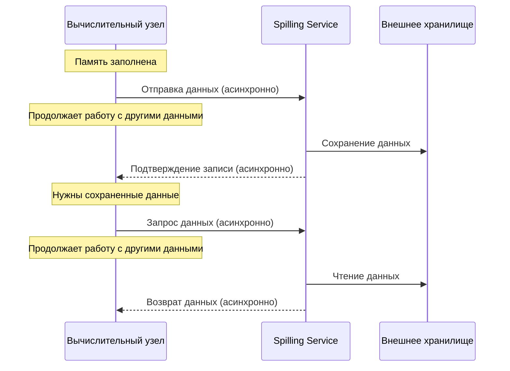

# Spilling Service

## Обзор

**Spilling Service** — это [акторный сервис](../concepts/glossary.md#actor-service), который предоставляет временное хранилище для блобов данных в системе {{ ydb-short-name }}. Сервис работает по принципу key-value хранилища, где клиенты могут сохранять данные по уникальному идентификатору и получать их обратно по этому идентификатору.

## Архитектура

### Основные компоненты

- **Task queue**: Сервис поддерживает внутреннюю очередь операций записи и чтения. Все запросы на спиллинг помещаются в данную очередь и обрабатываются асинхронно.
- **Thread pool**: Для выполнения операций ввода-вывода используется пул рабочих потоков. Количество потоков [конфигурируется](../reference/configuration/table_service_config.md#workerscount) и влияет на производительность сервиса.
- **File management**: Сервис автоматически создает, удаляет и управляет файлами на диске.
- **Resource monitoring**: Сервис осуществляет мониторинг использования дискового пространства, количества активных операций и других метрик производительности.

### Хранение данных

Данные сохраняются в файлах на локальной файловой системе. Spilling Service обеспечивает:

* распределение записей между файлами;
* удаление файлов;
* управление жизненным циклом данных.

При непредвиденном перезапуске устаревшие файлы удаляются автоматически.

## Взаимодействие с компонентами

Компоненты системы интегрированы с Spilling Service и взаимодействуют с ним через события акторной системы:

### Мониторинг состояния памяти

Вычислительные узлы осуществляют постоянный мониторинг состояния памяти через аллокатор. Аллокатор информирует узлы о снижении объема свободной памяти. Однако, система не дожидается полного исчерпания памяти, поскольку процесс спиллинга также требует дополнительных ресурсов памяти для сериализации и буферизации данных.

### Отправка событий

При обнаружении необходимости спиллинга данных вычислительный компонент (подсистема передачи данных или вычислительное ядро) выполняет следующие действия:

1. Сериализует данные в блоб
2. Генерирует уникальный идентификатор для блоба
3. Создает запрос на спиллинг с блобом и сгенерированным идентификатором
4. Отправляет запрос в Spilling Service
5. Освобождает ресурсы и переходит в режим ожидания, давая возможность другим задачам использовать вычислительные ресурсы

### Ожидание результатов

После отправки запроса вычислительный компонент освобождает ресурсы для других задач и переходит в режим ожидания, позволяя системе оптимально использовать вычислительные мощности кластера до завершения записи во внешнее хранилище.

### Обработка ответов

Spilling Service обрабатывает запрос и возвращает подтверждение записи по указанному идентификатору или сообщение об ошибке. Продолжение работы вычислительного компонента возможно только после получения подтверждения.

### Чтение данных

При необходимости восстановления данных компонент отправляет запрос чтения с идентификатором блоба. Spilling Service читает данные из внешней памяти и возвращает ответ с восстановленными данными. Во время ожидания загрузки данных освободившиеся вычислительные ресурсы используются для обработки других задач.

## Схема работы спиллинга

## Конфигурация

Подробная информация о настройке Spilling Service доступна в разделе [Конфигурация спиллинга](../reference/configuration/table_service_config.md).

## См. также

- [Концепция спиллинга](../concepts/query_execution/spilling.md)
- [Конфигурация спиллинга](../reference/configuration/table_service_config.md)
- [Мониторинг {{ ydb-short-name }}](../devops/observability/monitoring.md)
- [Диагностика производительности](../troubleshooting/performance/index.md)

