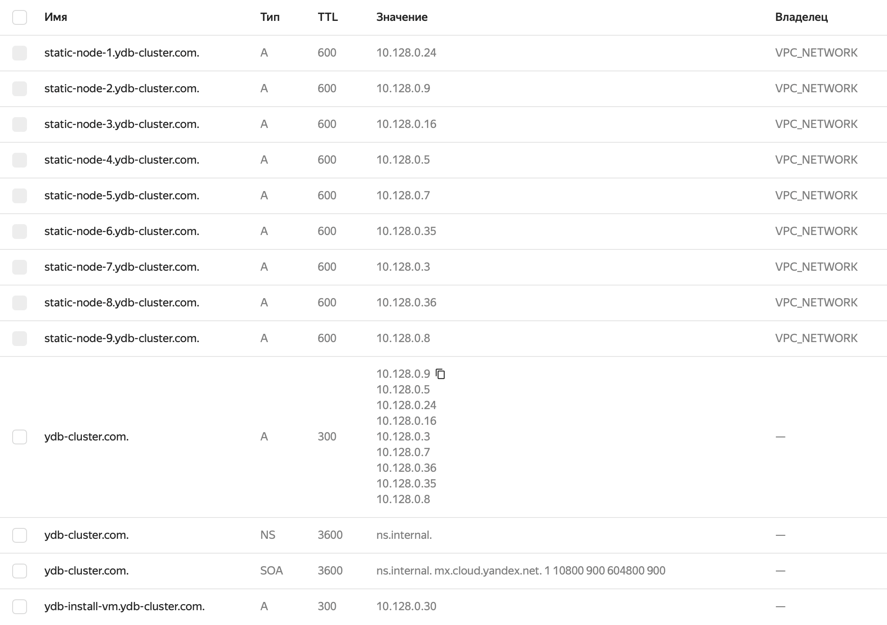
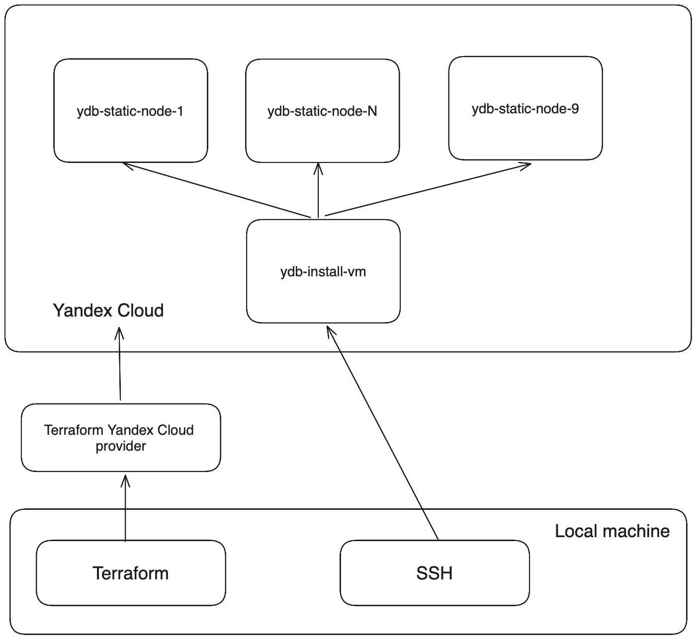



Для создания инфраструктуры в Яндекс Облаке потребуется:
* Активный [платёжный аккаунт](https://cloud.yandex.ru/ru/docs/billing/operations/create-new-account) с балансом достаточным для создания и работы 10 виртуальных машин. 
* [Сервисный аккаунт](https://cloud.yandex.ru/ru/docs/iam/concepts/users/service-accounts) с ролями: `vpc.admin`, `resource-manager.admin`, `compute.admin`, `admin`.
* Авторизованный ключ и API-ключ для работы Terraform с Яндекс Облаком.  
* Увеличенные [лимиты](https://cloud.yandex.ru/ru/docs/vpc/concepts/limits) частного облака:
    + `Compute Cloud`:
        - Количество vCPU виртуальных машин – 130 (стандартное значение 48)
        - Общий объём SSD-дисков – 1700 ГБ (стандартное значение 1000 ГБ)
    + `Virtual Private Cloud`:
        - Количество всех публичных IP-адресов – 15 (стандартное значение 8)



Для проверки синтаксиса и логики развертывания инфраструктуры в облаке – выполните команду `terraform plan`. На этом этапе будет создана виртуальная карта реализации сценария создания ресурсов в облаке, чтобы создать реальные ресурсы в облаке – выполните команду `terraform apply`. При первом запуске команды будет установлен провайдер, а потом выполнен сценарий создания ресурсов в облаке.

В результате исполнения Terraform сценария будут созданы десять виртуальных машин (девять виртуальных машин для установки YDB и одна виртуальная машина для Ansible проекта):


Также будет создана внутренняя DNS-зона:



Схема взаимодействия элементов организующих систему установки YDB может быть представлена так:



### Проверка доступности виртуальных машин между собой { #vm-network-check }

Для проверки доступности виртуальных машин между собой – подключитесь по SSH к любой созданной виртуальной машине и выполните команду `ping <another FQDN YDB VM>` – в терминал будет выведен отчет о соединении:
```
$ ping static-node-2.ydb-cluster.com
PING static-node-2.ydb-cluster.com (10.128.0.22) 56(84) bytes of data.
64 bytes from static-node-2.ydb-cluster.com (10.128.0.22): icmp_seq=1 ttl=61 time=1.21 ms
...
```