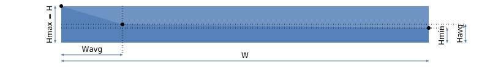
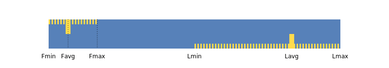
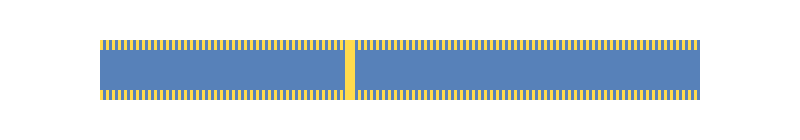

# Визуализация метрик

{{ ydb-short-name }} — распределённая СУБД для больших объёмов данных. [Кластер](../../concepts/glossary.md#cluster) может включать много [узлов](../../concepts/glossary.md#node); вычислительный граф тогда состоит из сотен и тысяч задач, каждая со своими метриками. Показать все значения по отдельности и по ним же делать выводы нереалистично, поэтому метрики задач **агрегируются по стадии**, попадают в ответ сервиса и на диаграмму уже в агрегированном виде. Ниже — как устроены агрегирование и визуализация и как по ним быстро оценить план и узкие места.

## Параллельность {#parallelism}

Число параллельно выполняющихся задач показано в колонке ```Tasks```. Для [стадий](../../concepts/glossary.md#processing-stage) чтения из хранилища оно совпадает с числом [шардов](../../concepts/glossary.md#data-shard). Слева в той же колонке полосатый фон («зебра») отражает долю уже завершившихся задач. На финальном графике завершённого запроса полоса занимает всю высоту строки стадии; для снимка «в процессе» картина иная. Точные числа — во всплывающей подсказке при наведении на область.

{inline=false}



Цвет фона колонки ```Tasks``` зависит от интенсивности использования CPU и от простоев задач в стадии; см. [следующий раздел](#aggregates).



## Агрегаты {#aggregates}

Для метрик в статистике вычисляются и передаются в ответ те же агрегаты, что и в SQL:

- ```MIN``` — минимум;
- ```MAX``` — максимум;
- ```COUNT``` — число значений;
- ```SUM``` — сумма;
- ```AVG``` — среднее (из ```COUNT``` и ```SUM```).

Если ```COUNT``` меньше числа задач стадии (часть задач не отдала метрику), это помечается как аномалия: рядом с метрикой появляется красный круг с числом ```COUNT```. Подробности — во всплывающей подсказке.

Если ```COUNT``` совпадает с числом задач (типичный случай), отдельный индикатор не рисуется. По умолчанию показывается ```SUM```; при наведении — развёрнуто: ```SUM, MIN | AVG | MAX```. Если метрику сообщила одна задача, ```MIN```, ```AVG``` и ```MAX``` скрыты, остаётся ```SUM``` (она совпадает с единственным значением).

Дополнительные правила отображения:

- для целочисленных счётчиков (число строк) используются суффиксы ```K```, ```M``` — множители 10³, 10⁶ и т.д.;
- для объёма (данные, память) — ```KB```, ```MB``` и т.д. по степеням двойки: 2¹⁰, 2²⁰ …;
- длительности — в удобочитаемом виде часы / минуты / секунды.

## Масштаб метрик {#scale}

В колонке ```Stages``` для каждой стадии сверху вниз выводятся метрики:

- ```Egress``` (тёмно-синий) — вывод данных через границу подсистемы (из хранилища в вычисление и обратно);
- ```Output``` (синий) — передача в следующую вычислительную стадию или в результат;
- ```Memory``` (тёмно-песочно-красный) — память;
- ```CPU``` (песочно-красный) — процессорное время;
- ```Input``` (зелёный) — ввод из другой вычислительной стадии;
- ```Ingress``` (тёмно-зелёный) — ввод через границу подсистемы.

Не у каждой стадии есть все шесть строк. У вычислительных стадий обязательны ```Memory``` и ```CPU```. Из пары ```Egress``` / ```Ingress``` может быть не больше одной. Несколько входов ```Input``` перечисляют отдельно. Если выходов ```Output``` несколько, на основной строке стадии показывается один из них, остальные — у связанных «клонов», см. [Множественные выходы](structure.md#multiout).

Помимо числа, каждая метрика сопровождается цветной полосой. Для одного и того же типа метрики значения по стадиям **нормируются между собой**: у стадии с максимальным ```SUM``` полоса на всю ширину колонки ```Stages```, у остальных — пропорционально этому максимуму. Так проще сравнить, на какой стадии больше всего трафика, CPU, памяти и т.п.



Масштабы **разных** типов метрик не сопоставимы: ширина полосы ```Output``` не означает то же самое, что ширина полосы ```Input``` — каждый тип масштабируется отдельно. Часто максимумы на выходе одной стадии и на входе другой близки, поэтому полосы выглядят согласованно. Однако, это не всегда так.



## Перекос данных {#dataskew}

При параллельной обработке важно, чтобы задачи одной стадии стартовали и завершались почти синхронно. Длительность стадии задаётся **самой медленной** задачей: пока она не закончилась, стадия не считается завершённой.

Помимо ```SUM``` (она задаёт длину цветной полосы), по остальным агрегатам строится ломаная линия; участок полосы **выше** линии рисуется более светлым:

- ```MAX``` задаёт общий масштаб; ломаная начинается в левом верхнем углу полосы;
- ```MIN``` задаёт высоту ломаной на правом краю: отношение к ```MAX``` такое же, как ```MIN/MAX``` (например, при ```MIN``` вдвое меньше ```MAX``` конец ломаной — середина правой границы);
- ```AVG``` задаёт промежуточную точку между ```MIN``` и ```MAX``` по горизонтали и вертикали.

{inline=false}

```text
Hmax = H
Hmin = MIN * H / MAX
Havg = AVG * H / MAX
Wavg = (AVG – MIN) * W / (MAX – MIN)
```

Ниже — четыре типичных случая.

1. ```MIN == AVG == MAX```: ломаная совпадает с верхним краем полосы, светлой зоны нет. Нагрузка по задачам равномерна (данные, время или память — в зависимости от метрики).

{inline=false}

```text
MAX = 100
AVG = 100
MIN = 100
```

2. ```MIN < MAX```, но разброс небольшой: светлая область — узкий сегмент у правого верхнего угла. Роль ```AVG``` для визуальной оценки вторична.

{inline=false}

```text
MAX = 100
AVG = 90
MIN = 80
```

3. ```MIN``` существенно меньше ```MAX```: важно положение ```AVG```. Если оно близко к ```MAX```, большинство задач загружены примерно одинаково, «лёгкие» задачи мало влияют на время стадии — перекос обычно некритичен.

{inline=false}

```text
MAX = 100
AVG = 90
MIN = 20
```

4. ```MIN``` сильно меньше ```MAX```, а ```AVG``` близко к ```MIN```: мало сильно перегруженных задач при большом числе простаивающих. Снижение перекоса (перераспределение работы) может заметно укоротить стадию.

{inline=false}

```text
MAX = 100
AVG = 30
MIN = 20
```

Практическое правило: **чем больше площадь светлой части полосы, тем сильнее неравномерность и тем внимательнее стоит смотреть на эту метрику.** Сильный перекос дополнительно помечается красным кругом с буквой ```S``` (data skew).



Число ```SUM``` рисуется поверх полосы и частично её перекрывает. Так сделано намеренно: либо полоса мала и стадия всё равно «тяжёлая», либо закрывается правый участок, менее важный для быстрой оценки; слева остаётся область с ломаной и светлым сегментом.



## Перекос времени {#timeskew}

Неравномерность бывает и **по времени**: одинаковый объём данных и схожее CPU/память, но разная длительность задач (узел перегружен, вытеснение планировщиком и т.д.). Такой сценарий на метриках из [предыдущего раздела](#dataskew) не всегда виден.

Оценка по времени — по правой колонке с временной шкалой: когда стадия стартовала и завершилась, как шли задачи. Чистый перекос по времени без перекоса по данным редок; чаще проявляются оба эффекта, поэтому логично начинать с данных.

Временная шкала читается проще, чем геометрия перекоса по данным. Для каждого [канала](../../concepts/glossary.md#channels) задачи отдают ```FirstMessage``` (```F```) и ```LastMessage``` (```L```) — моменты обработки первого и последнего сообщения. ```Fmin``` — начало активности всех задач стадии, ```Lmax``` — конец. Дополнительно рисуются две жёлтые «зебры»: от ```Fmin``` до ```Fmax``` вдоль верхнего края прямоугольника и от ```Lmin``` до ```Lmax``` вдоль нижнего. В точках ```Favg``` и ```Lavg``` — вертикальные штрихи до середины по высоте.

{inline=false}

Особый случай: обе «зебры» на всю ширину, вертикальные штрихи совпадают (не обязательно ровно по центру). Это соответствует ситуации, когда у каждой задачи ```FirstMessage == LastMessage``` — одно сообщение на передачу всего объёма между задачами (мало данных на канал).

{inline=false}



Так бывает, когда для каждой задачи в стадии ```FirstMessage == LastMessage```: отправлено или принято ровно одно сообщение. Типично при небольшом объёме данных на канал.



## Потребление CPU {#cpu}

Рассмотрим CPU на примере стадии ```0``` из раздела [Структура плана запроса](structure.md). Здесь «потребление» — использование процессорного времени на полезную работу. Простой стадии не даёт вклада в CPU; при работе вклады задач суммируются обычным агрегированием.

{inline=false}

«Загруженность» стадии и всего графа зависит от многих факторов, в том числе от других запросов на кластере. Для интерпретации CPU используется несколько представлений.

Помимо строк в ```Stages```, в правой колонке — график CPU по времени: интервалы с большей и меньшей утилизацией (песочно-красный) и ожидание данных (зелёный). При back pressure возможны и синие области; в этом разделе акцент на самом потреблении.

В примере стадия ```0``` накопила 1.71 с CPU, стадия ```1``` — 0.81 с, при более короткой календарной длительности. Чтобы сравнивать стадии, считается пропускная способность (throughput): число входных строк в секунду (сумма входов, если их несколько). От неё зависит насыщенность фона в ```Tasks```. На диаграмме видно расхождение: у стадии ```1``` порядка 329 млн строк/с, у стадии ```0``` — около 90 млн (точные значения — во всплывающей подсказке по ячейке в ```Tasks```).

Так сопоставляются разные величины — суммарный CPU и обработка строк, нормированная по длительности  — и становится проще искать узкое место в графе.

Графики CPU по стадиям имеют **разный вертикальный масштаб**: шкала подбирается так, чтобы пики заполняли доступную высоту. Иначе при разбросе на порядки «тихие» стадии были бы нечитаемы.

Это видно на суммарном графике по кластеру вверху: поздние всплески стадии ```0``` на общем графике выглядят небольшим выступом, потому что в тот момент основной вклад давала стадия ```1```. При общей шкале с ```1``` график ```0``` выглядел бы так же приплюснуто.

## Потребление памяти {#memory}

Память проще интерпретировать, чем CPU: ресурс менее «эластичен», и задачи чаще всего освобождают память к концу работы. Как и для CPU, временной график памяти по стадиям масштабируется независимо.
