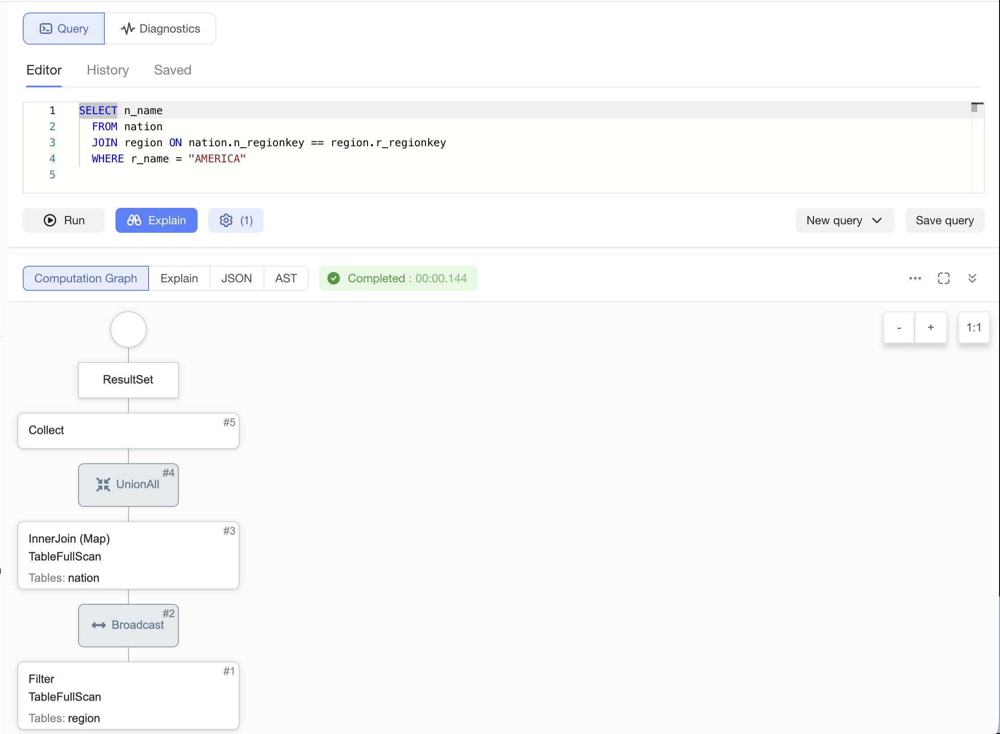
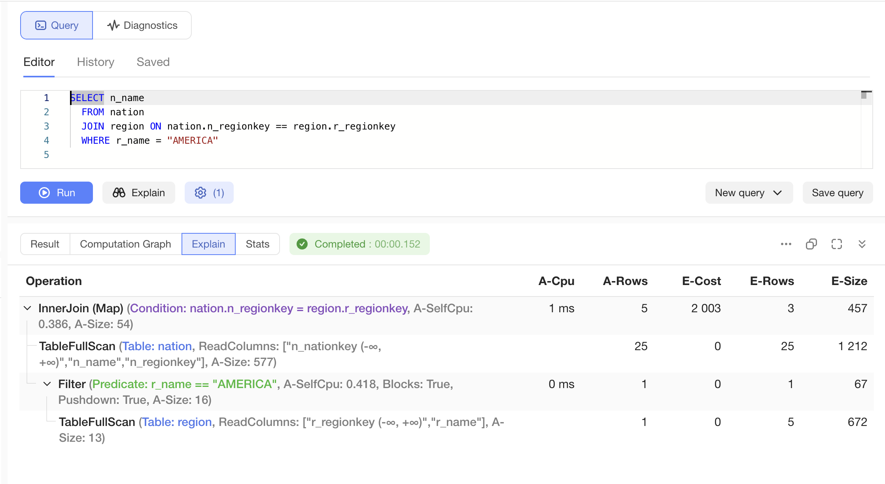

# План выполнения запроса

План запроса - это подробное описание того, как именно сервер планирует выполнять пользовательский запрос после его компиляции и всех использованных оптимизаций. Этот план можно получить и проанализировать без реального выполнения запроса - через команду `EXPLAIN`. Это может быть полезно если вы уже хорошо умеет анализироватьплан и заранее понимать уровень его эффективности.

Когда запрос реально выполняется, то этот план дополнительно обогащается реальной статистикой выполнения и, предоставляя большее количество информации для анализа.

## Получение EXPLAIN плана через CLI и SDK {#explain-cli}

Рассмотрим простой запрос:

```sql
SELECT n_name
  FROM nation
  JOIN region ON nation.n_regionkey == region.r_regionkey
  WHERE r_name = "AMERICA"
```

Чтобы узнать план этого запроса, не выполняя его на самом деле, необоходимо запустить команду `ydb sql` с указанием параметра `--explain` (тут предполагается что текст запроса находится в файле `file1.sql`):

```bash
ydb sql -f file1.sql --explain
```

В терминале будет напечатано примерно следующее:

```
┌────────┬────────┬────────┬────────────────────────────────────────────────────────────────────────────────────────────────────┐
│ E-Cost │ E-Rows │ E-Size │ Operation                                                                                          │
├────────┼────────┼────────┼────────────────────────────────────────────────────────────────────────────────────────────────────┤
│        │        │        │ ┌> ResultSet                                                                                       │
│ 2003   │ 3      │ 457    │ └─┬> InnerJoin (Map) (nation.n_regionkey = region.r_regionkey)                                     │
│ 0      │ 25     │ 1212   │   ├──> TableFullScan (Table: nation, ReadColumns: ["n_nationkey (-∞, +∞)","n_name","n_regionkey"]) │
│ 0      │ 1      │ 67     │   └─┬> Filter (Blocks: True, r_name == "AMERICA", Pushdown: True)                                  │
│ 0      │ 5      │ 672    │     └──> TableFullScan (Table: region, ReadColumns: ["r_regionkey (-∞, +∞)","r_name"])             │
└────────┴────────┴────────┴────────────────────────────────────────────────────────────────────────────────────────────────────┘
```

В самой правой колонке показана структура запроса. В нём написано что сначала сервер планирует (последовательность выполнения идёт снизу вверх):
- прочитать таблицу `region`
- применить предикат (фильтр) к полю `r_name` со значением `AMERICA`
- после чего результат объединяется с содержимым таблицы `nation`

В других колонках показаны прогнозные значения относительно объёма обработанных данных (`E-Rows` и `E-Size`) и общей `стоимости` выполнения запроса (`E-Cost`). Эти оценки стоимостной оптимизатор выводит из доступной **статистики источников данных** и структуры запроса и оптимизирует выполнения, выбирая из возможных вариантов выполнения план с наименьшей стоимостью.

Внутри план передаётся в формате JSON. Его можно получить, если изменить формат выдачи:

```bash
ydb sql -f file1.sql --explain --format json-unicode
```

Вывод достаточно объёмный и здесь приведён лишь частично:

```json
{
    "Plan" : {
        "Plans" : [
            {
                "PlanNodeId" : 6,
                "Plans" : [
                    {
"..."
                    }
                ],
                "Node Type" : "ResultSet",
                "PlanNodeType" : "ResultSet"
            }
        ],
        "Node Type" : "Query",
        "PlanNodeType" : "Query"
    }
}
```

Если вы взаимодействуете с сервером программным образом, то план присылается именно в этом формате

## Получение EXPLAIN плана в UI {#explain-ui}

В графическом интерфейсе {{ ydb-short-name }} также можно получить план выполнения, для этого надо использовать кнопку `[Explain]`. При этом там доступно больше вариантов плана. По умолчанию показывается закладка `Computation Graph` граф вычислений в виде операторов и связи между ними:



Если переключиться на закладку `Explain` то там будет примерно тот же самый план, который мы наблюдали в выводе CLI:



Оставшиеся закладки позволяют также исследовать исходную структуру плана в формате `JSON` на одноимённой закладке, а также ознакомиться с низкороувневым форматом, в который компилируется программа на закладке `AST` (обсуждение этого формата выходит за рамки данной документации)

## Получение плана при выполнении запроса через CLI {#analyze-cli}

Чтобы выполнить запрос и получить его план, следует запустить команду `ydb sql` с другой опцией `--explain-analyze`. Вывод в терминале при этом несколько изменится - в дополнение к оценкам оптимизатора появятся актуальные метрики, собранные во время работы запроса:

```
┌───────┬────────┬────────┬────────┬────────┬─────────────────────────────────────────────────────────────────────────────────────────────────────────────────┐
│ A-Cpu │ A-Rows │ E-Cost │ E-Rows │ E-Size │ Operation                                                                                                       │
├───────┼────────┼────────┼────────┼────────┼─────────────────────────────────────────────────────────────────────────────────────────────────────────────────┤
│       │        │        │        │        │ ┌> ResultSet                                                                                                    │
│ 1     │ 5      │ 2003   │ 3      │ 457    │ └─┬> InnerJoin (Map) (A-SelfCpu: 0.367, nation.n_regionkey = region.r_regionkey, A-Size: 54)                    │
│       │ 25     │ 0      │ 25     │ 1212   │   ├──> TableFullScan (Table: nation, ReadColumns: ["n_nationkey (-∞, +∞)","n_name","n_regionkey"], A-Size: 577) │
│ 0     │ 1      │ 0      │ 1      │ 67     │   └─┬> Filter (r_name == "AMERICA", A-SelfCpu: 0.333, Blocks: True, Pushdown: True, A-Size: 16)                 │
│       │ 1      │ 0      │ 5      │ 672    │     └──> TableFullScan (Table: region, ReadColumns: ["r_regionkey (-∞, +∞)","r_name"], A-Size: 13)              │
└───────┴────────┴────────┴────────┴────────┴─────────────────────────────────────────────────────────────────────────────────────────────────────────────────┘
```

Исходный план в формате JSON очень объёмный и здесь не приведён совсем.

## Получение плана при выполнении запроса в UI {#analyze-ui}

Аналогично, план запроса доступен в UI при обычноым выполнении кнопкой `[Run]`. Как и в случае с CLI, в план добавляются актуальные метрики:


## Получение графического плана при выполнении запроса через CLI {#svg-cli}

Графический план в формате SVG можно получить посредством утилиты командной строки. Для этого надо использовать используется команду [workload](../../reference/ydb-cli/commands/workload/index.md) с опцией `--plan`. На диске появятся файлы с базовым именем, заданным в опции, в нескольких форматах; расширение `.svg` соответствует графическому представлению.

Для произвольного SQL-запроса:

```bash
ydb workload query run --plan filename -q "SELECT count(*) FROM lineitem"
```

Для запросов из [TPC-H](../../reference/ydb-cli/workload-tpch.md) бенчмарка:

```bash
ydb workload tpch run --plan filename
```

## Получение графического плана при выполнении запроса в UI {#svg-ui}

Чтобы в [{{ ydb-short-name }} UI](../../reference/embedded-ui/ydb-monitoring.md) отображался графический план выполнения запроса, включите настройку `Experiments | Execution plan`.



Графический план в UI пока относится к экспериментальным возможностям (раздел `Experiments`). Со временем он должен перейти в обычные настройки интерфейса.




После этого выполните запрос, например:

```sql
SELECT count(*) FROM lineitem
```

В дополнительном меню справа (кнопка [...], отображается на всех вкладках интерфейса) появятся пункты:

- `Open Execution Plan` — открыть план в новой вкладке браузера;
- `Download Execution Plan` — сохранить план в файл.

Там же есть пункт `Download Diagnostics`.


Для этого запроса план будет выглядеть примерно так (конкретные значения метрик зависят от конфигурации и нагрузки кластера):

{inline=false}

Об элементах диаграммы и их назначениях подробнее написано в статье [Расположение информации на плане](layout.md). Чтобы разобраться в структуре плана и прохождении данных по стадиям, перейдите к разделу [Структура плана запроса](structure.md).


