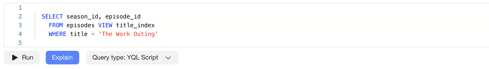
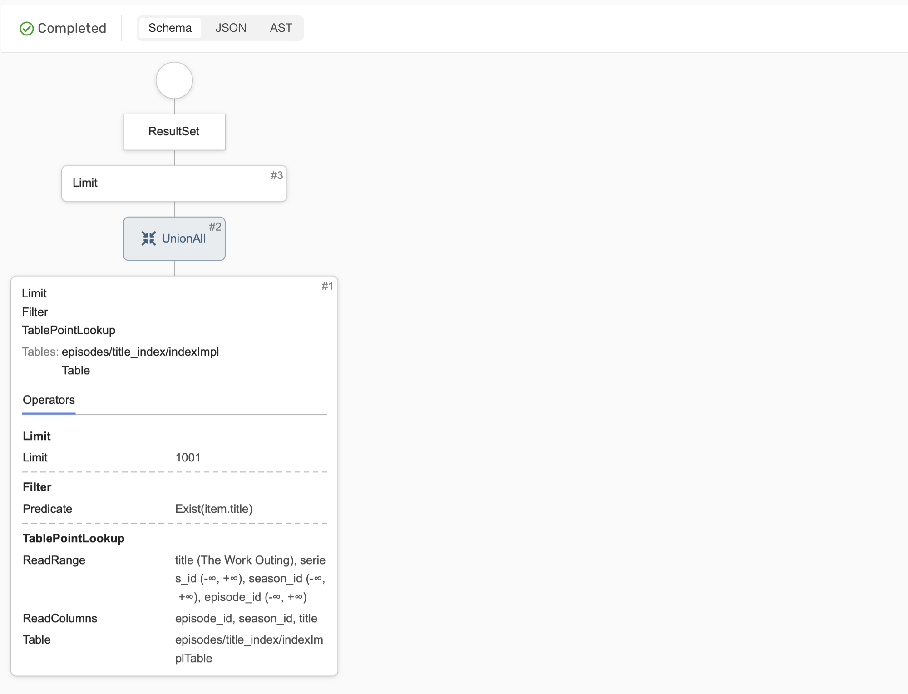

# Использование планов при оптимизации запросов

При разработке запроса важно проанализировать план его выполнения для своевременного обнаружения и устранения причин возможного чрезмерного потребления ресурсов кластера или аномально высокого времени выполнения. {{ ydb-short-name }} предоставляет два типа планов запроса: логический план и план исполнения. Логический план лучше подходит для анализа сложных запросов с большим количеством операторов [JOIN](../yql/reference/syntax/select/join.md). План исполнения более детализирован: он дополнительно показывает стадии распределённого плана и коннекторы между ними, что делает его более удобным для анализа простых OLTP-запросов.

## Логический план запроса

Логический план можно получить через {{ ydb-short-name }} [CLI](../reference/ydb-cli/commands/explain-plan.md).

В таком плане можно сопоставлять предсказания оптимизатора запросов со статистикой выполнения. Если предсказания значительно отличаются от фактических данных на этапе исполнения, это может указывать на то, что оптимизатор построил не самый эффективный план для текущего запроса. В таком случае с помощью [подсказок оптимизатора](query-hints.md) можно сформировать более эффективный план.

## План исполнения запроса

Для иллюстрации работы с планом исполнения рассмотрим следующий OLTP-запрос, выполняющий поиск серии по названию:

```yql
SELECT season_id, episode_id
  FROM episodes
  WHERE title = 'The Work Outing'
```

Схема строковой таблицы `episodes`:


Построим план исполнения для данного запроса, в {{ ydb-short-name }} это можно сделать двумя способами:



- {{ ydb-short-name }} CLI

  Получить план запроса через {{ ydb-short-name }} [CLI](../reference/ydb-cli/commands/explain-plan.md) можно с помощью следующей команды:

  ```bash
  ydb -p <profile_name> table query explain \
    -q "SELECT season_id, episode_id
    FROM episodes
    WHERE title = 'The Work Outing'"
  ```

  Результат:

  ```text
  Query Plan:
  ResultSet
  └──Limit (Limit: 1001)
     └──<UnionAll>
        └──Limit (Limit: 1001)
        └──Filter (Predicate: item.title == "The Work Outing")
        └──TableFullScan (ReadRanges: ["series_id (-∞, +∞)","season_id (-∞, +∞)","episode_id (-∞, +∞)"], ReadColumns: ["episode_id","season_id","title"], Table: episodes)
           Tables: ["episodes"]
  ```

- Embedded UI

  План запроса также можно получить через [Embedded UI](../reference/embedded-ui/ydb-monitoring.md). Для этого необходимо перейти на страницу базы данных в раздел `Query` и нажать `Explain`:

  

  Результат:

  



И в визуальном и в текстовом представлении видно, что в корне этого плана возвращение данных на клиент, в листьях работа со строковыми таблицами, а на промежуточных узлах — преобразования данных. Важно обратить внимание на узел, показывающий обращение к строковой таблице `episodes`. В данном случае это  `TableFullScan`, который означает выполнение полного сканирования строковой таблицы. А полное сканирование таблицы потребляет времени и ресурсов пропорционально её размеру, из-за чего по возможности их стараются избегать в таблицах, которые имеют тенденцию расти с течением времени или просто большие.

Одним из типовых способов избежать полного сканирования строковой таблицы является добавление [вторичного индекса](secondary-indexes.md). В данном случае имеет смысл добавить вторичный индекс для колонки `title`, для этого воспользуемся запросом:

```yql
ALTER TABLE episodes
  ADD INDEX title_index GLOBAL ON (title)
```

Стоит отметить, что в данном примере мы используем [синхронный вторичный индекс](../concepts/query_execution/secondary_indexes.md#sync). Создание индекса в {{ ydb-short-name }} — асинхронная операция, поэтому даже если запрос на построение завершился успехом, стоит подождать какое-то время, так как фактически индекс может быть еще не готов к использованию. Управлять асинхронной операцией можно через [CLI](../reference/ydb-cli/commands/secondary_index.md#add).

Построим план того же запроса с использованием вторичного индекса `title_index`. Обратите внимание, что вторичный индекс надо явно указать в запросе через конструкцию `VIEW`.



- {{ ydb-short-name }} CLI

  Команда:

  ```bash
  ydb -p <profile_name> table query explain \
    -q "SELECT season_id, episode_id
    FROM episodes VIEW title_index
    WHERE title = 'The Work Outing'"
  ```

  Результат:

  ```text
  Query Plan:
  ResultSet
  └──Limit (Limit: 1001)
     └──<UnionAll>
        └──Limit (Limit: 1001)
        └──Filter (Predicate: Exist(item.title))
        └──TablePointLookup (ReadRange: ["title (The Work Outing)","series_id (-∞, +∞)","season_id (-∞, +∞)","episode_id (-∞, +∞)"], ReadLimit: 1001, ReadColumns: ["episode_id","season_id","title"], Table: episodes/title_index/indexImplTable)
           Tables: ["episodes/title_index/indexImplTable"]
  ```

- Embedded UI

  

  Результат:

  



С использованием вторичного индекса запрос выполняется без полного сканирования основной таблицы. Вместо `TableFullScan` появился `TablePointLookup` - чтение индексной таблицы по ключу, а основную таблицу мы теперь совсем не читаем, так как все нужные нам колонки содержатся в индексной таблице.
