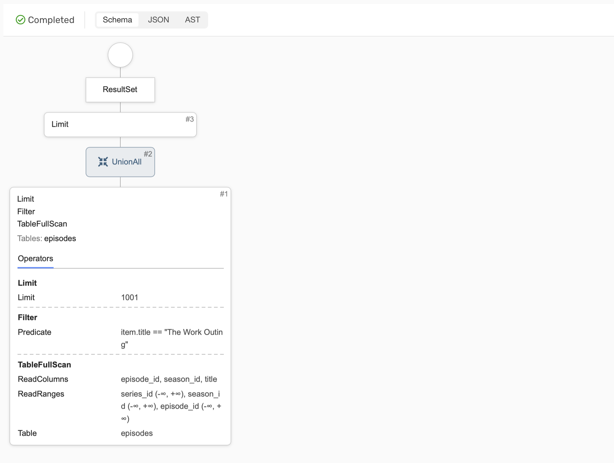

# Использование планов при оптимизации запросов

При написании запроса важно проанализировать план его выполнения для своевременного обнаружения и устранения причин возможного чрезмерного потребления ресурсов кластера или аномально высокого времени выполнения. В данной статье будет рассмотрен конкретный пример анализа плана запроса, а со справочной информацией о структуре планов {{ ydb-short-name }} можно ознакомиться [здесь](../yql/query_plans.md).

Рассмотрим следующий запрос, выполняющий поиск серии по названию:

``` sql
SELECT season_id, episode_id 
  FROM episodes 
  WHERE title = 'The Work Outing'
```

Схема таблицы `episodes`:


Построим план для данного запроса, в {{ ydb-short-name }} это можно сделать двумя способами:



- {{ ydb-short-name }} CLI

  Получить план запроса через {{ ydb-short-name }} [CLI](../reference/ydb-cli/_includes/index.md) можно с помощью следующей команды:
  ```
  ydb -p <profile_name> table query explain \
    -q "SELECT season_id, episode_id 
    FROM episodes 
    WHERE title = 'The Work Outing'"
  ```

  Результат:
  ```
  Query Plan:
  ResultSet
  └──Limit (Limit: 1001)
     └──<UnionAll>
        └──Limit (Limit: 1001)
        └──Filter (Predicate: item.title == "The Work Outing")
        └──TableFullScan (ReadRanges: ["series_id (-∞, +∞)","season_id (-∞, +∞)","episode_id (-∞, +∞)"], ReadColumns: ["episode_id","season_id","title"], Table: episodes)
           Tables: ["episodes"]
  ```

- Embedded UI

  План запроса также можно получить через [Embedded UI](../reference/embedded-ui/ydb-monitoring.md). Для этого необходимо перейти на страницу базы данных в раздел `Query` и нажать `Explain`:

  

  Результат:

  



И в визуальном и в текстовом представлении видно, что в корне этого плана возвращение данных на клиент, в листьях работа с таблицами, а на промежуточных узлах — преобразования данных. Важно обратить внимание на узел, показывающий обращение к таблице `episodes`. В данном случае это  `TableFullScan`, который означает выполнение полного сканирования таблицы. А полное сканирование таблицы потребляет времени и ресурсов пропорционально её размеру, из-за чего по возможности их стараются избегать в таблицах, которые имеют тенденцию расти с течением времени или просто большие.

Одним из типовых способов избежать полного сканирования таблицы является добавление [вторичного индекса](secondary-indexes.md). В данном случае имеет смысл добавить вторичный индекс для колонки `title`, для этого воспользуемся запросом:

``` sql
ALTER TABLE episodes
  ADD INDEX title_index GLOBAL ON (title)
```

Стоит отметить, что в данном примере мы используем [синхронный вторичный индекс](../concepts/_includes/secondary_indexes.md#sync). Создание индекса в {{ ydb-short-name }} — асинхронная операция, поэтому даже если запрос на построение завершился успехом, стоит подождать какое-то время, так как фактически индекс может быть еще не готов к использованию. Управлять асинхронной операцией можно через [CLI](../reference/ydb-cli/commands/_includes/secondary_index.md#add).

Построим план того же запроса с использованием вторичного индекса `title_index`. Обратите внимание, что вторичный индекс надо явно указать в запросе через конструкцию `VIEW`.



- {{ ydb-short-name }} CLI

  Команда:
  ```
  ydb -p <profile_name> table query explain \
    -q "SELECT season_id, episode_id 
    FROM episodes VIEW title_index
    WHERE title = 'The Work Outing'"
  ```
  
  Результат:
  ```
  Query Plan:
  ResultSet
  └──Limit (Limit: 1001)
     └──<UnionAll>
        └──Limit (Limit: 1001)
        └──Filter (Predicate: Exist(item.title))
        └──TablePointLookup (ReadRange: ["title (The Work Outing)","series_id (-∞, +∞)","season_id (-∞, +∞)","episode_id (-∞, +∞)"], ReadLimit: 1001, ReadColumns: ["episode_id","season_id","title"], Table: episodes/title_index/indexImplTable)
           Tables: ["episodes/title_index/indexImplTable"]
  ```
- Embedded UI

  

  Результат:

  



С использованием вторичного индекса запрос выполняется без полного сканирования основной таблицы. Вместо `TableFullScan` появился `TablePointLookup` - чтение индексной таблицы по ключу, а основную таблицу мы теперь совсем не читаем, так как все нужные нам колонки содержатся в индексной таблице. 