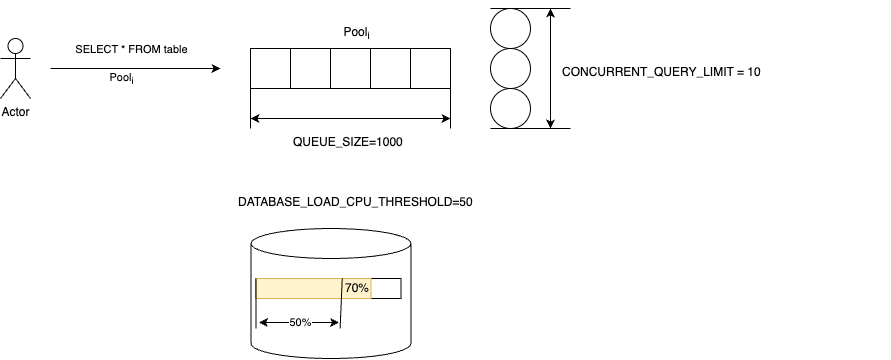
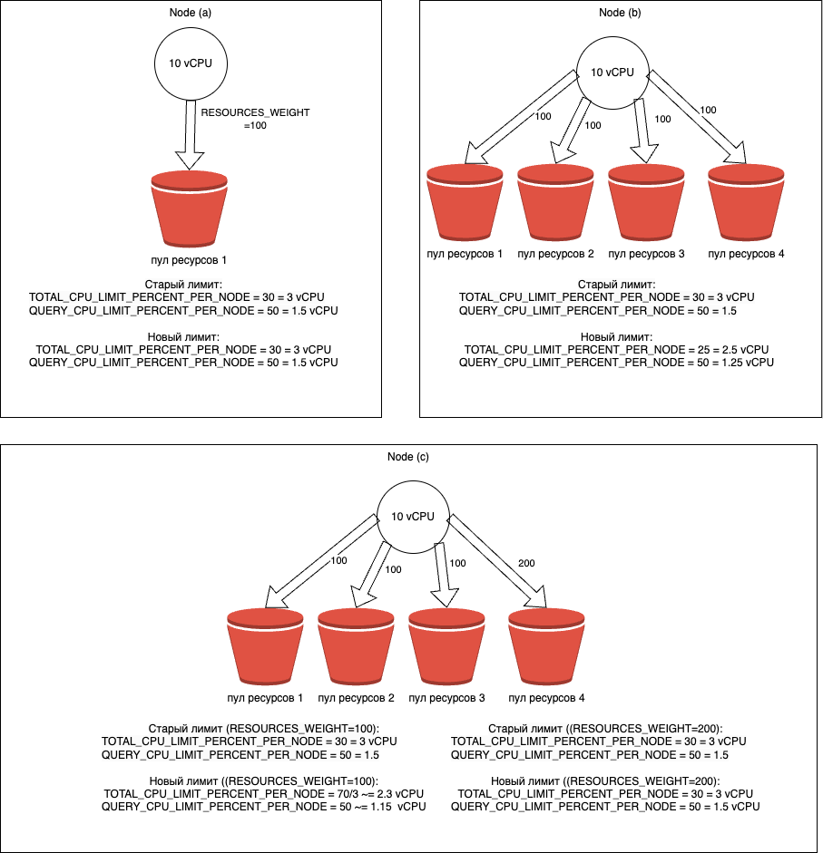

# Workload Manager — управление потреблением ресурсов

[Пулы ресурсов](../concepts/glossary.md#resource-pool) позволяют изолировать ресурсы [баз данных](../concepts/glossary.md#database) между выполняемыми запросами или же настраивать стратегии распределения ресурсов в случае переподписки (запроса большего объёма ресурсов, чем доступно в системе). Все пулы ресурсов являются равноправными, без какой-либо иерархии, и влияют друг на друга только при общем дефиците ресурсов.

Например, одним из типовых сценариев изоляции ресурсов является разделение двух классов потребителей:

1. Регулярный роботный процесс, который раз в сутки строит отчёт.
2. Аналитики, которые выполняют ad hoc запросы.



Представленная функциональность для управления потреблением ресурсами находится в стадии Preview.



## Создание пула ресурсов

В примере ниже приведён синтаксис для создания отдельного пула ресурсов с именем "olap", в котором будут выполняться аналитические запросы:

```yql
CREATE RESOURCE POOL olap WITH (
    CONCURRENT_QUERY_LIMIT=10,
    QUEUE_SIZE=1000,
    DATABASE_LOAD_CPU_THRESHOLD=80,
    RESOURCES_WEIGHT=100,
    QUERY_CPU_LIMIT_PERCENT_PER_NODE=50,
    TOTAL_CPU_LIMIT_PERCENT_PER_NODE=70
)
```

Ознакомиться с полным перечнем параметров пулов ресурсов можно в справке по [{#T}](../yql/reference/syntax/create-resource-pool.md#parameters). Часть параметров является глобальными для всей базы данных (например, `CONCURRENT_QUERY_LIMIT`, `QUEUE_SIZE`, `DATABASE_LOAD_CPU_THRESHOLD`), а другие — применяются только к одному вычислительному узлу (например, `QUERY_CPU_LIMIT_PERCENT_PER_NODE`, `TOTAL_CPU_LIMIT_PERCENT_PER_NODE`, `QUERY_MEMORY_LIMIT_PERCENT_PER_NODE`). Между всеми пулами может разделяться CPU в случае переподписки на одном вычислительном узле с помощью `RESOURCES_WEIGHT`.



Рассмотрим на примере выше, что на самом деле означают эти параметры и как они будут влиять на распределение ресурсов. Допустим, в базе данных {{ ydb-short-name }} выделено $10$ узлов по $10 vCPU$. В сумме в такой базе данных $100 vCPU$. Тогда на каждом узле для пула ресурсов с именем `olap` будет выделено:

$\frac{10 vCPU \cdot TOTAL\_CPU\_LIMIT\_PERCENT\_PER\_NODE}{100} = 10 vCPU \cdot 0.7 = 7 vCPU$

В сумме, при равномерном распределении ресурсов на всю базу данных, пулу ресурсов будет выделено:

$7 vCPU \cdot 10 \text{ (nodes)} = 70 vCPU$

На один запрос в этом пуле ресурсов будет выделено:

$\frac{10 vCPU \cdot TOTAL\_CPU\_LIMIT\_PERCENT\_PER\_NODE}{100} \cdot \frac{QUERY\_CPU\_LIMIT\_PERCENT\_PER\_NODE}{100} = 10 vCPU \cdot 0.7 \cdot 0.5 = 3.5 vCPU$

### Как работает CONCURRENT_QUERY_LIMIT и QUEUE_SIZE {#concurrent_query_limit}

Допустим, в пуле ресурсов `olap` уже выполняются 9 запросов. При поступлении нового запроса он сразу начнёт выполняться параллельно с другими 9-ю запросами. Теперь в пуле будет работать 10 запросов. Если в пул поступит 11-й запрос, он не начнёт выполняться, а будет помещён в очередь ожидания. Когда хотя бы один из 10 выполняющихся запросов завершится, 11-й запрос будет извлечён из очереди и начнёт выполняться.

Если в очереди уже находится $QUEUE\_SIZE = 1000$ запросов, то при отправке 1001-го запроса клиент сразу же получит в ответ ошибку, и этот запрос не будет выполнен. Пример ошибки:

```text
Issues:
<main>: Error: Request was rejected, number of local pending requests is 20, number of global delayed/running requests is 0, sum of them is larger than allowed limit 1 (including concurrent query limit 1) for pool olap
<main>: Error: Query failed during adding/waiting in workload pool olap
```

На число параллельно выполняемых запросов влияет не только `CONCURRENT_QUERY_LIMIT`, но и `DATABASE_LOAD_CPU_THRESHOLD`.

### Как работает DATABASE_LOAD_CPU_THRESHOLD {#database_load_cpu_threshold}

Когда запрос поступает в пул ресурсов, для которого установлен `DATABASE_LOAD_CPU_THRESHOLD`, сразу резервируется 10% от доступного CPU на узле, исходя из предположения, что запрос как минимум потребует такой объём ресурсов. Затем каждые 10 секунд происходит перерасчёт потребляемых ресурсов по всей базе данных, что позволяет уточнить первоначальную 10%-ную оценку. Это означает, что если на узел кластера одновременно поступит более 10 запросов, то не более 10 запросов будут запущены на выполнение, а остальные будут ожидать уточнения фактического потребления CPU.

Как и в случае `CONCURRENT_QUERY_LIMIT`, при превышении указанного порога нагрузки запросы отправляются в очередь ожидания.

### Распределение ресурсов в соответствии с RESOURCES_WEIGHT {#resources_weight}



Параметр `RESOURCES_WEIGHT` начинает работать только в случае переподписки и при наличии более одного пула ресурсов в системе. В текущей реализации `RESOURCES_WEIGHT` влияет только на распределение ресурсов `vCPU`. Когда в пуле ресурсов появляются запросы, он начинает участвовать в распределении ресурсов. Для этого в пулах происходит перерасчёт лимитов согласно алгоритму [Max-min fairness](https://en.wikipedia.org/wiki/Max-min_fairness). Само перераспределение ресурсов выполняется на каждом вычислительном узле индивидуально, как показано на рисунке выше.

Допустим, у нас есть узел в системе с доступными $10 vCPU$. Установлены ограничения:

- $TOTAL\_CPU\_LIMIT\_PERCENT\_PER\_NODE = 30$,
- $QUERY\_CPU\_LIMIT\_PERCENT\_PER\_NODE = 50$.

В этом случае у пула ресурсов будет ограничение $3 vCPU$ на узел и $1.5 vCPU$ на один запрос в этом пуле (рисунок *a*). Если в системе существует 4 таких пула, и все они пытаются использовать максимальные ресурсы, это составит $12 vCPU$, что превышает предел доступных ресурсов на узле ($10 vCPU$). В этом случае начинают действовать `RESOURCES_WEIGHT`, и каждому пулу будет выделено по $2.5 vCPU$ (рисунок *b*).

Если необходимо увеличить выделяемые ресурсы для конкретного пула, можно изменить его вес, например, на 200. Тогда этот пул получит $3 vCPU$, а остальные пулы поделят поровну оставшиеся $7 vCPU$, что составит $\frac{7}{3} vCPU$ на каждый пул (рисунок *c*).



Текущий алгоритм распределения ресурсов может быть изменен в будущем без поддержки обратной совместимости.



## Пул ресурсов по умолчанию

Даже если ни одного пула ресурсов не было создано, в системе всегда существует пул ресурсов `default`, который не может быть удалён. Любой запрос, выполняющийся в системе, всегда принадлежит какому-либо пулу — ситуации, когда запрос не привязан ни к одному пулу ресурсов, не бывает. По умолчанию настройки пула ресурсов `default` выглядят следующим образом:

```yql
CREATE RESOURCE POOL default WITH (
    CONCURRENT_QUERY_LIMIT=-1,
    QUEUE_SIZE=-1,
    DATABASE_LOAD_CPU_THRESHOLD=-1,
    RESOURCES_WEIGHT=-1,
    QUERY_MEMORY_LIMIT_PERCENT_PER_NODE=-1,
    QUERY_CPU_LIMIT_PERCENT_PER_NODE=-1,
    TOTAL_CPU_LIMIT_PERCENT_PER_NODE=-1
)
```

Это означает, что в пуле ресурсов `default` не применяются никакие ограничения: он функционирует независимо от других пулов и не имеет ограничений на потребляемые ресурсы. В пуле ресурсов `default` можно изменять параметры с помощью запроса [{#T}](../yql/reference/syntax/alter-resource-pool.md), за исключением параметров `CONCURRENT_QUERY_LIMIT`, `DATABASE_LOAD_CPU_THRESHOLD` и `QUEUE_SIZE`. Это ограничение введено намеренно, чтобы минимизировать риски, связанные с некорректной настройкой пула ресурсов по умолчанию.

## Управление ACL пула ресурсов

Для создания, изменения или удаления пула ресурсов необходимо выдать права доступа в соответствии с разрешениями, описанными в справке по [{#T}](../yql/reference/syntax/create-resource-pool.md). Например, для создания пулов ресурсов нужно иметь разрешение `CREATE TABLE` на директорию `.metadata/workload_manager/pools`, которое можно выдать запросом следующего вида:

```yql
GRANT CREATE TABLE ON `.metadata/workload_manager/pools` TO user1;
```

## Создание классификатора пула ресурсов

[Классификаторы пулов ресурсов](../concepts/glossary.md#resource-pool-classifier) позволяют задавать правила, по которым запросы будут распределяться между пулами ресурсов. В примере ниже приведён классификатор пула ресурсов, который отправляет запросы от всех пользователей в пул ресурсов с именем `olap`:

```yql
CREATE RESOURCE POOL CLASSIFIER olap_classifier
WITH (
    RESOURCE_POOL = 'olap',
    MEMBER_NAME = 'all-users@well-known'
);
```

- `RESOURCE_POOL` — имя пула ресурсов, в который будет отправлен запрос, удовлетворяющий требованиям, заданным в классификаторе пула ресурсов.
- `MEMBER_NAME` — группа пользователей или пользователь, запросы которых будут отправлены в указанный пул ресурсов.

## Управление ACL классификатора пула ресурсов

Ограничений на использование классификатора пула ресурсов нет — они глобальны для всей базы данных и доступны всем пользователям. Для создания, удаления или изменения классификатора пула ресурсов необходимо иметь разрешение `ALL` на всю базу данных, которое можно выдать запросом вида:

```yql
GRANT ALL ON `/my_db` TO user1;
```

Для использования классификатора пула ресурсов у пользователя должен быть доступ к пулу ресурсов, на который ссылается данный классификатор.

## Порядок выбора классификатора пула ресурсов в случае конфликтов

```yql
CREATE RESOURCE POOL CLASSIFIER olap1_classifier
WITH (
    RESOURCE_POOL = 'olap1',
    MEMBER_NAME = 'user1@domain'
);

CREATE RESOURCE POOL CLASSIFIER olap2_classifier
WITH (
    RESOURCE_POOL = 'olap2',
    MEMBER_NAME = 'user1@domain'
);
```

Допустим, имеются два классификатора пулов ресурсов с конфликтующими условиями, и пользователь `user1@domain` подходит под оба пула ресурсов: `olap1` и `olap2`. Если до этого в системе не существовало ни одного классификатора, то для `olap1` устанавливается `RANK=1000`, а для `olap2` — `RANK=2000`. Классификаторы пулов ресурсов с меньшим значением `RANK` имеют более высокий приоритет. В данном примере, так как у `olap1` более приоритетный `RANK`, чем у `olap2`, будет выбран именно он.

Также можно самостоятельно задавать `RANK` для классификаторов пулов ресурсов при создании с помощью синтаксической конструкции [{#T}](../yql/reference/syntax/create-resource-pool-classifier.md), либо изменять `RANK` для существующих классификаторов пулов ресурсов с помощью [{#T}](../yql/reference/syntax/alter-resource-pool-classifier.md).

В системе не может существовать два классификатора с одинаковым значением `RANK`, что позволяет однозначно определить, какой пул ресурсов будет выбран в случае конфликтующих условий.

## Пример приоритетного пула ресурсов

Рассмотрим пример задачи распределения ресурсов между командой аналитиков и условным директором (CEO). Для CEO важно иметь приоритет над вычислительными ресурсами, которые используются для аналитических задач, однако полезно обеспечить возможность команде аналитиков утилизировать больше ресурсов кластера в те периоды времени, когда CEO не использует ресурсы. Конфигурация для этого сценария может выглядеть следующим образом:

```yql
CREATE RESOURCE POOL olap WITH (
    CONCURRENT_QUERY_LIMIT=20,
    QUEUE_SIZE=100,
    DATABASE_LOAD_CPU_THRESHOLD=80,
    RESOURCES_WEIGHT=20,
    QUERY_CPU_LIMIT_PERCENT_PER_NODE=80,
    TOTAL_CPU_LIMIT_PERCENT_PER_NODE=100
);

CREATE RESOURCE POOL the_ceo WITH (
    CONCURRENT_QUERY_LIMIT=20,
    QUEUE_SIZE=100,
    RESOURCES_WEIGHT=100,
    QUERY_CPU_LIMIT_PERCENT_PER_NODE=100,
    TOTAL_CPU_LIMIT_PERCENT_PER_NODE=100
);
```

В примере выше создаются два пула ресурсов: `olap` для команды аналитиков и `the_ceo` для CEO.

- **Пул ресурсов `olap`**:

  - Имеет вес 20.
  - Ограничение на запускаемые запросы при перегрузке базы данных составляет 80% доступных ресурсов.

- **Пул ресурсов `the_ceo`**:

  - Имеет больший вес — 80.
  - Не имеет ограничений на запускаемые запросы при перегрузке.

Вес 80 для `the_ceo` фактически означает, что при конкуренции за ресурсы пул `the_ceo` будет получать приоритет в 4 раза больше, чем пул `olap`. Если в оба пула поступают запросы, система пересчитает лимиты, и для `olap` лимит `TOTAL_CPU_LIMIT_PERCENT_PER_NODE` будет сокращён до 20%, а для `the_ceo` — увеличен до 80%. Это перераспределение ресурсов основано на весах, как описано [выше](#resources_weight).

## Диагностика

### План запроса

Подробную информацию о планах запросов можно найти на странице [структура планов запросов](../yql/query_plans.md). Для получения информации об используемом пуле ресурсов необходимо запустить команду с получением статистики в формате `json-unicode`. Пример команды:

```bash
ydb -p <profile_name> sql -s 'select 1' --stats full --format json-unicode
```

В теле плана запроса, полученного с помощью приведённой выше команды, можно найти полезные атрибуты для диагностики работы с пулом ресурсов. Пример такой информации:

```json
"Node Type" : "Query",
"Stats" : {
  "TotalDurationUs": 28795,
  "ProcessCpuTimeUs": 45,
  "Compilation": {
    "FromCache": false,
    "CpuTimeUs": 7280,
    "DurationUs": 21700
  },
  "ResourcePoolId": "default",
  "QueuedTimeUs": 0
},
"PlanNodeType" : "Query"
```

Полезные атрибуты:

- `TotalDurationUs` — общее время выполнения запроса, включая время ожидания в очереди.
- `ResourcePoolId` — имя пула ресурсов, к которому был привязан запрос.
- `QueuedTimeUs` — общее время ожидания запроса в очереди.

### Метрики

Информацию о метриках пулов ресурсов можно найти в [справке по метрикам](../reference/observability/metrics/index.md#resource_pools).

### Системные представления

Информацию о системных представлениях, связанных с пулами ресурсов и классификаторами пулов ресурсов, можно найти на странице [{#T}](system-views.md#resource_pools).

## См. также

* [{#T}](../yql/reference/syntax/create-resource-pool.md)
* [{#T}](../yql/reference/syntax/alter-resource-pool.md)
* [{#T}](../yql/reference/syntax/drop-resource-pool.md)
* [{#T}](../yql/reference/syntax/create-resource-pool-classifier.md)
* [{#T}](../yql/reference/syntax/alter-resource-pool-classifier.md)
* [{#T}](../yql/reference/syntax/drop-resource-pool-classifier.md)
