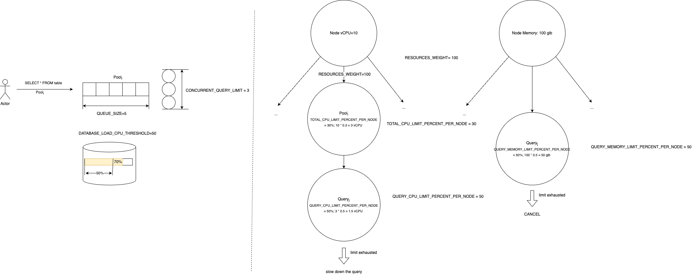

# Управление потреблением ресурсов

Описание этих сущностей может быть найдено в [resource pool](../concepts/glossary.md#resource-pool) и [resource pool classifier](../concepts/glossary#resource-pool-classifier.md)

## Создание resource pool

В примере ниже приведен синтаксис для создания отдельного resource pool в котором будут выполняться аналитический запросы.
```yql
CREATE RESOURCE POOL olap WITH (
    CONCURRENT_QUERY_LIMIT=10,
    QUEUE_SIZE=1000,
    DATABASE_LOAD_CPU_THRESHOLD=80,
    RESOURCES_WEIGHT=100,
    QUERY_CPU_LIMIT_PERCENT_PER_NODE=50,
    TOTAL_CPU_LIMIT_PERCENT_PER_NODE=70
)
```

Ознакомиться с параметрами resource pool можно [здесь](../yql/reference/yql-core/syntax/create-resource-pool.md#parameters)

Рассмотрим на примере выше что же на самом деле означают эти параметры и как они будут влиять на распределение ресурсов. Допустим в базе данных {{ ydb-short-name }} выделено 10 узлов по 10 vCPU. В сумме в такой базе данных 100 vCPU. Тогда на одном хосте для resource pool с именем `olap` будет выделено `10vCPU*TOTAL_CPU_LIMIT_PERCENT_PER_NODE/100=10vCPU*0.7=7vCPU`. В сумме при равномерном распределении ресурсов на всю базу данных будет выделено `7vCPU*10(узлов)=70vCPU`. На один запрос в этом resource pool будет выделено `10vCPU*TOTAL_CPU_LIMIT_PERCENT_PER_NODE/100*QUERY_CPU_LIMIT_PERCENT_PER_NODE/100=10vCPU*0.7*0.5=3.5vCPU`. Что касается `RESOURCES_WEIGHT`, то он начинает работать только в случае переподписки и когда число пулов в системе > 1, подробное описание этого параметра приведено ниже. Перейдем к рассмотрению `CONCURRENT_QUERY_LIMIT`, допустим что в resource pool `olap` работают уже 9 запросов, тогда при появлении нового запроса он сразу же перейдет в состояние выполнения параллельно с другими 9-ю запросами. Теперь в пуле уже работает 10 запросов, если же в resource pool будет отправлен 11-й запрос, то он не начнет выполняться, он будет отправлен в очередь ожидания. Когда хотя бы 1 из 10 выполняющихся запросов завершит свое выполнение, то из очереди будет извлечен 11-й запрос и отправлен на выполнение незамедлительно. Если же в очереди уже находится `QUEUE_SIZE=1000` элементов, то при отправке на выполнение 1001-ого запроса будет получена ошибка и запрос не будет выполнен. На число параллельно выполняемых запросов влияет не только `CONCURRENT_QUERY_LIMIT`, но еще и `DATABASE_LOAD_CPU_THRESHOLD`

## Как работает DATABASE_LOAD_CPU_THRESHOLD

Когда запрос приходит в resource pool для которого установлен `DATABASE_LOAD_CPU_THRESHOLD`, то для него сразу же резервируется 10% от доступного cpu на узле, в предположении что как минимум столько ресурсов будет потреблено запросом. Дальше на 10-и секундных окнах происходит перерасчет потребляемых ресурсов глобально по всему кластеру, которые позволяют уточнить 10% оценку. Также это означает что если на узел кластера одновременно придет больше чем 10 запросов, то не больше 10 запросов будут поставлены на выполнение, а остальные запросы будут ожидать уточнение потребления cpu.


## Default resource pool

Даже если ни одного resource pool не было создано, то в системе всегда существует `default` resource pool, который не может быть удален. Любой запрос который выполняется в системе всегда выполняется в каком-то пуле, не бывает ситуации когда resource pool не принадлежит никакому resource pool. По умолчанию настройки `default` resource pool выглядят следующим образом:

```yql
CREATE RESOURCE POOL default WITH (
    CONCURRENT_QUERY_LIMIT=-1,
    QUEUE_SIZE=-1,
    DATABASE_LOAD_CPU_THRESHOLD=-1,
    RESOURCES_WEIGHT=-1,
    QUERY_MEMORY_LIMIT_PERCENT_PER_NODE=-1,
    QUERY_CPU_LIMIT_PERCENT_PER_NODE=-1,
    TOTAL_CPU_LIMIT_PERCENT_PER_NODE=-1
)
```

Это означает что никакие ограничения в этом resource pool не применимы, он живет полностью независимо от других resource pool, а также не имеет ограничений на потребляемые ресурсы. В `default` resource pool возможно с помощью конструкции `ALTER RESOURCE POOL` менять параметры за исключением `CONCURRENT_QUERY_LIMIT`, `DATABASE_LOAD_CPU_THRESHOLD` и `QUEUE_SIZE`. Это ограничение было введено преднамеренно для минимизации проблем связанных с не корректной настройкой resource pool.

## Распределение ресурсов в соответствии с RESOURCES_WEIGHT



В текущей реализации `RESOURCES_WEIGHT` влияют только на распределение ресурсов vCPU. Как показано на рисунке выше. Допустим у нас есть узел в системе для которого доступно 10 vCPU. И установлены ограничения `TOTAL_CPU_LIMIT_PERCENT_PER_NODE=30` и `QUERY_CPU_LIMIT_PERCENT_PER_NODE=50`. В этом случае у resource pool будет ограничение 3 vCPU на узел и 1.5 vCPU на один запрос в этом resource pool. Обратите внимание что это не гарантии, а ограничения. Если же в системе существует 4 таких resource pool и они все хотят потреблять максимальные ресурсы, то в сумме это 12 vCPU что превышает предел доступных ресурсов на узле 10 vCPU. В этом случае начинают работать `RESOURCES_WEIGHT`. Тогда из 10 vCPU пулу будет выделено `min(NodeCPU*RESOURCES_WEIGHT/SUM(RESOURCES_WEIGHT), TOTAL_CPU_LIMIT_PERCENT_PER_NODE*NodeCPU)=min(10*100/400,3)=2.5vCPU`. Если нужно поднять выделяемые ресурсы для какого-то конкретного resource pool, то можно изменить вес для пула, например на 200. Тогда получим `min(10*200/500,3)=3vCPU`

## Управление ACL на resource pool

Для создания/изменения/удаления resource pool необходимо выдать права доступа в соответствии с разрешениями описанными в [SQL](../yql/reference/yql-core/syntax/create-resource-pool.md). Например, для возможности создания resource pool нужно иметь `CREATE TABLE` на директорию `.metadata/workload_manager/pools`

```yql
GRANT CREATE TABLE ON `.metadata/workload_manager/pools` TO user1;
```

## Создание resource pool classifier

В примере ниже приведен пример классификатора запросов, который отправляет запросы от всех пользователей в resource pool с именем `olap`
```yql
CREATE RESOURCE POOL CLASSIFIER olap_classifier
WITH (
    RESOURCE_POOL = 'olap',
    MEMBERNAME = 'all-users@well-known'
);
```

*RESOURCE_POOL* - имя ресурса пула в который будет отправлен запрос удовлетворяющий требования заданным в resource pool classifier
*MEMBERNAME* - группа пользователей или пользователь которые будут отправлены в *RESOURCE_POOL*

## Управление ACL на resource pool classifier

На использование resource pool classifier нет ограничений, они глобальны на всю базу данных и доступны всем пользователям. Для возможности создавать/удалять/изменять resource pool classifier необходимо иметь `ALL` на всю базу.

```yql
GRANT ALL ON `/my_db` TO user1;
```

Для использования resource pool classifier необходимо чтобы у пользователя был доступ к resource pool на который ссылается этот resource pool classifier. Необходимые права доступа для resource pool описаны в разделе выше

## Порядок выбора классификаторов в случае конфликтов

```yql
CREATE RESOURCE POOL CLASSIFIER olap1_classifier
WITH (
    RESOURCE_POOL = 'olap1',
    MEMBERNAME = 'user1@domain'
);

CREATE RESOURCE POOL CLASSIFIER olap2_classifier
WITH (
    RESOURCE_POOL = 'olap2',
    MEMBERNAME = 'user1@domain'
);
```

Допустим у нас есть два классификатора пулов ресурсов которые имеют конфликтующее условия. В этом случае один пользователь `user1@domain` подходит под два пула ресурсов: `olap1`, `olap2`. Если в системе до этого не существовало ни одного классификатора пулов ресурсов, то `olap1` выдается `RANK=1000`, а `olap2` выдается `RANK=2000`. Классификаторы пулов ресурсов с меньшим значением имеют более высокий приоритет. В данном примере, так как у `olap1` `RANK` более приоритетный чем у `olap2`, то он и буден выбран. В системе не может существовать два классификатора пула ресурсов с одинаковым `RANK` поэтому эта схема позволяет однозначно определить какой пул ресурсов будет выбран в случае конфликтующих условий.

## Пример CEO resource pool

Рассмотрим задачу распределения ресурсов между командой аналитики и CEO. CEO может потребоваться иметь приоритет над вычислительным ресурсами для аналитических вычислений, при этом полезно утилизировать больше ресурсов кластера, когда CEO не нужны какие-то вычислительные ресурсы. Для этого сценария конфигурация может выглядеть следующим образом:

```
CREATE RESOURCE POOL olap WITH (
    CONCURRENT_QUERY_LIMIT=20,
    QUEUE_SIZE=100,
    DATABASE_LOAD_CPU_THRESHOLD=80,
    RESOURCES_WEIGHT=100,
    QUERY_CPU_LIMIT_PERCENT_PER_NODE=80,
    TOTAL_CPU_LIMIT_PERCENT_PER_NODE=100
);

CREATE RESOURCE POOL the_ceo WITH (
    CONCURRENT_QUERY_LIMIT=20,
    QUEUE_SIZE=100,
    RESOURCES_WEIGHT=10000,
    QUERY_CPU_LIMIT_PERCENT_PER_NODE=100,
    TOTAL_CPU_LIMIT_PERCENT_PER_NODE=100
);
```

В примере выше создается два resource pool, один `olap` для команды аналитиков который имеет вес только `100` и ограничения на запускаемые запросы при перегрузке базы данных равный 80 процентам. В то же время пул `the_ceo` не имеет таких ограничения и имеет больший вес `10000`, который фактически означает что при конкуренции за ресурсы `the_ceo` пул будет получать приоритет больше в `100` раз

## Диагностика

### План запроса

Подробную информацию о планах запросов можно найти на странице [структура планов запросов](../yql/query_plans.md). Для получения информации о пуле запросов нужно запустить команду с форматом `json-unicode`. Пример команды:

```bash
ydb -p <profile_name> sql -s 'select 1' --stats full --format json-unicode
```

В плане запроса результаты выше приведенной команды можно найти полезные аттрибуты для диагностики работы с пулом ресурсов. Пример такой информации приведен ниже
```json
"Node Type" : "Query",
"Stats" : {
  "TotalDurationUs": 28795,
  "ProcessCpuTimeUs": 45,
  "Compilation": {
    "FromCache": false,
    "CpuTimeUs": 7280,
    "DurationUs": 21700
  },
  "ResourcePoolId": "default",
  "QueuedTimeUs": 0
},
"PlanNodeType" : "Query"
```

Полезные аттрибуты:
    - `TotalDurationUs` - общее время выполнения запроса с учетом ожидания в очереди
    - `ResourcePoolId` - имя ресурс пула к которому привязался запрос
    - `QueuedTimeUs` - общее время ожидания в очереди

### Метрики

Информацию о метриках пулов ресурсов можно найти в [справке по метрикам](../reference/observability/metrics/index.md#resource_pools)

### Системные таблицы

Информация о системных таблицах связанных с пулами ресурсов и классификаторами пулов ресурсов можно найти на странице [системных таблиц базы данных](system-views.md#resource_pools)